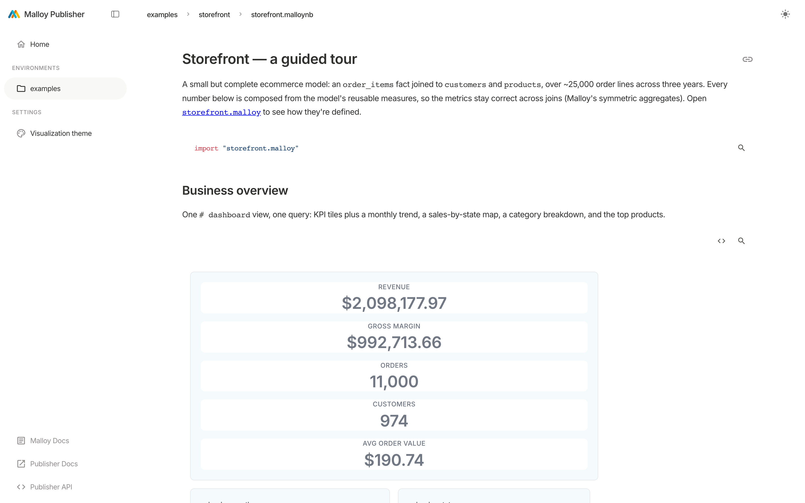

<p align="center">
  
</p>

<p align="center">
  <a href="https://github.com/malloydata/publisher/actions/workflows/build.yml"></a>
</p>

**Publisher** is the open-source semantic model server for [Malloy](https://malloydata.dev).

When an AI queries your database directly, it writes its own SQL — and gets it subtly wrong: the wrong
join, an invented column, a fan-out that double-counts but still looks plausible. Publisher puts a
Malloy semantic layer in front of your data, where measures, dimensions, and joins are defined once,
correctly. Applications, BI tools, and **AI agents** compose queries against that model instead of
writing raw SQL, so the numbers come back **right by construction**. Agents work through the sources
the model defines — not your raw tables — and you decide exactly what each caller can see.

Point Publisher at your Malloy models and it serves them over a REST API and a single MCP endpoint.

## Quick start

```bash
npx @malloy-publisher/server --port 4000
```

Open **http://localhost:4000** and explore the bundled example packages —
[`storefront`](examples/storefront) (a complete ecommerce model),
[`governed-analytics`](examples/governed-analytics) (access control), and
[`html-data-app`](examples/html-data-app) (a no-build dashboard) —
all DuckDB-backed, no credentials required. Give the server a moment to report `serving`:

```bash
curl -s http://localhost:4000/api/v0/status | jq .operationalState   # → "serving"
```

> **Heads up:** on some Node 24 setups `npx` skips DuckDB's native binding and the server exits with
> `Cannot find module ...duckdb.node`. Until that upstream fix lands, run from a clone instead
> (`bun install && bun run build && bun run start`). See [deployment.md](docs/deployment.md).

## Point your agent at it

This is the fast path to the "wow." Start the server, then connect any MCP-compatible agent to the
MCP endpoint on port **4040**:

```bash
claude mcp add --transport http malloy http://localhost:4040/mcp
```

Then just ask, in plain English:

> *"Use Malloy to explore the storefront sales data and chart revenue by category."*

The agent discovers what data exists (`malloy_getContext`), grounds itself in the real source, view,
and field names, runs the query (`malloy_executeQuery`), and returns an answer backed by your
semantic model. No schema spelunking, no hallucinated column names.

- **Agents:** this repo ships an [AGENTS.md](AGENTS.md) and a bundled skill library
  ([`skills/`](skills/)) that most AI coding hosts auto-discover. Start there.
- **Any MCP client** (Cursor, VS Code, Codex, Claude Desktop): see
  [docs/ai-agents.md](docs/ai-agents.md) for per-client config and the stdio bridge.

> The MCP server is stateless and unauthenticated, and it can read any data your models connect to.
> Bind it to loopback (`--host 127.0.0.1`) for local use, and put an authenticating gateway in front
> before exposing it more widely.

## What you can do

- **Explore, no code.** Build and drill into queries visually with [Malloy Explorer](docs/explorer.md) —
  every action generates valid Malloy, so metrics stay correct even across joins.
- **Answer questions with AI.** Connect an agent over MCP and ask in plain English — see above and
  [docs/ai-agents.md](docs/ai-agents.md).
- **Surface analytics your way.** Explore and share with zero code in the
  [Publisher App](docs/publisher-app.md), or ship a no-build
  [HTML data app](docs/html-data-apps.md) that Publisher hosts inside a package.
- **Build & validate models.** Author Malloy models guided by the bundled [skills](skills/), then
  publish them for serving.
- **Govern access.** [Givens](docs/givens.md) are one runtime-parameter mechanism that powers filter
  widgets, [row-level access](docs/row-level-access.md) (which rows a caller sees), and
  [`#(authorize)`](docs/authorize.md) source gates (who can query). Separately, curate *what* is
  [discoverable and queryable](docs/discovery-and-access.md).

## Documentation

The [`docs/`](docs/) folder is the reference hub — see its [index](docs/README.md). Highlights:

| Topic | Doc |
| --- | --- |
| Runnable example packages | [examples/](examples/) ([storefront](examples/storefront) · [governed-analytics](examples/governed-analytics) · [html-data-app](examples/html-data-app) · [data-app](examples/data-app)) |
| Connect an AI agent over MCP | [docs/ai-agents.md](docs/ai-agents.md) |
| No-code visual query builder | [docs/explorer.md](docs/explorer.md) |
| The Publisher App (navigation & features) | [docs/publisher-app.md](docs/publisher-app.md) |
| Build a custom UI (no build step) | [docs/html-data-apps.md](docs/html-data-apps.md) |
| REST & MCP API overview | [docs/api-overview.md](docs/api-overview.md) |
| Runtime parameters & access control | [givens](docs/givens.md) (base) · [row-level](docs/row-level-access.md) · [authorize](docs/authorize.md) · [discovery](docs/discovery-and-access.md) |
| Database connections | [docs/connections.md](docs/connections.md) |
| Deploy (npx / Docker / Compose) | [docs/deployment.md](docs/deployment.md) |
| Docker runtime deep-dive (layout, env, tuning) | [packages/server/README.docker.md](packages/server/README.docker.md) |
| Configuration & tuning reference | [docs/configuration.md](docs/configuration.md) |
| Theming (light/dark, palette) | [docs/theming.md](docs/theming.md) |
| Architecture & how it fits together | [docs/architecture.md](docs/architecture.md) |
| Build & develop from a clone | [docs/development.md](docs/development.md) |

The complete user guide also lives at
**[docs.malloydata.dev](https://docs.malloydata.dev/documentation/user_guides/publishing/publishing)**.

## Contributing

Build and hack on Publisher from a clone with [docs/development.md](docs/development.md); contribution
process and sign-off are in [CONTRIBUTING.md](CONTRIBUTING.md).

## Community

- Join the [Malloy Slack](https://join.slack.com/t/malloy-community/shared_invite/zt-1kgfwgi5g-CrsdaRqs81QY67QW0~t_uw)
- Report issues on [GitHub](https://github.com/malloydata/publisher/issues)
