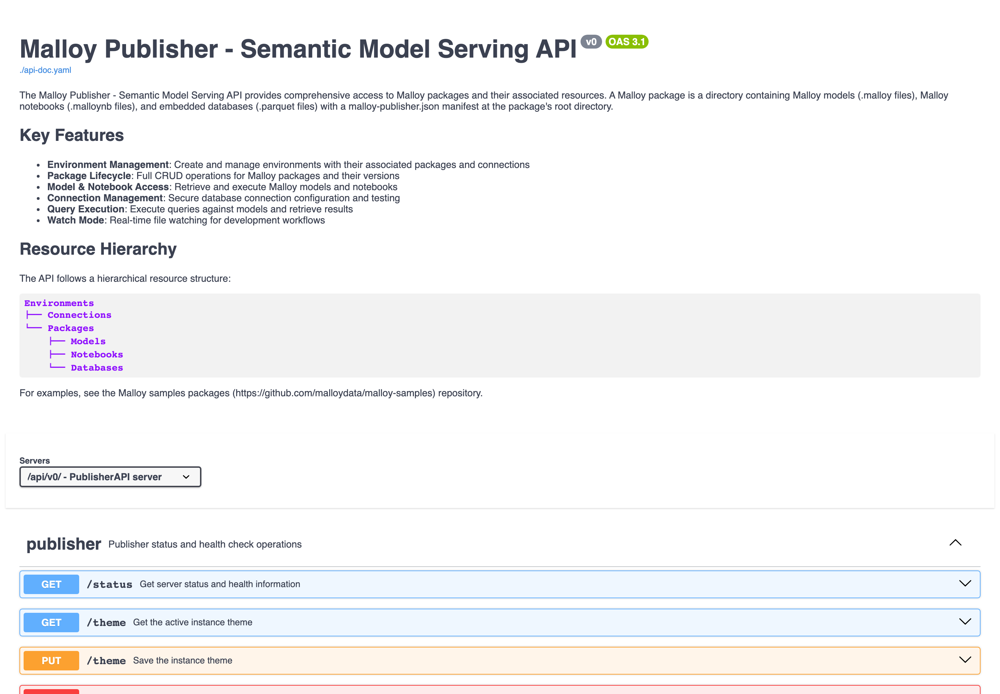

# API overview

> What this is: the shape of Publisher's programmatic surfaces — the resource hierarchy, the REST and
> MCP APIs, and where to find the live, interactive API explorer. For connecting an AI agent, see
> [ai-agents.md](ai-agents.md); for the App, see [publisher-app.md](publisher-app.md).

## Two surfaces

| Surface | Port | For |
| --- | --- | --- |
| **REST API** | `4000` (base path `/api/v0`) | Applications, dashboards, scripts — list content, compile models, run queries. |
| **MCP API** | `4040` (`/mcp`) | AI agents — discovery + query over the [Model Context Protocol](https://modelcontextprotocol.io). Tools: `malloy_getContext`, `malloy_executeQuery`, `malloy_searchDocs`. See [ai-agents.md](ai-agents.md). |

Both are read-through onto the same resource hierarchy. Neither surface authenticates callers —
put the server behind your own gateway before exposing it beyond localhost.

## Resource hierarchy

```
/api/v0
└── /environments/{env}
    ├── /packages/{pkg}
    │   ├── /models/{path}              a .malloy model
    │   │   ├── /query                  POST — run a Malloy query
    │   │   └── /compile                POST — compile to SQL / metadata
    │   ├── /notebooks/{path}           a .malloynb notebook
    │   │   └── /cells/{index}          GET — run one notebook cell
    │   ├── /pages                      in-package HTML data apps
    │   ├── /databases                  the package's embedded data files (e.g. parquet)
    │   └── /materializations           persisted-source builds
    └── /connections/{name}             database connections
```

(`/projects/{env}/…` is accepted as an alias for `/environments/{env}/…`.)

## Key endpoints

| Method & path | Does |
| --- | --- |
| `GET /api/v0/status` | Server lifecycle (`operationalState`), plus `loadErrors` for anything configured that did not load. |
| `GET /api/v0/environments` | List environments, each with its packages. |
| `GET /api/v0/environments/{env}/packages/{pkg}` | Package metadata (models, `explores`, `buildPlan`, …). |
| `GET  …/packages/{pkg}/models/{path}` | A model's compiled metadata (sources, views, givens). |
| `POST …/packages/{pkg}/models/{path}/query` | Run a Malloy query; body `{ "query": "…", "givens": {…} }` (plus optional `sourceName`, `queryName`, `compactJson` — see the [live spec](#live-api-explorer)). |
| `POST …/packages/{pkg}/models/{path}/compile` | Compile Malloy to SQL / metadata. |
| `GET  …/packages/{pkg}/notebooks/{path}/cells/{index}` | Run one notebook cell. |
| `GET  …/packages/{pkg}/pages` | List a package's HTML pages. |
| `GET  …/environments/{env}/connections` | List database connections. |

Example — run a query against the bundled `storefront` package:

```bash
curl -s -X POST \
  http://localhost:4000/api/v0/environments/examples/packages/storefront/models/storefront.malloy/query \
  -H 'content-type: application/json' \
  -d '{"query":"run: order_items -> by_category"}'
```

## Live API explorer

The running server hosts the full, interactive **Swagger UI** and the OpenAPI 3.1 spec:

| URL | What |
| --- | --- |
| **http://localhost:4000/api-doc.html** | Interactive Swagger UI — browse every endpoint, see schemas, try requests. |
| **http://localhost:4000/api-doc.yaml** | The raw OpenAPI 3.1 spec (feed it to codegen or Postman). |

The App's footer **Publisher API** link opens the same explorer.



> **Why isn't the explorer embedded directly in this page?** GitHub-rendered Markdown strips the
> JavaScript that Swagger UI needs, so an interactive explorer can't live inside a `.md` file on
> GitHub. Open the hosted URL above instead. (A docs site that permits inline HTML — e.g.
> docs.malloydata.dev — can embed Swagger/Redoc against `/api-doc.yaml`.)

## Generated clients

The spec drives a generated **Python client** ([`packages/python-client`](../packages/python-client))
and the TypeScript client the SDK uses. Regenerate them from `api-doc.yaml` after any spec change —
see [CONTRIBUTING.md](../CONTRIBUTING.md).
