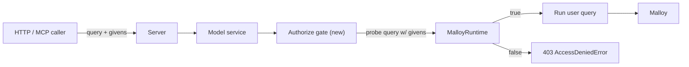

# Authorize Annotations — Project Plan

Implement Publisher-side `# authorize` source-level and `## authorize` file-level annotations whose boolean expressions are written in Malloy expression syntax, reference declared givens (`$NAME`), and gate access to a source at query time. Evaluated by Publisher (not core Malloy) using a synthetic Malloy probe query so we don't have to ship our own expression parser.

## Goal

Add `# authorize "<malloy-bool-expr>"` (source-level) and `## authorize "<malloy-bool-expr>"` (file/model-level) annotations to Publisher. Before running any query that touches an authorize-annotated source, Publisher evaluates each in-scope expression against the request's supplied `givens`. If at least one expression returns `true`, the request proceeds. If none do, the request is rejected with `403 Access Denied`.

A source may carry multiple `# authorize` annotations; if **any** evaluates to `true`, access is granted (`or` semantics). File-level `## authorize` annotations are folded into the same disjunction — any in-scope annotation returning `true` is sufficient. A source with no annotations in scope is unrestricted.

Authorize is checked **only on the source the query directly references**. Annotations on base sources that an extension extends are not inherited. The recommended pattern is to lock down sensitive base sources with `# authorize "false"` and re-expose curated subsets through extension sources gated by their own `# authorize` annotations and Malloy [access modifiers](https://docs.malloydata.dev/documentation/experiments/include) — see the example below.

## Prerequisite

The givens migration ([givens-migration-plan.md](givens-migration-plan.md), tracked via #745) is the ground truth this work rests on. Authorize expressions reference givens via `$NAME` — without givens, there's nothing to gate on. Land the givens work first; authorize layers on top.

## Expression language

Authorize expressions are Malloy expressions that:

- Reference declared givens with the `$NAME` sigil.
- Return `boolean`.
- Use only operators and literals — string/number/boolean/date literals, comparisons (`=`, `!=`, `<`, `<=`, `>`, `>=`), `in`, `and`, `or`, `not`.
- Must **not** reference source fields (dimensions / measures / joins). Authorize is a 0-row gate; a row-context reference is a translation-time error (and falls out of our evaluation strategy below for free).

### Recommended pattern: locked base + curated extensions

The expected idiom for a source carrying sensitive columns is:

1. Define the sensitive table as a base source with `# authorize "false"` so it is never directly queryable.
2. Define one or more extension sources via `<base> include { ... } extend { ... }`, using Malloy's [access modifiers](https://docs.malloydata.dev/documentation/experiments/include) to choose which base columns the extension re-exposes, and attach a real `# authorize` gate to each extension.

Consumers query the extension sources, never the base. The base's `# authorize "false"` annotation is a defense-in-depth backstop: if anyone tries `run: <base> -> ...` directly, they get a 403 before any field access is even considered.

```malloy
##! experimental.givens
##! experimental.access_modifiers

given:
  REGION :: string
  ROLE :: string

// Base source: locked. Direct queries are denied because the only
// in-scope authorize expression is the constant `false`.
# authorize "false"
source: customers_raw is duckdb.table("customers.parquet")

// Extension: re-exposes a curated subset of fields and adds an
// analyst-role gate. `private: *` hides every other column on the base.
# authorize "$ROLE = 'analyst'"
source: customers_marketing is customers_raw include {
  public: name, region, signup_date
  private: *
} extend {
  measure: customer_count is count()
}

// A second extension with a different gate and a different field surface.
# authorize "$REGION = 'us-west'"
source: customers_us_west is customers_raw include {
  public: name, region, signup_date, lifetime_value
  private: *
}
```

In this layout:

- `run: customers_raw -> ...` — denied. The source's only authorize expression is `false`, the disjunction is false, 403.
- `run: customers_marketing -> ...` — allowed when the request supplies `$ROLE = 'analyst'`, denied otherwise. The consumer can group/filter only on `name`, `region`, `signup_date` (per the `include`). `customers_raw`'s other columns are not on this source's surface at all.
- `run: customers_us_west -> ...` — allowed when `$REGION = 'us-west'`, on a different field surface.

A simpler example, without a base lockdown, where multiple gates on one source act as alternatives:

```malloy
##! experimental.givens

given:
  REGION :: string
  ROLE :: string
  TENANT :: string
  ALLOWED_TENANTS :: string[]

## authorize "$ROLE = 'admin'"

# authorize "$REGION = 'us-west'"
source: regional_view is duckdb.table("regional.parquet")

# authorize "$TENANT in $ALLOWED_TENANTS"
# authorize "$ROLE = 'tenant_manager'"
source: tenant_view is duckdb.table("tenants.parquet")
```

A query against `regional_view` is allowed if any of two gates returns `true`: the file-level admin gate, or the source-level region gate. A query against `tenant_view` is allowed if any of three gates returns `true`: the file-level admin gate, the tenant-allowlist gate, or the role gate.

## Evaluation strategy: delegate to Malloy via a synthetic probe query

A natural question is whether Publisher should evaluate authorize expressions itself or lean on Malloy. Malloy doesn't expose a public "compile and evaluate this expression standalone with these inputs" API, but it has everything we need composed at the query level: parser, type-checker, given-resolution (`runtime.run({ givens })`), and an evaluator (lowers to SQL and runs).

The right long-term home for this is **a first-class expression-evaluation function on the Malloy runtime** — something like `runtime.evaluateExpression(expr, { givens })` that returns the typed result without going through query materialization or a database round-trip. File this upstream as part of this project (Malloy GitHub issue + brief design proposal). Once Malloy ships it, `authorize.ts` swaps the probe-query body for a one-line call.

In the meantime, we ship the probe-query approach below. It's correct, exercises Malloy's existing public API, and avoids us hand-rolling a Malloy expression evaluator. Pseudocode:

```ts
async function authorize(
  model: Model,
  sourceName: string,
  givens: Record<string, unknown>,
): Promise<void> {
  const exprs = model.getAuthorize(sourceName); // includes file-level + source-level
  if (exprs.length === 0) return;

  // Synthetic probe model that imports the user's model (so all givens
  // are in scope) and adds a one-row dummy source we can run a select against.
  const probeText = `
    import "${model.path}"
    source: __authorize_probe is duckdb.sql("SELECT 1 AS dummy")
    run: __authorize_probe -> {
      select:
        ${exprs.map((e, i) => `__auth_${i} is (${e})`).join("\n        ")}
      limit: 1
    }
  `;

  const result = await runtime
    .loadModel(probeText, { importBaseURL })
    .loadFinalQuery()
    .run({ rowLimit: 1, givens });

  const passes = exprs.some(
    (_, i) => result.data.value[0][`__auth_${i}`] === true,
  );
  if (!passes) {
    throw new AccessDeniedError(
      `Access denied for source "${sourceName}": no authorize expression returned true`,
    );
  }
}
```

This approach gives us, for free:

- **Parsing & type-checking.** Malloy's translator validates the expression against the model's `given:` block. A typo, an unknown given, a type-mismatched comparison, or a reference to a source field — all surface as `MalloyError` we re-throw as a 4xx.
- **Given resolution.** Defaults, runtime supply, per-query overrides — all already plumbed through the existing givens pipeline. We don't reimplement any of it.
- **Full Malloy expression coverage.** Whatever Malloy supports today (operators, `in`, future additions like `filter<T>`) the authorize layer supports automatically.

The `loadModel(probeText)` pattern is the same one [packages/server/src/service/model.ts](../packages/server/src/service/model.ts) line ~210 already uses for `import` introspection, so it's a known-working integration point.

### Trade-off: cost per check

Each authorize-gated query costs one extra DuckDB round-trip (a `SELECT (expr) FROM (SELECT 1) LIMIT 1`-shaped query). For our workloads that's microseconds. The `__authorize_probe` source is `duckdb.sql("SELECT 1")` regardless of which database the actual model targets, so we never round-trip the user's real warehouse for the gate. DuckDB is always bundled in Publisher (see `@malloydata/db-duckdb` in [packages/server/build.ts](../packages/server/build.ts) line 14).

The DuckDB round-trip disappears entirely once Malloy exposes an in-process expression-evaluation API. Until then, no need to pre-optimize.

### Translation-time validation

Run the same probe pattern at `Model.create` time (with empty `givens`) to catch malformed annotations during model load, not first-request. Pre-flight failures attach to the `compilationError` that `Model.create` already surfaces today (~[packages/server/src/service/model.ts](../packages/server/src/service/model.ts) line 269). Goal: a typo in `# authorize` shows up at model-load time, not as a 500 the first time someone runs a query.

## Scope: top-level source only

Authorize is checked **only on the source the query directly references**. We do not walk extension chains, joins, or any other transitive references. A query like `run: customers_marketing -> ...` evaluates `customers_marketing`'s in-scope annotations (its own `# authorize` plus any file-level `## authorize` in the same file). It does **not** evaluate `customers_raw`'s annotations, even though `customers_marketing` extends `customers_raw`.

This is intentional. The recommended-pattern example above shows how the access-modifier layer (`include { public: ..., private: * }`) is what controls which base-source fields an extension can re-expose, and the extension's own `# authorize` is what gates consumer access to that curated surface. Walking the extension chain would conflate two separate concerns and — under our `or` semantics — would tend to widen rather than narrow access in surprising ways.

Source-name extraction from ad-hoc query strings reuses the existing `extractSourceName(query)` helper in [packages/server/src/service/model.ts](../packages/server/src/service/model.ts) line ~154.

## Architecture



## Recommended PR breakdown

### Parallel track — Malloy upstream proposal

Open a Malloy GitHub issue (and follow it with a PR or a design doc as the maintainers prefer) proposing a first-class expression-evaluation API on `Runtime` — roughly `runtime.evaluateExpression(modelURL, expr, { givens })` returning a typed result without a database round-trip. Reference this Publisher use case as motivation. Don't gate any of the Publisher PRs below on it; once the Malloy API ships, swap the probe-query body in `authorize.ts` for a one-line call (a small follow-up PR).

### PR 1 — Annotation parser + introspection

- New `packages/server/src/service/authorize.ts`:
  - `parseAuthorizeAnnotation(text)` — accepts both source-level `# authorize "<expr>"` and file/model-level `## authorize "<expr>"`. Body is a single quoted Malloy expression; the parser strips the wrapper quotes and returns the expression string. Multiple gates on the same source are expressed as multiple annotations (each parsed independently and concatenated).
  - `AuthorizeMap = Map<sourceName, string[]>` — source → effective expression list (file-level annotations followed by source-level annotations declared directly on that source). All entries are evaluated as a single disjunction at request time.
  - Tests in `authorize.spec.ts` mirroring [packages/server/src/service/filter.spec.ts](../packages/server/src/service/filter.spec.ts). Cover: bare quoted expression, multiple annotations stacking, malformed annotations (no quotes, mismatched quotes, no expression), file-level annotation collection.
- Wire into [packages/server/src/service/model.ts](../packages/server/src/service/model.ts):
  - In `Model.create`, after compilation, collect file-level annotations from `modelDef.annotation.notes` (the `##` annotations at the top of the file).
  - In `getSources()` (~line 758), collect each source's `# authorize` annotations directly off the source's `annotation.blockNotes` (the existing `annotation.inherits` walk that the filter parser uses is intentionally **not** used here — authorize annotations on extended base sources do not flow through). Cache as `authorizeMap` next to `filterMap`.
  - Surface the per-source effective expressions on the `Source` API shape so SDK / UI can show "this source is gated by …" if we want to later. Add an `Authorize` schema in [api-doc.yaml](../api-doc.yaml) similar to `Filter`. (Display only — server still enforces.)
- Tests: extend [packages/server/src/service/model.spec.ts](../packages/server/src/service/model.spec.ts) with a fixture model exercising file-level + source-level annotations, plus a fixture that verifies a base source's authorize annotation does **not** propagate to its extensions.

### PR 2 — Translation-time validation

- New helper in `authorize.ts`: `validateAuthorize(model, authorizeMap)` — runs the probe query pattern with empty `givens` for each source. The returned data doesn't matter; what matters is that compilation succeeds. Failures become `BadRequestError` / `ModelCompilationError` attached to `Model.compilationError`.
- Wire into `Model.create` after the source/filter collection step, before returning the populated `Model`.
- New error: `AuthorizeAnnotationError extends Error` with a clear message naming the source, expression, and underlying Malloy translator error.
- Tests: fixture models with malformed expressions (unknown given, wrong type, references a source field) — assert each fails at `Model.create` time with the right error class and message.

### PR 3 — Runtime gate

- `authorize(model, sourceName, givens)` in `authorize.ts` — the synthetic probe call shown above. Returns `void` on success, throws `AccessDeniedError` (new) when no in-scope expression returns `true`.
- New error class `AccessDeniedError extends Error` (HTTP 403). Wire into the existing error-mapping middleware in [packages/server/src/server.ts](../packages/server/src/server.ts).
- Hook into [packages/server/src/service/model.ts](../packages/server/src/service/model.ts):
  - `getQueryResults` (line ~339): immediately after `extractSourceName` / `sourceName` resolution and before `loadQuery`, call `authorize(this, effectiveSource, givens ?? {})`.
  - `executeNotebookCell` (line ~567): same — extract source from cell text, call `authorize`.
  - `compileSource` in [packages/server/src/service/environment.ts](../packages/server/src/service/environment.ts): same gate; `getSQL` should fail with 403 if authorize denies.
- Tests: extend [packages/server/src/service/filter_integration.spec.ts](../packages/server/src/service/filter_integration.spec.ts) with cases for: gate allows when at least one expression matches, gate denies when no expression matches, gate denies when all referenced givens are missing, multiple-expression disjunction (any one true is sufficient), file-level + source-level disjunction (file-level annotation alone is sufficient), source with no annotations is unrestricted, base source with `# authorize "false"` is unqueryable directly, extension of a locked base source is queryable when its own gate is satisfied.

### PR 4 — MCP + HTTP surface alignment

- [packages/server/src/mcp/tools/execute_query_tool.ts](../packages/server/src/mcp/tools/execute_query_tool.ts): no parameter changes (givens already plumbed). But map `AccessDeniedError` to the appropriate MCP error response so AI agents get a clean rejection rather than a generic failure.
- [packages/server/src/server.ts](../packages/server/src/server.ts) error mapper: `AccessDeniedError` → 403 with a body that names the source and authorize expression that failed (suppress the failing expression text in production-like contexts if we don't want to leak gate logic; configurable).
- Tests via the HTTP integration spec.

### PR 5 — Docs

- New `docs/authorize.md`. Sections: annotation syntax (source + file), expression language (link to Malloy expression docs, list supported operator subset, explicitly call out "no source field references — authorize is a 0-row gate"), the recommended locked-base + curated-extension pattern (lift the example block from this plan), additional examples (single source-level gate, multiple stacked gates, file-level + source-level interaction), error contract (403 body shape), explicit note that authorize is checked only on the top-level source the query references and is not inherited through `extend`.
- Cross-link from `docs/givens.md` (created during the givens migration): "if you want to gate access based on these givens, see authorize.md."
- [RELEASE_NOTES.md](../RELEASE_NOTES.md): single-line entry pointing at the new doc.

### PR 6 — End-to-end validation

- Add a sample model in [examples/](../examples/) that exercises both file-level and source-level authorize against givens — useful as a customer-migration demo.
- Playwright test in [e2e/tests/](../e2e/tests/) covering: a notebook that triggers a 403 when the user lacks the required given value; the same notebook succeeding with the correct given.
- Bonus: a fixture combining `#(filter)` (legacy) + `given:` + `# authorize` to confirm the three layers compose as expected and don't interfere.

## Future (out of scope)

- Swap the probe-query body in `authorize.ts` for a direct call to a Malloy `runtime.evaluateExpression` API once it lands upstream (parallel-track issue above). Removes the DuckDB round-trip per gate.
- Caching probe-query results within a request (e.g., one request hits 5 cells of the same notebook → don't re-evaluate the same `(expression, givens)` 5 times).
- Per-runtime authorize defaults (parallel to `givensPath`).
- Identity-aware gating — extending authorize beyond givens to include caller identity or group membership. The natural extension is to pass identity values as a reserved set of "system givens" alongside user givens, so the runtime gate becomes a pure superset of today's design.

## Definition of done

- A model with `# authorize` and/or `## authorize` annotations refuses to compile when an annotation is malformed at the syntactic level (missing quotes, no expression body) or at the semantic level (unknown given, type mismatch, references a source field).
- A request that touches an authorize-annotated source whose `givens` satisfy at least one in-scope expression executes normally.
- A request whose `givens` satisfy no in-scope expression — including the case where referenced givens are missing — gets a 403 naming the source.
- File-level and source-level annotations on the queried source are evaluated as a single disjunction; access is granted if any returns `true`.
- A source's authorize annotations are **not** inherited by sources that extend it. A base source locked with `# authorize "false"` is unqueryable directly, but extensions of it are governed solely by their own annotations and any file-level annotations in the file where they are declared.
- Authorize behaves correctly across all four execution entry points: `POST /…/query`, `POST /…/compile`, the notebook-cell GET, and the MCP `malloy_executeQuery` tool.
- Docs cover annotation syntax, the supported operator subset, the recommended locked-base + curated-extension pattern, and the 403 error contract.
