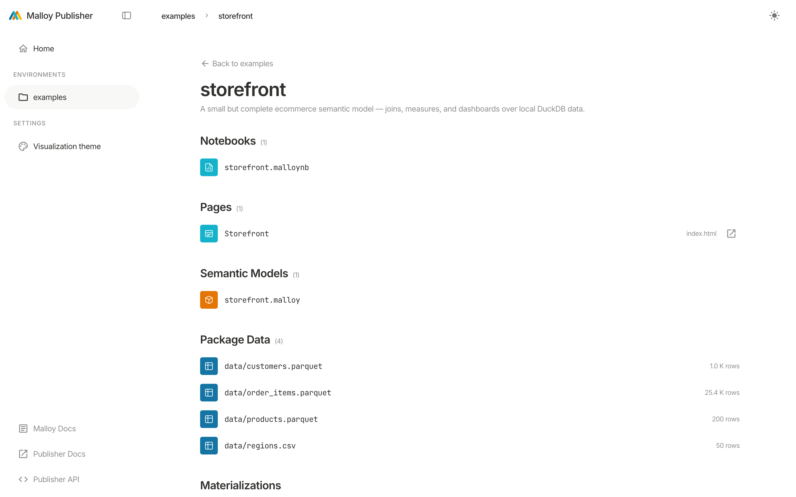
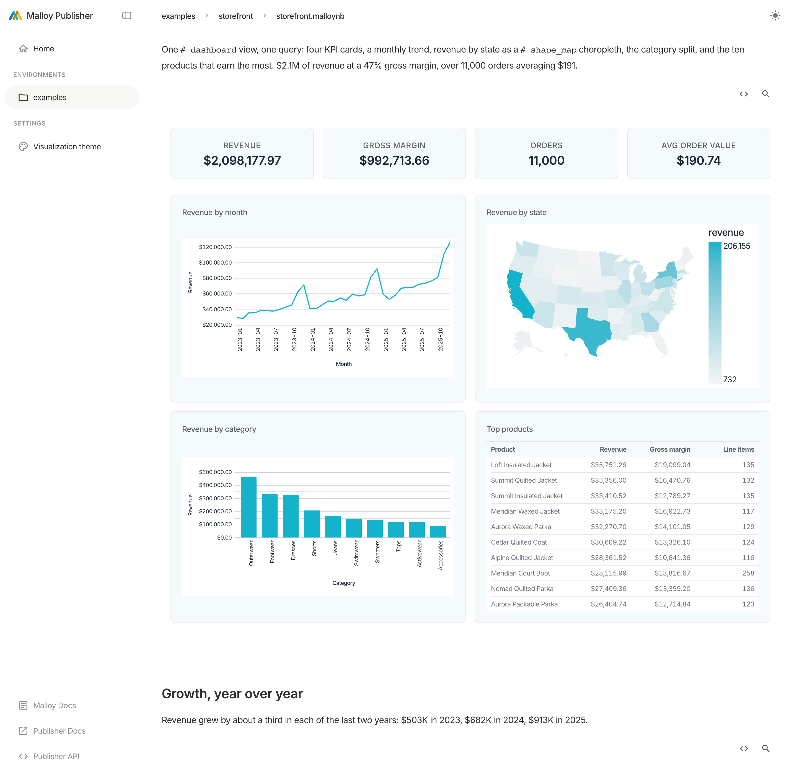
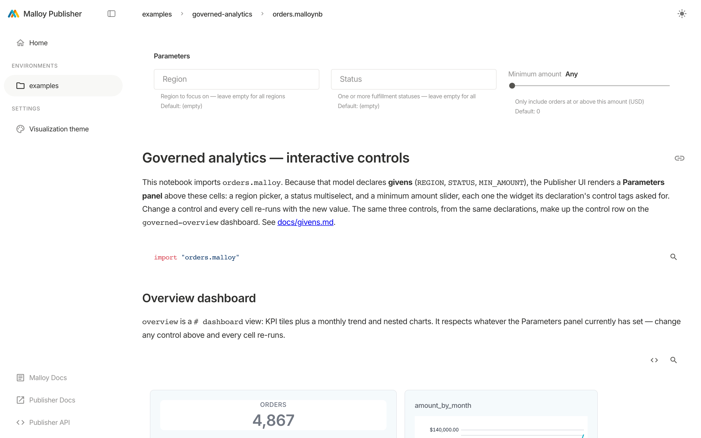

<!--
Copyright (c) Credible Data Inc.
SPDX-License-Identifier: MIT
-->

# The Publisher Console

> What this is: a tour of the **Publisher Console**, the server's built-in web UI — how the core
> constructs (environments, packages, models, sources, views, notebooks, data apps) surface in it,
> and how to navigate them. Zero code required. It's served at **http://localhost:4000** whenever
> the server is running.

The Console is the default, no-code way to explore what a Publisher deployment serves. It's built
from the [SDK](embedded-data-apps.md) but you don't need to know that — just open it and browse.
(The Console is Publisher's own UI. It is not an [HTML data app](html-data-apps.md), which is a
custom page _you_ author inside a package; see [choosing-a-surface.md](choosing-a-surface.md) for
how the three in-package surfaces relate.)

## The resource hierarchy

Everything in Publisher nests the same way, and the Console mirrors it:

```
Environment            e.g. "examples"
└── Package            e.g. "storefront"  (a versioned bundle of models + data)
    ├── Model          a .malloy file: sources, views, measures, dimensions
    │   ├── Source     a queryable entity (a table or a join graph)
    │   └── View       a saved, reusable query on a source
    ├── Notebook       a notebooks/*.malloy file (a legacy .malloynb is read, not authored): markdown + live query cells
    ├── Dashboard      a dashboards/*.malloy file: filter controls + a tiled grid
    └── Data Apps      an in-package HTML data app (the package's public/ dir)
```

The [REST and MCP APIs](api-overview.md) expose this exact hierarchy; the Console is a view onto it.

## Navigating

- **Left sidebar** — **Home**, then an **Environments** list, and a **Settings** section
  (Visualization theme). Pick an environment to see its packages; pick a package to see its models,
  notebooks, dashboards, and data apps.
- **Breadcrumbs** across the top track where you are: `environment › package › file`.
- **Theme toggle** (top-right) switches light/dark when the deployment allows it (see
  [theming.md](theming.md)).
- **Footer links** jump to the Malloy docs, these Publisher docs, and the live **Publisher API**
  explorer (see [api-overview.md](api-overview.md)).



## Two URL shapes

You'll see two path styles, and they're not interchangeable:

- **Console routes** are short — `/{environment}/{package}/{file}`, e.g.
  `http://localhost:4000/examples/storefront/storefront.malloy`. Use these to link to something
  inside the Console (a model, a dashboard, a package).
- **Resource paths** are fully qualified — `/environments/{environment}/packages/{package}/...`.
  This is the canonical form the [REST and MCP APIs](api-overview.md) use, and it's also how an
  in-package HTML data app is served, e.g.
  `http://localhost:4000/environments/examples/packages/html-data-app/`.

When in doubt, the fully-qualified `/environments/.../packages/...` form always works; the short form
is a Console convenience.

## What you can do in the Console

- **Browse a package** — one section each for **Dashboards**, **Notebooks**, **Data Apps**,
  **Semantic Models**, **Package Data** and **Materializations**, in that order, plus the package's
  `README.malloynb` rendered underneath. Data Apps is hidden when the package has none. Dashboards
  and Notebooks are hidden when empty too, unless creating is offered: then each shows an **Add**
  button and, with nothing in it, an empty row. Every kind has its own icon and its own color, so a
  row's type reads before its name does.
  The Materializations section lists the package's build runs and carries the three controls that
  change them: **Scope**, **Schedule** and **Add materialization**.
  Notebooks and dashboards are listed by title, with a notebook's path beside it and a dashboard's
  slug beside it; a notebook's title comes from its opening markdown heading unless a
  `## title="…"` or a `#" ` doc comment overrides it.
- **Build a dashboard by dragging** — every dashboard page has an **Edit** button that turns it into
  a grid you rearrange directly: drag a tile to move it, drag its right edge to resize it, set its
  view, label and chart from its own menu, add filters from the strip above. The classic dashboard-building
  feel, over a file you can still read and review — Save writes the
  `dashboards/*.malloy` back into the package ([dashboards.md](dashboards.md#editing-in-the-console)).
- **Create a dashboard or notebook** — the package page's **New** menu takes a model, the first view
  and a title, writes the file into the package (it never overwrites an existing one) and opens it in
  its editor. A host with its own record creates it there instead. It is offered when the server takes
  writes (the file goes into the package) or when a host keeps the record and can store; a workspace
  that keeps drafts in the browser beside a writable server still gets it, and writes to the package.
  It is not offered when neither route exists, on a record that cannot store, or on a pinned version
  of a package.
- **Edit a notebook** — a notebook page (a tagged `notebooks/*.malloy`, not a legacy `.malloynb`)
  has the same **Edit** button. Click a text cell to rewrite it (Done or Cmd/Ctrl+Enter keeps the change, Cancel drops it, and a
  text the file could not hold is flagged as you type), add text above or below any cell,
  remove a text cell, or drag cells into a new order (setup lines stay put, and a query stays below
  what it reads; a button that cannot act says why instead of going dead); query cells run as you edit. Save writes the file back into the package and leaves
  the rest of the file as it was: an edited cell is written in the `(markdown)` spelling, and removing
  a cell removes the comment lines directly above it. **Add query** inserts a query cell from a
  source the notebook reaches, one of its views, a chart and a caption; each query cell has a chart
  picker (Default, No chart, Line, Bar, Big value, Scatter). Big value is offered only for a view
  whose outputs are all aggregates, and a map only when the view already carries a map tag. A query
  can be added only below the setup lines (imports, givens, saved queries), and one added here is not mapped to the notebook's
  controls: it follows them only if its source reads a given as `$NAME`. Undo is cleared at Save when
  it removes a query cell that was already in the file, changes the chart of a cell whose chart line
  the editor cannot rewrite canonically (a bare `# line_chart`, or an unusual spelling), or is the
  first chart pick on an added query saved without a chart. The picker is disabled, with the reason,
  for a cell whose chart line the editor does not model (such as `# bar_chart { size=spark }`), and
  that line is left alone. On a server that does not take writes, Save is off. A notebook the editor
  cannot place cell by cell (for example two statements on one line, text after a block closer, or a
  comment straddling a cell boundary) opens read-only and says why. A save whose text declares a
  real `#(authorize)` or `#(access_filter)` gate outside prose is refused with a 400, so the editor
  opens such a file but cannot save it from the Console; gates live in the model file.
- **Explore, no code** — open a source in the [Explorer](explorer.md), the visual query builder;
  every action generates valid Malloy, and you can view the Malloy and SQL behind any result.
- **Read a notebook** — a `.malloynb` in a package renders its markdown and runs its query cells
  inline, including `# dashboard` views (KPI tiles + nested charts). The format is deprecated and
  the bundled examples no longer ship one, but the viewer stays for packages that have them.



- **Tune parameters live** — when a model declares [givens](givens.md), a dashboard over it shows a
  control row and a notebook a **Parameters panel**; change a control and every tile or cell re-runs.
  Try `http://localhost:4000/examples/governed-analytics`.



- **Open a data app** — a package's [HTML data apps](html-data-apps.md) render inside the Console
  (and can be opened standalone). Try
  `http://localhost:4000/environments/examples/packages/html-data-app/`.
- **Edit the theme** — operators can iterate colors/fonts live at `/settings/theme` (see
  [theming.md](theming.md)).

## Where to go next

- Discover data with an AI agent instead of clicking: [ai-agents.md](ai-agents.md).
- Build a custom UI: [html-data-apps.md](html-data-apps.md).
- Drive it programmatically: [api-overview.md](api-overview.md).
