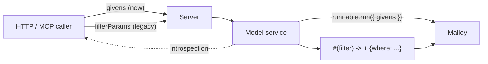

# Givens Migration — Project Plan

Adopt Malloy native [`given:`](https://docs.malloydata.dev/documentation/experiments/givens) (givens) as the going-forward way for callers to supply runtime parameters, while keeping the existing `#(filter)` + `filterParams` path working unchanged so the current customer integration doesn't break. Builds on top of upstream PR #744, which already lands the basic per-query plumbing.

## Goal

Move the publisher off our home-grown `#(filter)` + `filterParams` mechanism (referred to colloquially as "source_filters") and onto Malloy's native [givens](https://docs.malloydata.dev/documentation/experiments/givens) as the long-term contract for runtime model parameters. Existing customer integrations that POST `filterParams` against models with `#(filter)` annotations must keep working transparently across the entire deprecation window — no code changes required on their side until we coordinate removal.

## Prior art: malloydata/publisher#744

A community contributor ([@adamribaudo-ff](https://github.com/adamribaudo-ff)) has an open PR that lands the foundational query-time givens plumbing: [malloydata/publisher#744](https://github.com/malloydata/publisher/pull/744).

What that PR does:

- Adds optional `givens` to the `QueryRequest` and `CompileRequest` schemas in [api-doc.yaml](../api-doc.yaml).
- Threads `givens` through `Model.getQueryResults()` in [packages/server/src/service/model.ts](../packages/server/src/service/model.ts) and passes it to `runnable.run({ rowLimit, givens })`.
- Threads `givens` through `environment.compileSource()` in [packages/server/src/service/environment.ts](../packages/server/src/service/environment.ts) to `queryMaterializer.getSQL({ givens })`.
- Wires `givens` through [packages/server/src/controller/query.controller.ts](../packages/server/src/controller/query.controller.ts) and [packages/server/src/controller/compile.controller.ts](../packages/server/src/controller/compile.controller.ts).
- Extracts `req.body.givens` in [packages/server/src/server.ts](../packages/server/src/server.ts) on both POST endpoints.
- Adds `givens` to the `malloy_executeQuery` Zod schema in [packages/server/src/mcp/tools/execute_query_tool.ts](../packages/server/src/mcp/tools/execute_query_tool.ts) and passes it at both `getQueryResults()` call sites.
- Regenerates [packages/server/src/api.ts](../packages/server/src/api.ts).

What PR #744 explicitly does **not** do (per its own scope statement, which is our hand-off list):

- No notebook-cell givens (the endpoint is GET-based; deferred).
- No givens metadata / introspection endpoint — i.e., the API doesn't yet tell callers what givens a model declares.
- No `givensPath` / `malloy-config.json` runtime defaults.
- No `finalizeGivens` security enforcement.
- No `Runtime`-constructor givens.
- No deprecation work on `#(filter)` / `filterParams`.

## Ground truth in this repo

The "source_filters" feature today is:

- Annotation parser: [packages/server/src/service/filter.ts](../packages/server/src/service/filter.ts) — parses `#(filter) name=… dimension=… type=[equal|in|like|greater_than|less_than]` and emits `+ {where: …}` Malloy refinements.
- Wiring through query/notebook execution: [packages/server/src/service/model.ts](../packages/server/src/service/model.ts) (`getQueryResults` line ~339, `executeNotebookCell` line ~567, `getSources` filter parsing line ~758).
- HTTP entry points: `filterParams` body field and `bypassFilters` toggle in [packages/server/src/server.ts](../packages/server/src/server.ts) (line 1164) and the legacy [packages/server/src/server-old.ts](../packages/server/src/server-old.ts) (line 799); `filter_params` / `bypass_filters` query params on the notebook-cell GET (server.ts line 1085).
- API schema: `Filter`, `filterParams`, `bypassFilters` in [api-doc.yaml](../api-doc.yaml) (lines 2012, 2720, 2799).
- Controllers: [packages/server/src/controller/query.controller.ts](../packages/server/src/controller/query.controller.ts), [packages/server/src/controller/model.controller.ts](../packages/server/src/controller/model.controller.ts).
- MCP tool: `filterParams` in [packages/server/src/mcp/tools/execute_query_tool.ts](../packages/server/src/mcp/tools/execute_query_tool.ts).
- SDK: filter widgets and `buildFilterParams` in [packages/sdk/src/components/Notebook/Notebook.tsx](../packages/sdk/src/components/Notebook/Notebook.tsx) (line ~248) and [packages/sdk/src/components/filter/](../packages/sdk/src/components/filter/).
- Docs: [docs/filters.md](filters.md), with a mention in [docs/ai-agents.md](ai-agents.md).
- Tests: [packages/server/src/service/filter.spec.ts](../packages/server/src/service/filter.spec.ts), [packages/server/src/service/filter_integration.spec.ts](../packages/server/src/service/filter_integration.spec.ts).

## Scope decisions baked in

- Keep `#(filter)` annotations + `filterParams` HTTP field + `sourceFilters` body alias working unchanged for the customer's existing models. No removal in this project.
- New `givens` is additive: new request field (already in #744), new schema, new SDK hook. Models that don't declare `given:` are unaffected.
- A model that mixes both (`#(filter)` + `given:`) is supported. Both injection paths run independently. Document it but discourage it.
- Internal `Filter*` types stay where they are; we add a parallel `Given*` track and let them coexist. No big rename.
- Use Malloy's native API end-to-end (`.run({ givens })`, `.getSQL({ givens })`, `Model.givens`). No publisher-side shim, no parallel `+ {where: …}` translation for givens. PR #744 already commits us to that direction.

## Architecture sketch

The two paths run independently and compose. Models that adopt `given:` get the native path; models still using `#(filter)` keep the WHERE-injection path; models that use both get both.

## Recommended PR breakdown

Each item below is a self-contained PR that ships independently. Land in order; flip the deprecation copy in the docs PR.

### PR 1 — Review and land malloydata/publisher#744

Day 1 task. The community-authored PR is fully scoped, well-tested, and unblocks every other PR below.

- Review [malloydata/publisher#744](https://github.com/malloydata/publisher/pull/744) end-to-end.
- Pull the branch, run `bun run build` + the server test suite locally, confirm the 7 pre-existing `DuckLakeCatalog` failures are unrelated.
- Smoke-test against a customer-shaped Malloy model that declares a `given:` block. Verify both endpoints (`POST /…/query`, `POST /…/compile`) and the MCP `malloy_executeQuery` tool accept `givens` and the value lands in the resulting SQL.
- Drive review comments to resolution, get approvals, and merge.

If the PR has stalled, it's fine to graft the commits onto a publisher-owned branch and finish review there — no need to rewrite from scratch. Credit the original author in commit messages.

### PR 2 — Givens introspection

Right now a caller sending `givens` has to know out-of-band what givens the model declares. Surface that.

- [api-doc.yaml](../api-doc.yaml): add a `Given` component matching the [`Given` shape in the docs](https://docs.malloydata.dev/documentation/experiments/givens#introspection) — `name`, `type` (Malloy type), `default` (optional), `location`, `annotations`. Add `givens: Given[]` to the `CompiledModel` and `Source` schemas.
- [packages/server/src/service/model.ts](../packages/server/src/service/model.ts): in `Model.create`, after compilation, read declared givens from Malloy's `Model.givens` (`ReadonlyMap<string, Given>`). Cache them next to the existing `filterMap` (~line 100). Surface them in `getStandardModel()` (~line 496) and in the `Source` shape inside `getSources()` (~line 758).
- Tests: extend [packages/server/src/service/model.spec.ts](../packages/server/src/service/model.spec.ts) with a fixture model that declares a couple of givens; assert they show up on the compiled-model response.

### PR 3 — Notebook-cell givens

PR #744 explicitly defers this because the notebook-cell endpoint is GET. Symmetric with how `filter_params` is already handled today.

- [api-doc.yaml](../api-doc.yaml): add a `givens` query param (URL-encoded JSON) to the notebook-cell GET endpoint, parallel to the existing `filter_params` param at line ~2012.
- [packages/server/src/server.ts](../packages/server/src/server.ts) line ~1085: parse `req.query.givens` analogous to `filter_params`. Same JSON-parse error handling (return 400 on bad JSON).
- [packages/server/src/controller/model.controller.ts](../packages/server/src/controller/model.controller.ts) `executeNotebookCell` (line ~96): accept `givens?: Record<string, unknown>` and pass to `model.executeNotebookCell(...)`.
- [packages/server/src/service/model.ts](../packages/server/src/service/model.ts) `executeNotebookCell` (line ~567): accept `givens?` and pass to `runnableToExecute.run({ rowLimit, givens })` (line ~634). The existing filter-injection block above it is unchanged.
- Skip [server-old.ts](../packages/server/src/server-old.ts) — already legacy.
- Tests: extend [packages/server/src/service/filter_integration.spec.ts](../packages/server/src/service/filter_integration.spec.ts) with a notebook-cell case that uses givens.

### PR 4 — SDK introspection + UI

- New hook `packages/sdk/src/hooks/useModelGivens.ts` that reads `givens` off the compiled-model response (added in PR 2).
- Notebook integration in [packages/sdk/src/components/Notebook/Notebook.tsx](../packages/sdk/src/components/Notebook/Notebook.tsx):
  - Add `buildGivens(...)` next to `buildFilterParams` (line ~248). Emits the JS shapes from the [Accepted JS shapes table](https://docs.malloydata.dev/documentation/experiments/givens#accepted-js-shapes).
  - When the model declares givens, render parameter inputs (start with: text input for string, number input for number, checkbox for boolean, date picker for date, multi-select for arrays). Reuse styling from [packages/sdk/src/components/filter/DimensionFilter.tsx](../packages/sdk/src/components/filter/DimensionFilter.tsx).
  - Send both `givens` and `filterParams` through `executeNotebookCell` / model-query calls when both are present.
- Don't touch existing filter widgets — those keep working.
- New API client method on the notebooks client to pass `givens` through to the GET endpoint added in PR 3.

### PR 5 — Docs + deprecation messaging

- Rewrite [docs/filters.md](filters.md) into `docs/givens.md` as the new canonical doc. Leave a one-line "moved" note + redirect at the top of `filters.md`.
- Migration recipe section. Map `#(filter)` types to `given:` patterns:
  - `type=in` on string → `given: X :: string[]` + `where: dim in $X`.
  - `type=equal` → `given: X :: string is null` + `where: dim = $X`.
  - `type=like` → not directly expressible; recommend keeping `#(filter)` for these until we add a `like` story or use `filter<string>`.
  - `type=greater_than` / `less_than` on date → `given: X :: date` + `where: dim > $X`.
- [docs/ai-agents.md](ai-agents.md): mention `givens` next to `filterParams`.
- [RELEASE_NOTES.md](../RELEASE_NOTES.md): add an entry — "Givens are now the recommended way to supply runtime parameters; `filterParams` and `#(filter)` annotations are deprecated and will be removed in a future release after a coordinated migration with current users."
- Mark `Filter`, `filterParams`, `filter_params`, `bypass_filters`, `bypassFilters` with `deprecated: true` in [api-doc.yaml](../api-doc.yaml). Description text links to `docs/givens.md`.
- Surface deprecation at runtime: when a model uses `#(filter)`, log once per model + add `Deprecation: true` HTTP response header on the affected endpoints. Don't break clients.

### PR 6 — End-to-end validation

- Create a sample model in `examples/` (or a fixture) that uses `given:` only, mirroring the [auto_recalls](filters.md) shape from current docs. Useful as a customer-migration demo too.
- Add a Playwright test under [e2e/tests/](../e2e/tests/) exercising notebook-cell execution with givens via the new SDK widgets.
- Smoke-test the customer's existing `#(filter)`+`filterParams` integration shape continues to pass — extend [packages/server/src/service/filter_integration.spec.ts](../packages/server/src/service/filter_integration.spec.ts) with a regression case that hits the legacy code paths after the new code paths exist.
- Bonus: a fixture model that uses **both** `given:` and `#(filter)` to confirm they compose.

## Future (out of scope for this project)

- Per-runtime defaults: `givensPath` in [packages/server/publisher.config.json](../packages/server/publisher.config.json) and `Runtime`-constructor givens. Most useful for multi-tenant deployments.
- `finalizeGivens` security primitive — only meaningful once per-runtime givens exist, and most useful for RLAC.
- Row-level access control via `inline` givens.
- Removing `#(filter)` + `filterParams` — coordinate with the customer on a date; one PR to delete the parser, the legacy fields, and the deprecation surface.

## Definition of done

- New `givens` request field works end-to-end on `POST /…/query`, `POST /…/compile`, the notebook-cell GET, and the MCP `malloy_executeQuery` tool, against a model that declares `given:` blocks.
- A caller can introspect the givens a model declares via the compiled-model response.
- The notebook UI can render an input for each declared given and send the values through.
- Existing customer integration sending `filterParams` against a model with `#(filter)` annotations passes the regression suite unchanged.
- A model that uses both runs both injection paths and matches expected results.
- Docs, MCP, SDK, and OpenAPI are consistent. Deprecation surface is wired but doesn't break callers.
- A short migration recipe lives in `docs/givens.md`.
