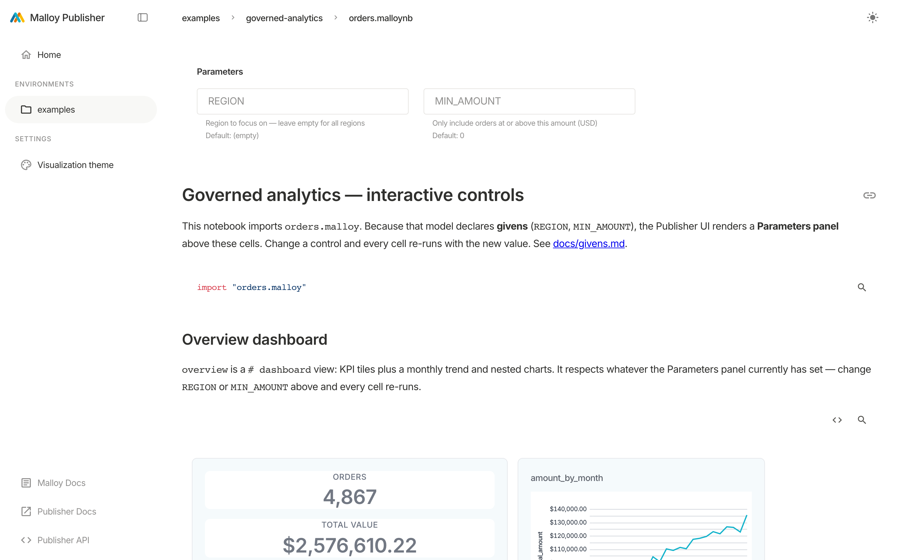
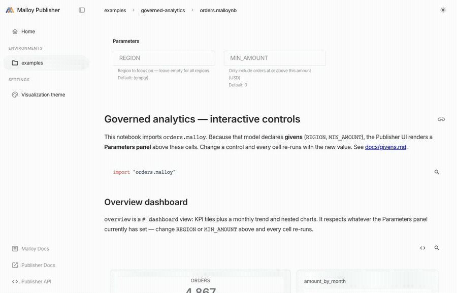

# Givens (Runtime Parameters)

> What this is: the base runtime-parameter mechanism that powers notebook filter controls,
> [row-level access](row-level-access.md), and [`#(authorize)`](authorize.md) gates.
> Runnable example: [examples/governed-analytics](../examples/governed-analytics).

Givens are Malloy's native mechanism for declaring runtime parameters on a model — one typed value a caller supplies at query time — and the base primitive Publisher builds several features on top of. A model declares a `given:`, queries reference it as `$name`, and the caller supplies a value (or the declared default applies). Publisher introspects declared givens, exposes them through the API, renders inputs in the notebook UI, and forwards values to Malloy's runtime.

For the authoritative Malloy reference (semantics, supported types, scoping rules), see [Malloy: Givens](https://docs.malloydata.dev/documentation/experiments/givens).

## What givens power

Givens are deliberately simple; the leverage is in what they enable. Jump to the application you care about:

| Application | What it does | Where |
| --- | --- | --- |
| **Interactive filters** | Each declared given is a typed input that becomes a control — text box, multi-select, date picker, checkbox — in the notebook UI; changing one re-runs the cells. | [Notebook UI](#notebook-ui), below |
| **Row-level filtering & access control** | A source scopes its own rows by a caller-supplied given (e.g. per-tenant), optionally made mandatory with a gate so callers can't opt out. | [Row-level access](row-level-access.md) |
| **Source authorization** | `#(authorize)` boolean expressions over givens allow or deny access to a whole source (HTTP 403). | [Authorize](authorize.md) |

> **Here for access control?** Givens are just the values your gates read. Skim [Declaring Givens](#declaring-givens) for the syntax, then go to [Authorize](authorize.md) to allow/deny a whole source, or [Row-level access](row-level-access.md) to scope which rows a caller sees. Both enforce policy only behind a trusted tier that sets givens from verified identity — givens are caller-asserted.

> **Runnable example.** [`examples/governed-analytics`](../examples/governed-analytics) is one small
> package that exercises all three applications. It declares filter-control givens in
> [`orders.malloy`](../examples/governed-analytics/orders.malloy) and renders their controls in
> [`orders.malloynb`](../examples/governed-analytics/orders.malloynb); the same package backs the
> [authorize](authorize.md) and [row-level](row-level-access.md) docs.

## Declaring Givens

Givens are an experimental Malloy feature. Enable them once at the top of the model, then declare each given as a top-level statement before the source that uses it:

```malloy
##! experimental.givens

#(description="Product category to spotlight")
given: category :: string is 'Footwear'

#(description="Minimum retail price to include (USD)")
given: min_price :: number is 0

source: spotlight_products is duckdb.table('data/products.parquet') extend {
  primary_key: product_id
  measure: product_count is count()

  view: by_name is {
    where: category = $category and retail_price >= $min_price
    select: name, brand, retail_price
    order_by: retail_price desc
    limit: 10
  }
}
```

A given has a name, a Malloy type, and an optional default. Queries reference the value with `$name`. When a caller supplies an override, Malloy substitutes the supplied value; otherwise the declared default applies.

### Supported Types

| Type        | Example declaration                                  | Use case                             |
| ----------- | ---------------------------------------------------- | ------------------------------------ |
| `string`    | `given: category :: string is 'Footwear'`            | Exact-match dimension values         |
| `string[]`  | `given: categories :: string[] is []`                | Multi-value `in` filters             |
| `number`    | `given: min_price :: number is 0`                    | Numeric ranges, thresholds           |
| `boolean`   | `given: include_returns :: boolean is false`         | Toggle predicates                    |
| `date`      | `given: cutoff :: date is @2024-01-01`               | Date thresholds                      |
| `timestamp` | `given: since :: timestamp is @2024-01-01 00:00:00`  | Timestamp thresholds                 |
| `filter<T>` | `given: REGION :: filter<string> is f''`             | First-class Malloy filter expression |

### Annotations

Givens accept the standard Malloy `#(...)` annotation syntax. Publisher surfaces annotations on introspection and uses the `description="..."` form as helper text in the notebook UI:

```malloy
#(description="Earliest report date to include")
given: report_after :: date is @2024-01-01
```

## How It Works

When a query executes, Publisher forwards declared and supplied given values to Malloy's runtime:

1. Caller supplies givens as a `{ name: value }` map (request body, query string, or MCP tool argument).
2. Publisher passes the map to Malloy via `runnable.run({ givens })` (query execution) or `queryMaterializer.getSQL({ givens })` (compile-to-SQL).
3. Malloy substitutes the values inline when evaluating `$name` references.
4. Unset givens fall back to their declared defaults.

There is no Publisher-side query rewriting (no `+ { where: ... }` refinement). The substitution happens entirely inside Malloy.

### Accepted JS Shapes

Givens are typed in Malloy, but the wire format is JSON. The mapping is:

| Malloy type      | JS / JSON shape                                              |
| ---------------- | ------------------------------------------------------------ |
| `string`         | `"Footwear"`                                                  |
| `string[]`       | `["Footwear", "Outerwear"]`                                   |
| `number`         | `42`                                                          |
| `boolean`        | `true` / `false`                                              |
| `date`           | `"2024-01-01"` (ISO date string)                              |
| `timestamp`      | `"2024-01-01T12:00:00Z"` (ISO timestamp)                      |
| `filter<string>` | `"us-east, us-west"` (Malloy filter syntax as a string)       |

See the [Malloy accepted JS shapes table](https://docs.malloydata.dev/documentation/experiments/givens#accepted-js-shapes) for the full list.

## API

### Introspection

Givens declared on a model appear on `CompiledModel.givens` and on each `Source.givens` in the API response. For the bundled [`governed-analytics/orders.malloy`](../examples/governed-analytics/orders.malloy):

```json
{
  "givens": [
    {
      "name": "REGION",
      "type": "filter<string>",
      "annotations": [
        "#(description=\"Region to focus on — leave empty for all regions\")"
      ]
    },
    {
      "name": "MIN_AMOUNT",
      "type": "number",
      "annotations": ["#(description=\"Only include orders at or above this amount (USD)\")"]
    }
  ]
}
```

Callers use this metadata to render input widgets without out-of-band knowledge of the model.

### REST Endpoints

**Execute a model query** — `POST /api/v0/environments/:env/packages/:package/models/:model/query`

```json
{
  "query": "run: sales -> by_region",
  "givens": {
    "REGION": "us-east",
    "MIN_AMOUNT": 500
  }
}
```

**Compile Malloy source** — `POST /api/v0/environments/:env/packages/:package/models/:model/compile`

```json
{
  "source": "run: sales -> by_region",
  "includeSql": true,
  "givens": { "REGION": "us-east" }
}
```

**Execute a notebook cell** — `GET /api/v0/environments/:env/packages/:package/notebooks/:path/cells/:index`

Query parameter `givens` accepts URL-encoded JSON:

```
?givens=%7B%22REGION%22%3A%22us-east%22%2C%22MIN_AMOUNT%22%3A500%7D
```

### MCP Tool

The `malloy_executeQuery` tool accepts a `givens` parameter on the same wire shape:

```json
{
  "environmentName": "examples",
  "packageName": "governed-analytics",
  "modelPath": "orders.malloy",
  "query": "run: sales -> by_region",
  "givens": {
    "REGION": "us-east"
  }
}
```

## Notebook UI

This is the **interactive-filters** application of givens: each given is a typed input that becomes a control, chosen automatically from its Malloy type. Declare the parameters once on the model and the UI gives your users the controls for them, with no per-notebook wiring. When a notebook's model declares givens, the Publisher UI automatically renders a Parameters panel above the notebook content, one widget per given:



Change a control and every cell re-runs with the new value — no reload, no rewiring:



The example above ships in Publisher's default `examples` environment — open [`examples/governed-analytics/orders.malloynb`](../examples/governed-analytics/) to try it.

| Malloy type                        | Widget                                     |
| ---------------------------------- | ------------------------------------------ |
| `string`, `filter<string>`         | Text input with × clear                    |
| `string[]`                         | Multi-value autocomplete with chip removal |
| `number`                           | Numeric input with × clear                 |
| `boolean`                          | Checkbox                                   |
| `date`, `timestamp`, `timestamptz` | Date picker with native clear              |

`#(description="...")` annotations render as MUI helper text beneath the input. A **Reset** button appears next to the "Parameters" heading whenever any input has a non-default value.

Setting a value re-executes all notebook cells with the new givens applied.

## Worked Example

The bundled `examples` environment ships [`governed-analytics`](../examples/governed-analytics), whose [`orders.malloy`](../examples/governed-analytics/orders.malloy) declares `REGION` and `MIN_AMOUNT` givens and [`orders.malloynb`](../examples/governed-analytics/orders.malloynb) runs a dashboard over them. Open the notebook in the Publisher UI:

```
http://localhost:4000/examples/governed-analytics/orders.malloynb
```

The Parameters panel auto-renders above the cells with the declared defaults; change `REGION` (or `MIN_AMOUNT`) and every cell re-executes with the new value.
