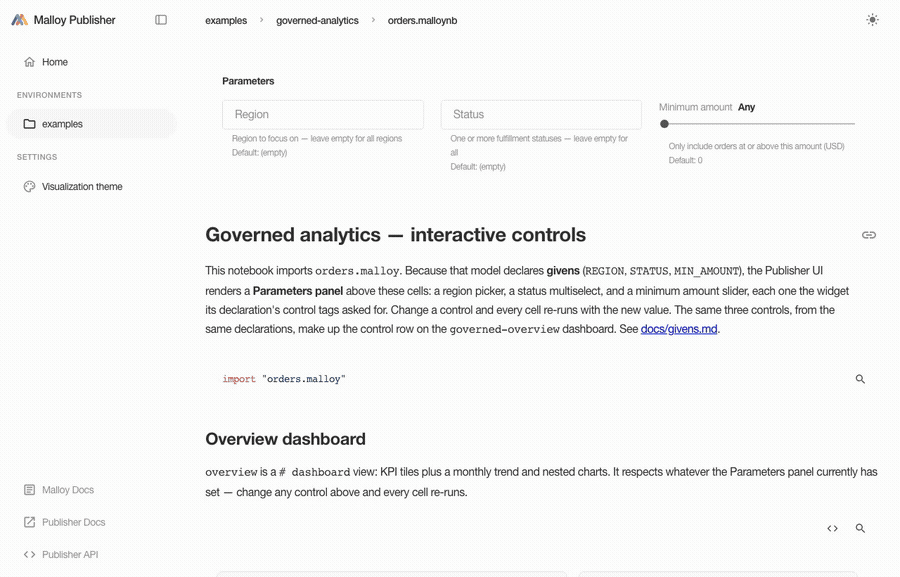

# Givens (Runtime Parameters)

> What this is: the base runtime-parameter mechanism that powers notebook filter controls,
> [row-level access](row-level-access.md), and [`#(authorize)`](authorize.md) gates.
> Runnable example: [examples/governed-analytics](../examples/governed-analytics).

Givens are Malloy's native mechanism for declaring runtime parameters on a model — one typed value a caller supplies at query time — and the base primitive Publisher builds several features on top of. A model declares a `given:`, queries reference it as `$name`, and the caller supplies a value (or the declared default applies). Publisher introspects declared givens, exposes them through the API, renders inputs in the notebook UI, and forwards values to Malloy's runtime.

For the authoritative Malloy reference (semantics, supported types, scoping rules), see [Malloy: Givens](https://docs.malloydata.dev/documentation/experiments/givens).

## What givens power

Givens are deliberately simple; the leverage is in what they enable. Jump to the application you care about:

| Application | What it does | Where |
| --- | --- | --- |
| **Interactive filters** | Each declared given is a typed input that becomes a control — text box, multi-select, date picker, checkbox — in the notebook UI; changing one re-runs the cells. | [Notebook UI](#notebook-ui), below |
| **Row-level filtering & access control** | A source scopes its own rows by a caller-supplied given (e.g. per-tenant), optionally made mandatory with a gate so callers can't opt out. | [Row-level access](row-level-access.md) |
| **Source authorization** | `#(authorize)` boolean expressions over givens allow or deny access to a whole source (HTTP 403). | [Authorize](authorize.md) |

> **Here for access control?** Givens are just the values your gates read. Skim [Declaring Givens](#declaring-givens) for the syntax, then go to [Authorize](authorize.md) to allow/deny a whole source, or [Row-level access](row-level-access.md) to scope which rows a caller sees. Both enforce policy only behind a trusted tier that sets givens from verified identity — givens are caller-asserted.

> **Runnable example.** [`examples/governed-analytics`](../examples/governed-analytics) is one small
> package that exercises all three applications. It declares filter-control givens in
> [`orders.malloy`](../examples/governed-analytics/orders.malloy) and renders their controls in
> [`orders.malloynb`](../examples/governed-analytics/orders.malloynb); the same package backs the
> [authorize](authorize.md) and [row-level](row-level-access.md) docs.

## Declaring Givens

Givens are an experimental Malloy feature. Enable them once at the top of the model, then declare each given as a top-level statement before the source that uses it:

```malloy
##! experimental.givens

#(description="Product category to spotlight")
given: category :: string is 'Footwear'

#(description="Minimum retail price to include (USD)")
given: min_price :: number is 0

source: spotlight_products is duckdb.table('data/products.parquet') extend {
  primary_key: product_id
  measure: product_count is count()

  view: by_name is {
    where: category = $category and retail_price >= $min_price
    select: name, brand, retail_price
    order_by: retail_price desc
    limit: 10
  }
}
```

A given has a name, a Malloy type, and an optional default. Queries reference the value with `$name`. When a caller supplies an override, Malloy substitutes the supplied value; otherwise the declared default applies.

### Supported Types

| Type          | Example declaration                                            | Use case                             |
| ------------- | -------------------------------------------------------------- | ------------------------------------ |
| `string`      | `given: category :: string is 'Footwear'`                      | Exact-match dimension values         |
| `number`      | `given: min_price :: number is 0`                              | Numeric ranges, thresholds           |
| `boolean`     | `given: include_returns :: boolean is false`                   | Toggle predicates                    |
| `date`        | `given: cutoff :: date is @2024-01-01`                         | Date thresholds                      |
| `timestamp`   | `given: since :: timestamp is @2024-01-01 00:00:00`            | Timestamp thresholds                 |
| `timestamptz` | `given: since :: timestamptz is @2024-01-01 00:00:00::timestamptz` | Zone-aware timestamp thresholds  |
| `filter<T>`   | `given: REGION :: filter<string> is f''`                       | First-class Malloy filter expression |

These are the scalar types Malloy's grammar accepts in a `given:` declaration. **Array and record
givens are not among them**: `given: categories :: string[] is []` is a compile error
(`unexpected ']'`), not an unsupported-but-tolerated form. To let a caller pass several values, use
`filter<string>` and send a Malloy filter expression such as `Footwear, Outerwear`.

The `timestamptz` cast is not decoration. A bare `@2024-01-01 00:00:00` literal is a `timestamp`,
so using it as a `timestamptz` default fails to compile with a type-mismatch error. Declaring the
given with no default at all also works.

### Annotations

Givens accept the standard Malloy `#(...)` annotation syntax. Publisher surfaces annotations on introspection and uses the `description="..."` form as helper text in the notebook UI:

```malloy
#(description="Earliest report date to include")
given: report_after :: date is @2024-01-01
```

**Expect a `malformed-route` warning on that line, and ignore it.** Malloy reads an annotation's
route from the sigil to the first whitespace, so a description of more than one word makes the
route `#(description="Earliest` and the compiler warns that it is not well formed. The annotation
still reaches the API and still renders as helper text; the warning is cosmetic.

It is called out here because the obvious ways to silence it are all worse, and each was tried
against the compiler:

| Instead of the form above | Compiles | Helper text |
| --- | --- | --- |
| `#(doc) Earliest report date to include` | clean | renders as `doc) Earliest report date to include` |
| `#(description) Earliest report date to include` | clean | renders as `description) Earliest report date to include` |
| `# description="Earliest report date to include"` (a tag, note the space) | clean | nothing renders: plain `#` tags are Malloy's reserved namespace and are filtered out before the annotation list reaches a client |

So keep `#(description="…")`.

## How It Works

When a query executes, Publisher forwards declared and supplied given values to Malloy's runtime:

1. Caller supplies givens as a `{ name: value }` map (request body, query string, or MCP tool argument).
2. Publisher passes the map to Malloy via `runnable.run({ givens })` (query execution) or `queryMaterializer.getSQL({ givens })` (compile-to-SQL).
3. Malloy substitutes the values inline when evaluating `$name` references.
4. Unset givens fall back to their declared defaults.

There is no Publisher-side query rewriting (no `+ { where: ... }` refinement). The substitution happens entirely inside Malloy.

### Accepted JS Shapes

Givens are typed in Malloy, but the wire format is JSON. The mapping is:

| Malloy type      | JS / JSON shape                                              |
| ---------------- | ------------------------------------------------------------ |
| `string`         | `"Footwear"`                                                  |
| `number`         | `42`                                                          |
| `boolean`        | `true` / `false`                                              |
| `date`           | `"2024-01-01"` (ISO date string)                              |
| `timestamp`      | `"2024-01-01T12:00:00Z"` (ISO timestamp)                      |
| `filter<string>` | `"us-east, us-west"` (Malloy filter syntax as a string)       |

See the [Malloy accepted JS shapes table](https://docs.malloydata.dev/documentation/experiments/givens#accepted-js-shapes) for the full list.

### Validation and errors

Malloy validates supplied givens when it prepares the query: an unknown given name (a typo, or a name the model doesn't declare) and a value that doesn't fit the given's declared type both throw a `runtime-given-*` error, which the publisher maps to a **400** with Malloy's message (unknown names come with a "did you mean?" hint).

There is one exception. On a source guarded by `#(authorize)`, the authorize check runs first and binds the full supplied givens map, and it fails closed: a bad given (unknown name *or* wrong-typed value) makes that check throw and the gate denies, so the request returns **403** rather than 400. That looks like access denied, not validation. If a gated query returns 403 unexpectedly, check the given names and values against the model before assuming it's a permission problem.

The `/compile` endpoint (with `includeSql: true`) follows the same handling: a bad given is surfaced rather than silently omitting `sql`.

## API

### Introspection

Givens declared on a model appear on `CompiledModel.givens` and on each `Source.givens` in the API response. For the bundled [`governed-analytics/orders.malloy`](../examples/governed-analytics/orders.malloy):

```json
{
  "givens": [
    {
      "name": "REGION",
      "type": "filter<string>",
      "annotations": [
        "#(description=\"Region to focus on — leave empty for all regions\")"
      ]
    },
    {
      "name": "MIN_AMOUNT",
      "type": "number",
      "annotations": ["#(description=\"Only include orders at or above this amount (USD)\")"]
    }
  ]
}
```

Callers use this metadata to render input widgets without out-of-band knowledge of the model.

### REST Endpoints

**Execute a model query** — `POST /api/v0/environments/:env/packages/:package/models/:model/query`

```json
{
  "query": "run: sales -> by_region",
  "givens": {
    "REGION": "us-east",
    "MIN_AMOUNT": 500
  }
}
```

**Compile Malloy source** — `POST /api/v0/environments/:env/packages/:package/models/:model/compile`

```json
{
  "source": "run: sales -> by_region",
  "includeSql": true,
  "givens": { "REGION": "us-east" }
}
```

**Execute a notebook cell** — `GET /api/v0/environments/:env/packages/:package/notebooks/:path/cells/:index`

Query parameter `givens` accepts URL-encoded JSON:

```
?givens=%7B%22REGION%22%3A%22us-east%22%2C%22MIN_AMOUNT%22%3A500%7D
```

### MCP Tool

The `malloy_executeQuery` tool accepts a `givens` parameter on the same wire shape:

```json
{
  "environmentName": "examples",
  "packageName": "governed-analytics",
  "modelPath": "orders.malloy",
  "query": "run: sales -> by_region",
  "givens": {
    "REGION": "us-east"
  }
}
```

## Notebook UI

This is the **interactive-filters** application of givens: each given is a typed input that becomes a control, chosen automatically from its Malloy type. Declare the parameters once on the model and the UI gives your users the controls for them, with no per-notebook wiring. When a notebook's model declares givens, the Publisher UI automatically renders a Parameters panel above the notebook content, one widget per given:


Change a control and every cell re-runs with the new value, no reload and no rewiring:



The example above ships in Publisher's default `examples` environment — open [`examples/governed-analytics/orders.malloynb`](../examples/governed-analytics/) to try it.

| Malloy type                          | Widget                        |
| ------------------------------------ | ----------------------------- |
| `number`                             | Numeric input with × clear    |
| `boolean`                            | Checkbox                      |
| `date`, `timestamp`, `timestamptz`   | Date picker with native clear |
| `string`, `filter<…>`, anything else | Text input with × clear       |

The UI can also render a slider for a `filter<number>` lower bound and a
single- or multi-pick dropdown for a `filter<string>`, driven by the `label`,
`control`, `rangeMin`, `rangeMax` and `suggest` fields on a given. Those fields
are specified but **no endpoint populates them yet**, so a model cannot ask for
either control today and every given falls to the table above. When they do
arrive, a slider or dropdown appears only where it can represent the filter
faithfully: a `filter<number>` holding a range or a negation, or a
`filter<string>` holding anything but a plain list of values, keeps the text box
rather than showing a control that would rewrite the author's filter on first
use.

`#(description="...")` annotations render as MUI helper text beneath the input. A
**Reset** button appears next to the "Parameters" heading whenever any given has a
value set, whether it was typed, picked, or carried in by the URL. A given left
unset does not count. Whether an empty parameter (`?REGION=`) counts depends on
the type: for a `string` or a `filter<…>` the empty string is a real value (the
empty filter, i.e. "All"), so it counts; for a `number`, `boolean` or date type
there is no empty value to mean, so it reads as unset and does not.

Reset clears every control, and a cleared given is left out of the request
entirely rather than sent as an empty value. A given declared with a default
then runs on that default. For one declared **without** a default, what an
omitted given does is a property of the model, not of Reset: see
[Row-level access](row-level-access.md) for the case where that matters most.

Reset restores a notebook's own starting values where a notebook has them, but
nothing populates those yet, so today clearing is all it does. Either way it is
not "back to how I found it": a notebook opened from a shared link starts on the
link's values, and Reset discards those too.

## Coming from `#(filter)`

The notebook's Filters panel is gone, so a model that relied on `#(filter)` or
`##(filters)` annotations is no longer filterable from a notebook, and one with
a `required` filter cannot be satisfied there at all. The annotations still work
everywhere else: the REST `filterParams` parameter and the server-side
enforcement are unchanged. This is the UI half of the migration.

There is no automatic conversion, because the two mechanisms are different
shapes. A `#(filter)` annotation marks an existing dimension as filterable and
the server builds the `where:` clause. A given is a declared parameter that the
model itself uses, so you write the `where:` yourself and gain control over what
it means.

A source annotated like this:

```malloy
#(filter) dimension=region type=in
#(filter) dimension=amount type=gte required
source: sales is orders_base extend { }
```

becomes two givens and one `where:`:

```malloy
##! experimental.givens

#(description="Region to focus on — leave empty for all regions")
given: REGION :: filter<string> is f''

#(description="Only include orders at or above this amount (USD)")
given: MIN_AMOUNT :: number is 0

source: sales is orders_base extend {
  where: region ~ $REGION and amount >= $MIN_AMOUNT
}
```

Three things worth knowing while converting:

- **`type=in` and `type=equal` become `filter<string>`**, whose value is filter
  syntax rather than a bare value, so one control can carry several values. The
  empty filter `f''` is the natural "no constraint" starting point.
- **A `required` filter has no direct equivalent.** A given always has a value,
  its default, so "the reader must choose" is expressed by picking a default
  that is safe to run, or by using `#(authorize)` where the requirement is
  really about access rather than about filtering. See
  [Row-level access](row-level-access.md).
- **The name is the reader-facing label**, so it appears in the Parameters panel
  and in the URL. `#(description=…)` supplies the helper text underneath.

### Parameters live in the URL

A notebook's parameters are part of its address. Change a control and the URL
gains `?REGION=West`; open that URL and the notebook runs with that value on its
first pass, so a filtered notebook can be linked, bookmarked, and shared.

Changing a control replaces the address rather than adding a history entry, so
Back leaves the notebook instead of walking through every value you tried.

Only the names the model declares are read from the URL, and only those are
written back, so an unrelated query parameter on the page (a tracking tag, say)
is left alone and cannot break the notebook.

A `filter<…>` given is held in the URL in Malloy's own filter syntax, escaped by
the filter parser itself, so a picked value containing a comma, a leading `-`, or
a `%` matches only itself rather than being read as syntax. A plain `string`,
`number`, `boolean` or date given is held as its own literal value.

Two things to know if you hand-edit the query string rather than letting the
controls write it.

**An empty value means "unset" for the types that have no empty value.**
`?MIN_AMOUNT=` on a `number`, `boolean` or date given leaves that given out of
the request entirely, so it behaves exactly as if you had never named it: a
given with a default runs on its default, and one without a default is simply
unset (see [Row-level access](row-level-access.md) for where that matters).
For a `string` or `filter<…>` given the empty string is a value you can mean, so
`?REGION=` keeps it and sends it.

**A `+` in a query string means a space, not a plus.** An offset pasted by hand
into a timestamp, `?SINCE=2024-01-05T10:30:00+05:00`, arrives with the `+`
already eaten. Publisher puts it back when a full date and time precede it, so
that spelling works, but a link you generate elsewhere should percent-encode it
as `%2B` rather than rely on the repair. It cannot be repaired on a bare date:
`?SINCE=2024-01-05+05:00` arrives as `2024-01-05 05:00`, which is a valid time
of day, and is read as one.

**A `date` given refuses a zone that would move the day.** A date is a calendar
day, so `?ORDER_DATE=2024-01-05T00:30:00%2B05:30` resolves to the 4th and is
refused rather than silently filtering on a day you did not write. Where the
value also carries a time and the zone leaves the day alone, as in
`?ORDER_DATE=2024-01-05T00:00:00Z`, it is read normally.

A zone on a **bare** date is refused whatever it is, and for every temporal
type, not just `date`: an offset qualifies a time of day, and a bare date has
none, so there is nothing for it to qualify. `?SINCE=2024-01-05Z` does not
resolve, and neither does the percent-encoded `?SINCE=2024-01-05%2B00:00`.

Watch the `+` here, because it changes the answer rather than just the spelling.
`?SINCE=2024-01-05+00:00` arrives as `2024-01-05 00:00`, which is a bare date
followed by a valid time of day, so it resolves to midnight on the 5th rather
than being refused.

Do **not** percent-encode it to be explicit. That is the right move for a value
that carries a time, which is what the `%2B` advice above is about, and the wrong
one here: `?SINCE=2024-01-05%2B00:00` delivers a real `+`, which makes it a bare
date carrying an offset, and that is refused. No spelling makes an offset work on
a bare date. Add the time you mean, as in `?SINCE=2024-01-05T00:00:00%2B00:00`,
or leave the date bare.

### When a cell cannot run

A cell the server refuses to run now shows "This cell could not be run" and the
reason, in place of its result. Before, the failure went to the browser console
and the reader was left with an empty space. A required given with no value, and
an `#(authorize)` denial, both surface this way.

## Worked Example

The bundled `examples` environment ships [`governed-analytics`](../examples/governed-analytics), whose [`orders.malloy`](../examples/governed-analytics/orders.malloy) declares `REGION` and `MIN_AMOUNT` givens and [`orders.malloynb`](../examples/governed-analytics/orders.malloynb) runs a dashboard over them. Open the notebook in the Publisher UI:

```
http://localhost:4000/examples/governed-analytics/orders.malloynb
```

The Parameters panel auto-renders above the cells with the declared defaults; change `REGION` (or `MIN_AMOUNT`) and every cell re-executes with the new value.
