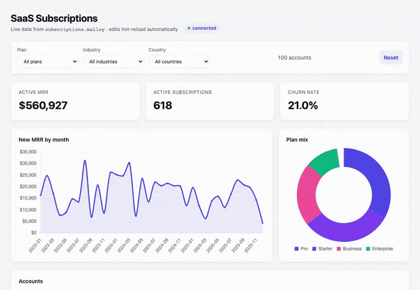

# In-package HTML data apps

A package can ship a `public/` directory of plain web files next to its `.malloy`
files. Publisher serves that directory and exposes a small JavaScript runtime at
`/sdk/publisher.js` so the page can run Malloy queries against the package's
models and render whatever you like with the front-end tools you already know
(Chart.js, D3, plain DOM, or `<malloy-render>`). There is no build step, no npm
install, and no framework requirement. You write HTML, CSS, and JavaScript, and
Publisher serves it and answers its queries.

> **What this is:** a self-contained dashboard written in plain HTML/CSS/JS, shipped *inside* a
> package and **served by Publisher** — no build step, no framework, no npm. It's the supported way to
> ship a custom UI. (For zero-code exploration, use the [Publisher App](./publisher-app.md); to build
> against the data programmatically, see the [REST/MCP APIs](./api-overview.md).)

Reach for an HTML data app when you want a self-contained, custom dashboard that ships with the model
and needs no toolchain. A page can also be *embedded* into another site as an auto-resizing iframe
with `Publisher.embed` (see [Embedding](#embedding)).

The bundled `storefront` package ships one — a Chart.js dashboard in
[`examples/storefront/public/index.html`](../examples/storefront/public/index.html), backed entirely
by `Publisher.query` calls against the model's views:


Filters run new Malloy queries and repaint the KPIs, charts, and table in place — here in the bundled [`html-data-app`](../examples/html-data-app/) SaaS-subscriptions example:



## How it fits together

```
my-package/
  publisher.json        # package manifest (name, version, description)
  subscriptions.malloy  # one or more models
  subscriptions.parquet # data the models read
  public/               # everything in here is web-served
    index.html          # can be one self-contained file, or split out css/js
    embed-test.html
```

Publisher serves the contents of `public/` at:

```
/environments/<env>/packages/<pkg>/<file>
```

so `public/index.html` is the package's landing page and any other file under
`public/` loads at its relative path. Only `public/` is reachable over the web. The models, the data
files, and `publisher.json` live outside it and are never served; the page
reaches model data only through the query API, which goes through the same
governance (filters, access modifiers, authorize annotations) as any other
Publisher client.

A package becomes a data app simply by having a `public/` directory. There is no
flag to set in `publisher.json`.

## Quick start

Copy the worked example and run it with live reload:

```bash
mkdir -p /tmp/publisher-demo
cp -R examples/html-data-app /tmp/publisher-demo/
cat > /tmp/publisher-demo/publisher.config.json <<'JSON'
{
  "frozenConfig": false,
  "environments": [
    {
      "name": "demo",
      "packages": [{ "name": "html-data-app", "location": "./html-data-app" }],
      "connections": []
    }
  ]
}
JSON

SERVER_ROOT=/tmp/publisher-demo \
  bun run packages/server/src/server.ts --watch-env demo
```

Open `http://localhost:4000/environments/demo/packages/html-data-app/`. Edit a
file under `public/` and the open page reloads on its own; edit the `.malloy`
model and the package recompiles. The `--watch-env` part is what enables that
loop (see [Live reload](#live-reload) below).

The smallest page that talks to a model is:

```html
<!doctype html>
<title>Subscriptions</title>
<pre id="out"></pre>
<script src="/sdk/publisher.js"></script>
<script>
  Publisher.query("subscriptions.malloy", "run: subscriptions -> plan_mix").then((rows) => {
    document.getElementById("out").textContent = JSON.stringify(rows, null, 2);
  });
</script>
```

## The runtime

Load the runtime once per page with a root-relative script tag, so it resolves
through Publisher no matter which environment or package the page is served
under:

```html
<script src="/sdk/publisher.js"></script>
```

It attaches a single global, `window.Publisher`. The script has no dependencies
and adds nothing to the page's markup.

| Member | Signature | Returns |
|---|---|---|
| `Publisher.query` | `(modelPath, malloy?, opts?)` | `Promise<Array>` of row objects |
| `Publisher.queryFull` | `(modelPath, malloy?, opts?)` | `Promise<MalloyResult>` (full envelope) |
| `Publisher.embed` | `(selector, options)` | `{ iframe, destroy() }` |
| `Publisher.context` | property | `{ environment, package }` inferred from the URL |
| `Publisher.setToken` | `(token \| null)` | `undefined`; the token then applies to all later queries on the page |

### Querying

`Publisher.query(modelPath, malloy, opts)` runs a Malloy query against one model
in the current package and resolves to an array of plain row objects, ready to
feed a chart or a table.

```js
// Run a named view defined in the model.
const rows = await Publisher.query("subscriptions.malloy", "run: subscriptions -> plan_mix");
// rows -> [{ plan: "Pro", account_count: 272 }, { plan: "Starter", account_count: 255 }, ...]
```

`modelPath` is the model file's path within the package, with `/` separators
(here `"subscriptions.malloy"`; a nested model would be `"models/events.malloy"`). The
second argument is any Malloy query string. Build the model's queries the way you
would anywhere else: run a pre-built view, refine it, or write an ad-hoc query.

```js
// Refine a view with a filter at call time.
await Publisher.query("subscriptions.malloy", "run: subscriptions -> plan_mix + { where: plan = 'Pro' }");

// A single-row KPI view: read element [0].
const [kpis] = await Publisher.query("subscriptions.malloy", "run: subscriptions -> kpis");
document.getElementById("mrr").textContent = kpis.active_mrr;
```

Defining frontend-friendly views in the model (pre-aggregated, pre-sorted, one
per tile) keeps the page's query strings short and the work on the server. The
example's `subscriptions.malloy` does exactly this with `kpis`, `mrr_by_month`,
`plan_mix`, and `accounts`.

A dashboard usually issues several queries at once and renders them together:

```js
const [kpisRows, byMonth, planMix, accounts] = await Promise.all([
  Publisher.query("subscriptions.malloy", "run: subscriptions -> kpis"),
  Publisher.query("subscriptions.malloy", "run: subscriptions -> mrr_by_month"),
  Publisher.query("subscriptions.malloy", "run: subscriptions -> plan_mix"),
  Publisher.query("subscriptions.malloy", "run: subscriptions -> accounts"),
]);
```

> **See it working.** The example's
> [`public/index.html`](../examples/html-data-app/public/index.html) does exactly this in its
> `refresh()` — four `Publisher.query` calls fanned out with `Promise.all`, driving two Chart.js
> charts, a KPI row, and a filterable table, all from the views in
> [`subscriptions.malloy`](../examples/html-data-app/subscriptions.malloy).

The third argument, `opts`, is optional:

| Option | Type | Effect |
|---|---|---|
| `sourceName` | string | Run against a named source instead of passing a full `run:` string |
| `queryName` | string | Run a saved query by name |
| `environment`, `package` | string | Override the environment or package the query targets, for pages not served under `/environments/<env>/packages/<pkg>/` |

`sourceName` and `queryName` are alternatives to passing a `run:` string as the
second argument; use one path or the other. For parameterized results, run a
model-defined view or source that already encodes the logic (via `sourceName` /
`queryName`) rather than assembling a `run:` string on the page. The no-build page
runtime does not pass per-query [givens](./givens.md) values (model-declared given
*defaults* still apply), so never interpolate untrusted input into a `run:`
string — constrain it to a known set, or keep the filtering in model-defined
views.

`Publisher.queryFull(...)` takes the same arguments but resolves to the full
Malloy result envelope rather than just the rows. Use it when you want to hand
the result to `<malloy-render>` and let Malloy draw the chart; use `query` when
you want the raw rows to drive your own rendering.

On a failed query the returned promise rejects with an `Error` whose message is
prefixed `Publisher.query:`. The error carries `error.status` (the HTTP status)
and `error.response` (the parsed JSON body), so you can branch on a missing
filter, a compile error, or a permission failure.

### Context

`Publisher.context` is `{ environment, package }`, read from the page's own URL
(`/environments/<env>/packages/<pkg>/...`). `query`, `queryFull`, and the live
reload use it automatically, so a page served from inside its package does not
need to name its environment or package anywhere. If you serve the page from
somewhere else (for example a host page on another path that calls the API
directly), pass `environment` and `package` in `opts`.

### Auth

By default the runtime sends the browser's cookies with every request
(`credentials: "include"`) and adds no `Authorization` header, so a page served
to a logged-in user authenticates as that user with no extra code.

To authenticate with a bearer token instead, call `Publisher.setToken(token)`
before querying; pass `null` to clear it and fall back to cookies. This is the
hook a host application uses to pass a signed token into an embedded page (see
[Embedding](#embedding)).

What the Publisher server enforces on these routes is the package's own model
governance: filter and runtime-parameter (given) rules, access modifiers, and
`#(authorize)` annotations are applied when the query compiles and runs. The static file, page-listing, and
events routes themselves are open; treat anything you put under `public/` as
world-readable to anyone who can reach the server, and keep secrets in the models
and the database, behind the query API, not in the page.

## Embedding

A page can be embedded in another page as an auto-resizing iframe with
`Publisher.embed`:

```html
<script src="https://your-publisher/sdk/publisher.js"></script>
<div id="dashboard"></div>
<script>
  Publisher.embed("#dashboard", {
    src: "https://your-publisher/environments/demo/packages/html-data-app/index.html",
  });
</script>
```

`embed(selector, options)` mounts an iframe into the element matched by
`selector` (a CSS string or an element) and returns `{ iframe, destroy() }`. Call
`destroy()` to remove it and detach its listeners; calling `embed` again lets you
remount, which is handy when the host swaps dashboards.

Options:

| Option | Type | Effect |
|---|---|---|
| `src` | string (required) | URL of the page to embed |
| `token` | string | Appended to `src` as an `embed_token` query parameter for the embedded page to read |
| `height` | number or string | Fixed height (`number` is treated as pixels). Omit it to auto-size. |
| `allow` | string | Value for the iframe's `allow` attribute (permissions policy) |

The iframe is sandboxed with `allow-scripts allow-same-origin allow-forms`. When
you omit `height`, the embedded page measures its own content and posts its
height to the host, which resizes the iframe to match; the host only accepts
those messages from the iframe it created. You do not write any of that wiring,
it ships in the runtime. If your embedded page sets `body { min-height: 100vh }`
or similar, the runtime still measures the real content height rather than the
viewport, so the frame does not grow without bound.

For a same-origin or same-tenant embed, the browser's cookies authenticate the
iframe and you pass no token. For a cross-origin embed (your customer's app on a
different domain), mint a short-lived signed token on your server and pass it as `token`; the
embedded page reads `embed_token` and calls `Publisher.setToken(...)`. Mint the token server-side with
the same signing key the server verifies; never put a long-lived or admin token in client HTML.

## Live reload

When the server runs with `--watch-env <env>` (or `PUBLISHER_WATCH=<env>`),
Publisher mounts that environment's local-directory packages in place and watches
them. Editing a `.malloy` file recompiles the package; editing a file under
`public/` refreshes any open page. The runtime subscribes to a server-sent-events
stream and reloads the page when the package changes; this is automatic for any
page that loads `publisher.js` from inside its package.

The stream is `GET /api/v0/environments/<env>/packages/<pkg>/events`. It emits a
`hello` event on connection, a `mode` event reporting whether watch mode is on, a
`changed` event on each package change, and a periodic heartbeat. Without `--watch-env`, the stream
connects and reports `mode: disabled`, and no reloads fire, which is the expected
production posture.

## Full-screen apps in the page viewer

When you open a page from inside the Publisher App (the package's Pages list), it
is shown in an iframe wrapped in light chrome (a title and an "open standalone"
link). By default that iframe is sized to the page's content height: the page's
runtime measures how tall its content actually is and the viewer matches it, so
an ordinary dashboard never gets a nested scrollbar.

A full-screen app, such as a slide deck that sizes itself to `100vh`, has no
content height to measure, so the default sizing would clip it. Declare that the
page should fill the viewer instead with a single meta tag in the `<head>`:

```html
<meta name="publisher:fit" content="viewport" />
```

The viewer then makes the iframe fill the available height, so the page's own
`100vh` resolves against the real viewport and looks the same as it does opened
standalone. Because the viewer reads this tag from the page's markup, it works
even for a page that does not load `publisher.js`. The tag must sit near the top
of `<head>` (within the first 4KB, the same window the title is read from). Pages
without it keep content-height sizing, so marking one app full-screen does not
affect any other page, and opening a page directly at
`/environments/<env>/packages/<pkg>/<file>` is unaffected either way.

## Listing a package's pages

`GET /api/v0/environments/<env>/packages/<pkg>/pages` returns the package's HTML
pages, which the Publisher App uses to show what a package offers. Each entry is:

```json
{
  "resource": "/environments/examples/packages/html-data-app/index.html",
  "packageName": "html-data-app",
  "path": "index.html",
  "title": "SaaS Subscriptions"
}
```

`resource` is the root-relative URL to open the page (note it is not under
`/api/v0`), `path` is the file's path within `public/`, and `title` is taken from
the page's `<title>` tag, falling back to `path`. An entry also carries
`fit: "viewport"` when the page opts into filling the viewer with
`<meta name="publisher:fit" content="viewport">` (see
[Full-screen apps in the page viewer](#full-screen-apps-in-the-page-viewer)), and
omits the field otherwise. The listing covers `.html` and `.htm` files up to
three directories deep and is empty for a package with no `public/` directory.

## The package manifest

`publisher.json` sits at the package root and is not web-served. The fields that
matter for a data app are:

| Field | Required | Purpose |
|---|---|---|
| `name` | yes | Package name, used in the API URLs |
| `description` | yes | Shown in the Publisher UI |
| `version` | recommended | Package version, e.g. `"0.0.1"` |
| `location` | no | Source path or URI (local path, GitHub, S3, GCS) for remote packages |

```json
{
  "name": "html-data-app",
  "version": "0.0.1",
  "description": "SaaS subscriptions dashboard built as an in-package HTML data app."
}
```

## Security model

- Only `public/` is served. Requests are confined to that directory: path
  traversal (`..`) and names that resolve outside the package are rejected, and a
  symlink under `public/` that points outside it returns 403. Models, data, and
  `publisher.json` are never reachable over the web.
- Served HTML carries `Content-Security-Policy: frame-ancestors *` so pages are
  framable by default, which means any site can frame them (a clickjacking
  vector). Set `PUBLISHER_FRAME_ANCESTORS` to restrict which origins may embed
  your pages (for example to your own app's origin), and do so for any page that
  shows sensitive data. All responses carry `X-Content-Type-Options: nosniff`.
- The query API applies the model's governance (filters, access modifiers,
  authorize annotations). The static, pages, and events routes do not add their
  own auth, so do not place anything sensitive under `public/`.

## Reference

Endpoints used by an HTML data app:

| Method and path | Purpose |
|---|---|
| `GET /environments/<env>/packages/<pkg>/<file>` | Serve a file from `public/` |
| `GET /sdk/publisher.js` | The page runtime |
| `POST /api/v0/environments/<env>/packages/<pkg>/models/<model>/query` | Run a query (used by `Publisher.query`) |
| `GET /api/v0/environments/<env>/packages/<pkg>/pages` | List the package's pages |
| `GET /api/v0/environments/<env>/packages/<pkg>/events` | Live-reload stream |

See also:

- `examples/html-data-app/` for a complete worked package (filters, charts, KPIs,
  and an embed demo).
- [Givens (runtime parameters)](./givens.md) for declaring model parameters.
- [The React SDK](./embedded-data-apps.md) — advanced/internal, if you specifically need React components.
