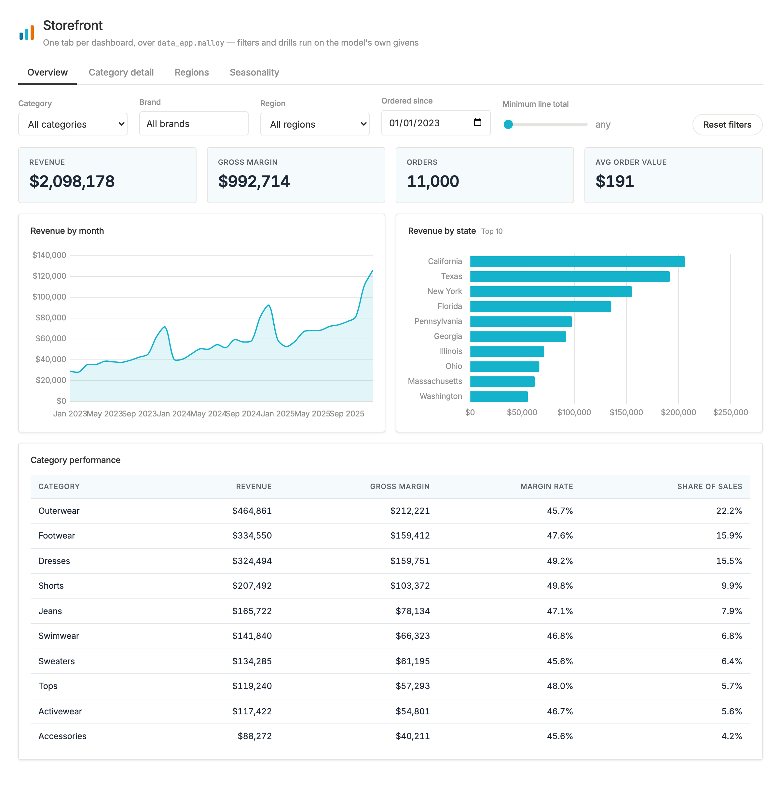
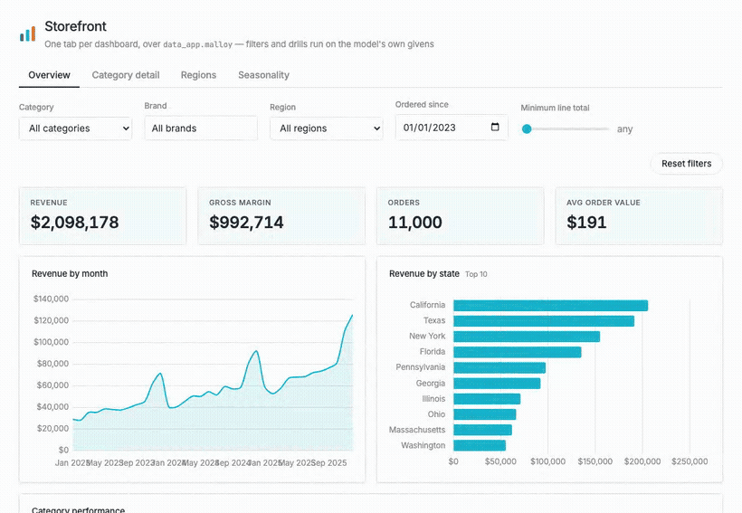

# In-package HTML data apps

A package can ship a `public/` directory of plain web files next to its `.malloy`
files. Publisher serves that directory and exposes a small JavaScript runtime at
`/sdk/publisher.js` so the page can run Malloy queries against the package's
models and render whatever you like with the front-end tools you already know
(Chart.js, D3, plain DOM, or `<malloy-render>`). There is no build step, no npm
install, and no framework requirement. You write HTML, CSS, and JavaScript, and
Publisher serves it and answers its queries.

Ship any library you use inside the package's `public/` directory and load it
with a relative path, rather than from a CDN. The bundled examples put theirs in
`public/vendor/`. Two reasons: agent sandboxes and many corporate networks block
CDNs, and the failure is easy to miss, because the script never runs, so the page
comes up with empty charts and whatever renders after them; and a page's JavaScript runs with the viewing
user's data authority, so it is worth knowing exactly what you are loading.

> **What this is:** a self-contained dashboard written in plain HTML/CSS/JS, shipped *inside* a
> package and **served by Publisher** — no build step, no framework, no npm. It's the supported way to
> ship a custom UI. (For zero-code exploration, use the [Publisher Console](./console.md); to build
> against the data programmatically, see the [REST/MCP APIs](./api-overview.md).)

Reach for an HTML data app when you want a self-contained, custom dashboard that ships with the model
and needs no toolchain. A page can also be *embedded* into another site as an auto-resizing iframe
with `Publisher.embed` (see [Embedding](#embedding)).

The bundled `storefront` package ships one:
[`examples/storefront/public/index.html`](../examples/storefront/public/index.html), a Chart.js page
with one tab per dashboard in the package, backed entirely by `Publisher.query` calls against the
model's views:



Everything on it that looks like a Publisher feature is the page's own code reading the model:
the control row is built from the model's `given:` declarations, the tables take their headings and
number formats from each field's tags, and a table cell whose dimension carries `# drill` behaves the
way it does on a dashboard — hover to see it is a link, click to seed the given and land on the tab
named by the tag:



None of that is built in. [Reading the model in the page](#reading-the-model-in-the-page) is how it
is done, and the same three moves work in any page you write.

## How it fits together

```
my-package/
  publisher.json       # package manifest (name, version, description)
  storefront.malloy    # one or more models
  data/                # data the models read
  public/              # everything in here is web-served
    index.html         # can be one self-contained file, or split out css/js
    embed-test.html
    app/               # page modules, once one file stops being enough
      app.js
    vendor/            # chart library, vendored rather than loaded from a CDN
      chart.umd.js
```

Publisher serves the contents of `public/` at:

```
/environments/<env>/packages/<pkg>/<file>
```

so `public/index.html` is the package's landing page and any other file under
`public/` loads at its relative path. Only `public/` is reachable over the web. The models, the data
files, and `publisher.json` live outside it and are never served; the page
reaches model data only through the query API, which goes through the same
governance (filters, access modifiers, authorize annotations) as any other
Publisher client.

A package becomes a data app simply by having a `public/` directory. There is no
flag to set in `publisher.json`.

## Quick start

Copy the worked example and run it with live reload:

```bash
mkdir -p /tmp/publisher-demo
cp -R examples/storefront /tmp/publisher-demo/
cat > /tmp/publisher-demo/publisher.config.json <<'JSON'
{
  "frozenConfig": false,
  "environments": [
    {
      "name": "demo",
      "packages": [{ "name": "storefront", "location": "./storefront" }],
      "connections": []
    }
  ]
}
JSON

SERVER_ROOT=/tmp/publisher-demo \
  bun run packages/server/src/server.ts --watch-env demo
```

Open `http://localhost:4000/environments/demo/packages/storefront/`. Edit a
file under `public/` and the open page reloads on its own; edit the `.malloy`
model and the package recompiles. The `--watch-env` part is what enables that
loop (see [Live reload](#live-reload) below).

The smallest page that talks to a model is:

```html
<!doctype html>
<title>Storefront</title>
<pre id="out"></pre>
<script src="/sdk/publisher.js"></script>
<script>
  Publisher.query("storefront.malloy", "run: order_items -> by_category").then((rows) => {
    document.getElementById("out").textContent = JSON.stringify(rows, null, 2);
  });
</script>
```

## The runtime

Load the runtime once per page with a root-relative script tag, so it resolves
through Publisher no matter which environment or package the page is served
under:

```html
<script src="/sdk/publisher.js"></script>
```

It attaches a single global, `window.Publisher`. The script has no dependencies
and adds nothing to the page's markup.

| Member | Signature | Returns |
|---|---|---|
| `Publisher.query` | `(modelPath, malloy?, opts?)` | `Promise<Array>` of row objects |
| `Publisher.queryFull` | `(modelPath, malloy?, opts?)` | `Promise<MalloyResult>` (full envelope) |
| `Publisher.embed` | `(selector, options)` | `{ iframe, destroy() }` |
| `Publisher.context` | property | `{ environment, package }` inferred from the URL |
| `Publisher.setToken` | `(token \| null)` | `undefined`; the token then applies to all later queries on the page |

### Querying

`Publisher.query(modelPath, malloy, opts)` runs a Malloy query against one model
in the current package and resolves to an array of plain row objects, ready to
feed a chart or a table.

```js
// Run a named view defined in the model.
const rows = await Publisher.query("storefront.malloy", "run: order_items -> by_category");
// rows -> [{ category: "Outerwear", total_sales: 1240310.5 }, { category: "Footwear", ... }, ...]
```

`modelPath` is the model file's path within the package, with `/` separators
(here `"storefront.malloy"`; a nested model would be `"models/events.malloy"`). The
second argument is any Malloy query string. Build the model's queries the way you
would anywhere else: run a pre-built view, refine it, or write an ad-hoc query.

```js
// Refine a view with a filter at call time.
await Publisher.query("storefront.malloy", "run: order_items -> by_category + { where: brand = 'Vela' }");

// A single-row KPI query: read element [0].
const [kpis] = await Publisher.query(
  "storefront.malloy",
  "run: order_items -> { aggregate: total_sales, order_count }",
);
document.getElementById("sales").textContent = kpis.total_sales;
```

Defining frontend-friendly views in the model (pre-aggregated, pre-sorted, one
per tile) keeps the page's query strings short and the work on the server. The
example's `storefront.malloy` does exactly this with `by_category`,
`sales_by_month`, and `top_products`.

A dashboard usually issues several queries at once and renders them together:

```js
const [kpiRows, byCategory, byMonth, topProducts] = await Promise.all([
  Publisher.query("storefront.malloy", "run: order_items -> { aggregate: total_sales, order_count }"),
  Publisher.query("storefront.malloy", "run: order_items -> by_category"),
  Publisher.query("storefront.malloy", "run: order_items -> sales_by_month"),
  Publisher.query("storefront.malloy", "run: order_items -> top_products"),
]);
```

> **See it working.** The example's
> [`public/app/app.js`](../examples/storefront/public/app/app.js) does exactly this: every tile on the
> visible tab is fired at once with `Promise.all`, driving Chart.js charts, a KPI row, and drillable
> tables, all from the views in
> [`storefront.malloy`](../examples/storefront/storefront.malloy).

The third argument, `opts`, is optional:

| Option | Type | Effect |
|---|---|---|
| `givens` | object | Values for the model's [givens](./givens.md), as `{ NAME: value }` — bound by the server, never pasted into query text |
| `sourceName` | string | Run against a named source instead of passing a full `run:` string |
| `queryName` | string | Run a saved query by name |
| `environment`, `package` | string | Override the environment or package the query targets, for pages not served under `/environments/<env>/packages/<pkg>/` |

`sourceName` and `queryName` are alternatives to passing a `run:` string as the
second argument; use one path or the other.

**Filter with givens, not with string building.** Anything a reader picks — a
dropdown, a date, a drill click — should reach the server as a given, not as text
spliced into a `run:` string:

```js
await Publisher.query("data_app.malloy", "run: scoped_orders -> by_category", {
  givens: { CATEGORY: "Outerwear", MIN_SALE: ">= 100" },
});
```

A given is declared in the model, typed, and bound by the server, so a value with
a quote in it cannot change what the query means. A `filter<T>` given takes
Malloy filter syntax as a string (`"Outerwear"`, `"Nike, Levi's"`, `">= 100"`,
`""` for all); other types take the plain value. Givens are per-file, so the query
has to run against a model file that imports them — the example adds a small
[`data_app.malloy`](../examples/storefront/data_app.malloy) whose `scoped_orders`
source applies all five, which is also what makes the page's filters mean the same
thing as the dashboards'. If you do build a query string, restrict the values to a
set the model itself produced, and never interpolate free text.

`Publisher.queryFull(...)` takes the same arguments but resolves to the full
Malloy result envelope rather than just the rows: the data, plus a `schema.fields`
entry per column carrying that field's annotations. Use it to hand a result to
`<malloy-render>`, or to read the model's own tags — see below.

On a failed query the returned promise rejects with an `Error` whose message is
prefixed `Publisher.query:`. The error carries `error.status` (the HTTP status)
and `error.response` (the parsed JSON body), so you can branch on a missing
filter, a compile error, or a permission failure.

## Reading the model in the page

A hand-authored page does not have to keep its own copy of what a column is
called, how its numbers read, or which cells are clickable. The model already says
all three, and both the Console and the React SDK work by reading exactly the same
metadata. A page that reads it too gets the same behaviour, and stays correct when
the model changes.

**Field tags come back with the result.** `Publisher.queryFull` returns
`schema.fields`, one entry per column, each with the annotations the model
declared:

```json
{
  "name": "category",
  "annotations": [
    { "value": "# drill { to=[\"category\", \"self\"] given=CATEGORY }\n" },
    { "value": "# label=\"Category\"\n" }
  ]
}
```

So a table renderer can take its heading from `# label`, its number format from
`# currency` / `# percent` / `# number=`, and its alignment from whether the field
is an aggregate — Malloy marks a measure with `calculation` in its own
`#(malloy)` annotation, which is also the rule that keeps a drill off a total.
The example does this once in
[`public/app/result.js`](../examples/storefront/public/app/result.js) and every
tile inherits it.

**Drill is a tag, not an endpoint.** `# drill { to=[…] given=… }` sits on a model
*dimension*, so every result that groups by it is clickable wherever it renders.
Reproducing the Console's behaviour is four rules:

| Rule | What it means |
|---|---|
| `to=<slug>` | Go to that destination with the clicked value written into the named given. In the Console that is a dashboard page; in a page with tabs it is the tab of the same name. |
| `to=self` | Filter where you already are, leaving the destination alone. |
| Offer only what you can honor | Filter destinations to the ones your page can actually reach, and mark only those cells. A dead link that looks live is worse than plain text. |
| Never drill an aggregate | The tag can reach a measure through the view; the total is not the value someone clicked. |

`given=` is optional and defaults to the dimension name upper-cased. The value is
written as filter syntax, so a value containing a comma has to be quoted or it
reads as two values.

Match the affordance and it will feel like the rest of Publisher: an ordinary-looking
cell at rest with `cursor: pointer`, and the link color plus an underline on hover.
The Console marks those cells with the class `publisher-drill`; the example uses
the same name, in
[`public/app/drill.js`](../examples/storefront/public/app/drill.js).

**A chart is another rendering of the same field**, so a bar over a drillable
dimension should click like the table does — by its axis label as much as by its
bar. In a canvas chart that costs a little more than in a table, and the example
pays it in
[`public/app/charts.js`](../examples/storefront/public/app/charts.js):

- **Hit-test the axis yourself.** Chart.js's `onClick` and `onHover` fire only
  for the plot area, and the tick labels are outside it. Take the pointer
  position from the canvas's own `mousemove`/`click`, and when it lands inside
  `chart.scales.x` (or `.y`, for horizontal bars) ask that scale for the index:
  `scale.getValueForPixel(x)`. Anywhere else, fall back to
  `chart.getElementsAtEventForMode(event, "nearest", { intersect: true }, true)`
  so the bar and its label resolve to the same row.
- **Paint the affordance.** Canvas text takes no CSS, so there is no hover rule
  to write: track the hovered index, make `ticks.color` a function that returns
  the link color for it, and `chart.update("none")` when it changes. A plain
  `render()` will not repaint it — the scale caches its label items until an
  update clears them.
- **Only on a categorical axis.** A time axis thins its labels out, so a tick
  index no longer identifies a row; a bar axis draws one tick per bar, which is
  what makes the mapping safe. Keep the value axis inert either way.

**Filter state belongs in the URL**, in the shape the Console uses: one query
parameter per given, named exactly as the given is
(`?tab=regions&REGION=West`). A drill that navigates pushes a history entry, so
Back returns to where the click came from; a control change replaces, so Back
leaves the page rather than walking every filter someone tried.

**The control row can be generated too.** `GET
/api/v0/environments/<env>/packages/<pkg>/models/<model>` includes a `givens`
array — each given's name, type, `# label`, `control` (`select`, `multiselect`),
`suggest` source, range bounds, and default. Building the row from that is what
lets a page match a dashboard's promise that the controls are not written on any
page: add a given to the model and the widget appears. See
[`public/app/controls.js`](../examples/storefront/public/app/controls.js).

### Context

`Publisher.context` is `{ environment, package }`, read from the page's own URL
(`/environments/<env>/packages/<pkg>/...`). `query`, `queryFull`, and the live
reload use it automatically, so a page served from inside its package does not
need to name its environment or package anywhere. If you serve the page from
somewhere else (for example a host page on another path that calls the API
directly), pass `environment` and `package` in `opts`.

### Auth

By default the runtime sends the browser's cookies with every request
(`credentials: "include"`) and adds no `Authorization` header, so a page served
to a logged-in user authenticates as that user with no extra code.

To authenticate with a bearer token instead, call `Publisher.setToken(token)`
before querying; pass `null` to clear it and fall back to cookies. This is the
hook a host application uses to pass a signed token into an embedded page (see
[Embedding](#embedding)).

What the Publisher server enforces on these routes is the package's own model
governance: filter and runtime-parameter (given) rules, access modifiers, and
`#(authorize)` annotations are applied when the query compiles and runs. The static file,
data-app-listing, and
events routes themselves are open; treat anything you put under `public/` as
world-readable to anyone who can reach the server, and keep secrets in the models
and the database, behind the query API, not in the page.

## Embedding

A page can be embedded in another page as an auto-resizing iframe with
`Publisher.embed`:

```html
<script src="https://your-publisher/sdk/publisher.js"></script>
<div id="dashboard"></div>
<script>
  Publisher.embed("#dashboard", {
    src: "https://your-publisher/environments/demo/packages/storefront/index.html",
  });
</script>
```

`embed(selector, options)` mounts an iframe into the element matched by
`selector` (a CSS string or an element) and returns `{ iframe, destroy() }`. Call
`destroy()` to remove it and detach its listeners; calling `embed` again lets you
remount, which is handy when the host swaps dashboards.

Options:

| Option | Type | Effect |
|---|---|---|
| `src` | string (required) | URL of the page to embed |
| `token` | string | Appended to `src` as an `embed_token` query parameter for the embedded page to read |
| `height` | number or string | Fixed height (`number` is treated as pixels). Omit it to auto-size. |
| `allow` | string | Value for the iframe's `allow` attribute (permissions policy) |

The iframe is sandboxed with `allow-scripts allow-same-origin allow-forms`. When
you omit `height`, the embedded page measures its own content and posts its
height to the host, which resizes the iframe to match; the host only accepts
those messages from the iframe it created. You do not write any of that wiring,
it ships in the runtime. If your embedded page sets `body { min-height: 100vh }`
or similar, the runtime still measures the real content height rather than the
viewport, so the frame does not grow without bound.

For a same-origin or same-tenant embed, the browser's cookies authenticate the
iframe and you pass no token. For a cross-origin embed (your customer's app on a
different domain), mint a short-lived signed token on your server and pass it as `token`; the
embedded page reads `embed_token` and calls `Publisher.setToken(...)`. Mint the token server-side with
the same signing key the server verifies; never put a long-lived or admin token in client HTML.

## Live reload

When the server runs with `--watch-env <env>` (or `PUBLISHER_WATCH=<env>`),
Publisher mounts that environment's local-directory packages in place and watches
them. Editing a `.malloy` file recompiles the package; editing a file under
`public/` refreshes any open page. The runtime subscribes to a server-sent-events
stream and reloads the page when the package changes; this is automatic for any
page that loads `publisher.js` from inside its package.

The stream is `GET /api/v0/environments/<env>/packages/<pkg>/events`. It emits a
`hello` event on connection, a `mode` event reporting whether watch mode is on, a
`changed` event on each package change, and a periodic heartbeat. Without `--watch-env`, the stream
connects and reports `mode: disabled`, and no reloads fire, which is the expected
production posture.

One consequence for headless verification: because the runtime holds that stream open, a served
page never reaches network idle, so a Playwright or Puppeteer check that waits for `networkidle`
hangs. Wait on `load` plus a content selector instead. This holds with watch mode off too, since
the stream still connects to hear `mode: disabled`.

## Full-screen apps in the data app viewer

When you open a data app from inside the Publisher Console (the package's Data Apps
list), it is shown in an iframe wrapped in light chrome (a title and an "open
standalone" link). By default that iframe is sized to the page's content height: the page's
runtime measures how tall its content actually is and the viewer matches it, so
an ordinary dashboard never gets a nested scrollbar.

A full-screen app, such as a slide deck that sizes itself to `100vh`, has no
content height to measure, so the default sizing would clip it. Declare that the
page should fill the viewer instead with a single meta tag in the `<head>`:

```html
<meta name="publisher:fit" content="viewport" />
```

The viewer then makes the iframe fill the available height, so the page's own
`100vh` resolves against the real viewport and looks the same as it does opened
standalone. Because the viewer reads this tag from the page's markup, it works
even for a page that does not load `publisher.js`. The tag must sit near the top
of `<head>` (within the first 4KB, the same window the title is read from). A data app
without it keeps content-height sizing, so marking one app full-screen does not
affect any other, and opening a page directly at
`/environments/<env>/packages/<pkg>/<file>` is unaffected either way.

## Listing a package's data apps

`GET /api/v0/environments/<env>/packages/<pkg>/data-apps` returns the package's data
apps, which the Publisher Console uses to show what a package offers. Each entry is:

```json
{
  "resource": "/environments/examples/packages/storefront/index.html",
  "packageName": "storefront",
  "path": "index.html",
  "title": "Storefront"
}
```

`resource` is the root-relative URL to open the page (note it is not under
`/api/v0`), `path` is the file's path within `public/`, and `title` is taken from
the page's `<title>` tag, falling back to `path`. An entry also carries
`fit: "viewport"` when the app opts into filling the viewer with
`<meta name="publisher:fit" content="viewport">` (see
[Full-screen apps in the data app viewer](#full-screen-apps-in-the-data-app-viewer)), and
omits the field otherwise. The listing covers `.html` and `.htm` files up to
three directories deep and is empty for a package with no `public/` directory.

## The package manifest

`publisher.json` sits at the package root and is not web-served. No field in it is
data-app-specific (a package becomes a data app by having a `public/` directory);
the manifest field reference is [packages.md](packages.md).

```json
{
  "name": "storefront",
  "version": "1.0.0",
  "description": "A small but complete ecommerce semantic model — joins, measures, and dashboards over local DuckDB data."
}
```

## Security model

- Only `public/` is served. Requests are confined to that directory: path
  traversal (`..`) and names that resolve outside the package are rejected, and a
  symlink under `public/` that points outside it returns 403. Models, data, and
  `publisher.json` are never reachable over the web.
- Served HTML carries `Content-Security-Policy: frame-ancestors *` so pages are
  framable by default, which means any site can frame them (a clickjacking
  vector). Set `PUBLISHER_FRAME_ANCESTORS` to restrict which origins may embed
  your pages (for example to your own app's origin), and do so for any page that
  shows sensitive data. All responses carry `X-Content-Type-Options: nosniff`.
- The query API applies the model's governance (filters, access modifiers,
  authorize annotations). The static, data-app-listing, and events routes do not
  add their own auth, so do not place anything sensitive under `public/`.

## Reference

Endpoints used by an HTML data app:

| Method and path | Purpose |
|---|---|
| `GET /environments/<env>/packages/<pkg>/<file>` | Serve a file from `public/` |
| `GET /sdk/publisher.js` | The page runtime |
| `POST /api/v0/environments/<env>/packages/<pkg>/models/<model>/query` | Run a query (used by `Publisher.query`) |
| `GET /api/v0/environments/<env>/packages/<pkg>/data-apps` | List the package's data apps |
| `GET /api/v0/environments/<env>/packages/<pkg>/events` | Live-reload stream |

See also:

- [`examples/storefront/`](../examples/storefront) for a complete worked package
  (a tab per dashboard, model-driven controls and drill, and an embed demo in
  [`public/embed-test.html`](../examples/storefront/public/embed-test.html)).
- [Dashboards](./dashboards.md) for the `# drill` grammar these pages read, and
  what the Console does with it.
- [Givens (runtime parameters)](./givens.md) for declaring model parameters.
- [The React SDK](./react-data-apps.md) — Malloy's renderer, notebooks, and dashboards as components for a React data app.
