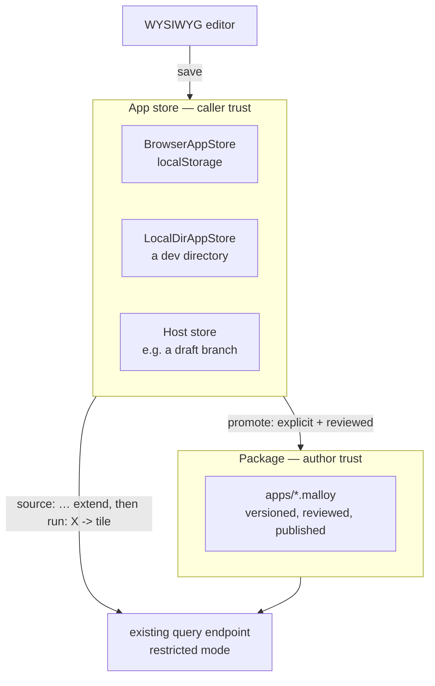

<!--
Copyright (c) Credible Data Inc.
SPDX-License-Identifier: MIT
-->

# Design: Malloy apps (v2)

**Status: a design, not shipped code.** Nothing below describes behavior you can run today. Where it
says a mechanism exists, there is a citation; everything else is a proposal. Written September 2026.

One authored artifact — an **app** — becomes the surface you reach for instead of a notebook, a
dashboard, or a workbook, and it gains a WYSIWYG editor, a pluggable place to save, an agent that can
add a tile, and an embedding story. The app is a plain `.malloy` file whose unit is a **source
extension**: `source: X is <base> extend { … }`, with every tile a **view** inside it and one view —
the page — naming which tiles show and in what order. There is no new file format, no sidecar, and no
fork.

It does not absorb every existing artifact. `.malloynb` survives for the one thing an app cannot
express — a document whose cells build on each other — and HTML data apps survive for pages that ship
code. §13 and §16 draw both lines.

**Related:** [choosing-a-surface.md](choosing-a-surface.md) (whose three-surface taxonomy this
narrows to an app-or-code decision), [malloyyo-dashboards-design.md](malloyyo-dashboards-design.md) (whose "one engine,
two document types" principle this reverses, §16), [security-posture.md](security-posture.md) (the
trust boundary §4, §5 and §9 argue against), [givens.md](givens.md), [dashboards.md](dashboards.md).

## How to read this document

It is in two parts, and they are separable on purpose.

**Part I (§1–§12) is the WYSIWYG editor for source extensions.** It is the buildable half: what gets
built, in what order, with the backwards-compatible steps first. Everything in it works against
today's language, today's renderer and today's query endpoint, and the compatibility of each step is
stated where it is sequenced (§12). A reader can adopt Part I on its own.

**Part II (§13–§17) is the north star.** It aligns notebooks and dashboards so that both *are* source
extensions — one document, two reading modes — and converges their syntax and their implementations.
Part I is deliberately shaped so that every step is also a step toward Part II: the page view Part I
edits is the document Part II reads as a dashboard or a notebook, and the reader Part I ships for
today's `dashboards/*.malloy` is the compatibility path Part II keeps. Where Part II needs something
Part I does not — a language change, an upstream ask, a breaking rename — it says so, and nothing in
Part I waits on it.

---

# Part I — The WYSIWYG editor for source extensions

## 1. Why

Publisher has **four** authored artifact types, and only one of them is editable:

| Artifact | Format | Editable | Lives in |
| --- | --- | --- | --- |
| Notebook | `.malloynb`, `>>>` delimiters | no | a package |
| Dashboard | `dashboards/*.malloy` + `# artifact` | no | a package |
| HTML data app | `public/*.html` | by editing files | a package |
| **Workbook** | `JSON.stringify(WorkbookData)` | **yes** | a `WorkbookStorage` |

The editable one is the only one that is not Malloy. A workbook persists a bespoke JSON shape
(`packages/sdk/src/components/Workbook/WorkbookManager.ts:155`) and exports to `.malloynb` through a
one-way function that emits syntactically invalid Malloy — `` `import {${cell.sourceName}}" from
'${cell.modelPath}'"` `` (`packages/sdk/src/components/Workbook/WorkbookManager.ts:174`). It is also unreachable: the route exists in
`packages/app/src/App.tsx`, and no shipped navigation points at it.

Meanwhile the read-only artifacts are the good ones. They are declarative, reviewable in a pull
request, and agent-authorable. The gap is not expressiveness — it is that **nothing can write them
back**. There is no endpoint in `api-doc.yaml` that persists a model, notebook, or dashboard file.

Downstream, every consumer that wants an editor builds its own. Credible's is the clearest case: it
reimplements the entire layer above the leaf renderer — `app/src/components/MalloyReport/` alone is
3,666 lines, plus a second cell splitter for uncommitted drafts, plus three unrelated
iframe protocols — and still has no authoring surface at all.

So: one authoring surface, one renderer, one editor, one place to save, and the same file in every
surface that displays it.

## 2. The app document

An app is a plain `.malloy` file. What makes it an app is a model-level `## app` tag. What it
*contains* is one **source extension** over the model it is bound to, and a tile is a **view** inside
that extension. One view — the page — is the app's table of contents.

```malloy
## app { title="Storefront" }
import "ecommerce.malloy"

##" ### Revenue is up 12% this quarter
##" Narrative that introduces the page rather than any one tile.

source: storefront is orders extend {
  measure: aov is total_revenue / order_count

  #" ### Revenue trend
  # colspan=2
  # line_chart
  view: revenue_trend is by_month

  # break
  view: top_brands is by_brand + { limit: 5 }

  # dashboard { columns=3 }
  view: page is {
    nest: revenue_trend
    nest: top_brands
  }
}
```

Three roles, and each has exactly one home:

- **The extension** holds what the app shares across its tiles — a measure, a dimension, a join, a
  `where:` that narrows every tile at once.
- **A tile** is a named view. Its chart type, its width and its prose are annotations on the view,
  in the renderer's own spelling (`# colspan=2`, `# break`, `# line_chart`, `#"`).
- **The page** is a view whose `nest:` list names the tiles that show, in the order they show, under
  the `# dashboard { columns=N }` that sets the grid. Membership and order live here and nowhere
  else. A view the page does not nest is a helper, not a tile.

### Why a source extension is the unit

An earlier draft of this design made a tile a top-level `query:` carrying a `# tile { … }` tag, with
the document a list of those. The extension is the better primitive for six reasons, every one
verified rather than argued. The compile probes ran through `loadRestrictedQuery` — the mode a stored
tile compiles in (§4) — on the `@malloydata/malloy` build installed in the repo's `node_modules`
(0.0.427; `packages/server/package.json` declares `^0.0.432`), and the whole example above translated
as a model, with its `import` resolved against a real model, with **zero problems**.

1. **Shared definitions work in the store.** A caller-written extension declaring `dimension:` and
   `measure:`, used by a tile, compiles and runs in restricted mode. The earlier draft listed "no
   cross-tile shared definitions in the store" as an inherent cost of the design; it is not a cost of
   this one, and §4 no longer says it.
2. **A tile re-runs by name on the existing endpoint.** Both `run: orders extend { view: v is … }
   -> v` and the two-statement form the store actually sends — `source: x is orders extend { view: v
   is … }` then `run: x -> v` — compile and run restricted. No new door (§4, §7).
3. **The page is one query, and its result is the shape the renderer already lays out.** `run:
   storefront -> page` returns `{"revenue_trend":[…],"top_brands":[…]}` in one request, which is
   exactly what `@malloydata/render`'s `# dashboard` consumes. Tags and `#"` prose declared on a view
   arrive on the nested field when the page says `nest: revenue_trend` — verified on the result:
   `page.dashboard.columns=3`, `t1.colspan=2`, `t1.line_chart=true`, and the view's `#"` under the
   nest's `annotations.inherits`. Reading an app therefore needs **no client-side result combiner**
   (§7).
4. **It is the form that already ships.** `examples/storefront/dashboards/overview.malloy` is
   `source: overview is scoped_orders extend { … }` with `# colspan`, `# break` and `# label` on each
   view, and a model-level `## artifact { tiles=[…] }` naming them. That array is a page view spelled
   as a tag (§14). So the reader opens today's dashboards on day one, and the editor has real files
   to validate against before it writes anything (§12).
5. **The base's gate carries through it.** For `source: x is locked extend { … }` followed by `run:
   x -> …`, the compiled `structRef` is `x`, and `x`'s own `annotations.blockNotes` hold the base's
   `#(authorize) false`. The extension form is at least as safe as a top-level query, and §4 says
   exactly how far that claim goes.
6. **The editor's parser already understands it.** `Malloy.parse` yields the extension as an
   `explore` symbol whose children are the views, each a `query` symbol whose `lensRange` covers the
   view's own annotations (`revenue_trend` above spans lines 9–12: the `#"`, the `# colspan`, the
   `# line_chart` and the `view:`), and the page's `nest:` entries are children of the page
   (`malloy/packages/malloy/src/lang/parse-tree-walkers/document-symbol-walker.ts:105`, `:160`).
   Every gesture in §6 is a bounded operation on ranges the editor already holds.

### Forms that look reasonable and are not

- **`view:` is not a top-level statement.** A top-level `view:` is a syntax error — `no viable
  alternative at input 'view:'`. Views exist only inside a source's `{}`
  (`malloy/packages/malloy/src/lang/grammar/MalloyParser.g4`). This is why the document is an
  extension rather than a list of views: the braces are where views live.
- **`# tile { colspan=2 }` is nobody's spelling.** The renderer reads `# dashboard { columns=N }` off
  the parent view and `# colspan=N`, `# break`, `# subtitle`, `# borderless` off each child
  (`malloy/packages/malloy-render/src/component/tag-configs.ts:332`, `:420`, `:434`; emitted as CSS
  grid at `malloy/packages/malloy-render/src/component/dashboard/dashboard.tsx:103` and `:168`;
  validated at `malloy/packages/malloy-render/src/render-field-metadata.ts:556-607`). Publisher's
  own dashboard reads the identical four tags off a named view
  (`packages/server/src/service/dashboard.ts:659-662`). An earlier draft introduced `# tile { … }`
  as the layout tag; it is withdrawn. A tile is a view the page nests and needs no marker, and a
  layout tag in any other spelling would be new renderer work for nothing.
- **A second `#` on a line is a new annotation, not a continuation.** The lexer takes `#` to
  end-of-line, so `# colspan=2 # line_chart` silently drops `line_chart` — no error, no
  warning. Several properties on one `#` line are fine (`## artifact { … } dashboard { columns=12 }`
  in `examples/storefront/dashboards/overview.malloy` is one annotation with two properties); a
  second `#` is not.
- **Tags precede the statement they annotate.** A control tag written after a `given:` attaches to
  whatever comes next.
- **`##"` is refused inside the braces.** *"Model annotations not allowed at this scope"*
  (`malloy/packages/malloy/src/lang/malloy-to-ast.ts:2259`). Page-level prose lives outside the
  extension, before or after it, never between two tiles.
- **A `#"` with nothing after it inside the braces vanishes silently.** At top level an orphaned
  annotation is a compile error — *"Object annotation not connected to any object"*
  (`malloy/packages/malloy/src/lang/malloy-to-ast.ts:2236`). Inside a source body it is not: a
  `#"` written last, before the closing `}`, translates with zero problems and lands on nothing.
  Verified. The editor must never leave one behind (§6).

### Prose has a home, and it needed no language change

- **Prose belonging to a tile** is the tile's `#"` doc comment, on the view. It arrives on the
  view's `annotations.blockNotes`, each note carrying its own `at.range` — verified inside the
  braces (`file:///s.malloy`, line 2, characters 2–10 for the example probed). When the page nests
  that view by name, the prose travels with it under the nest's `annotations.inherits`, and a `#"`
  written on the `nest:` entry itself lands on the nest's own `blockNotes` with its own range.
- **Prose belonging to no tile** — an opening paragraph, a closing note — is a standalone `##"`
  block outside the braces. It arrives in `modelAnnotations[url].ownNotes.notes`, **each note with
  an exact `at.range`**.
- **Prose written between two tiles** inside the braces belongs to the next tile: a `#"` between
  `view: a` and `view: b` arrives on `b`'s `blockNotes`. Verified. In this form there is no
  page-level narrative *between* tiles, only above and below the extension — narrower than the
  earlier draft's top-level form, and stated as such. Part II raises the language ask that would
  widen it (§13).

Because every note carries a source position, a flow reading mode (§13) interleaves prose and tiles
by **source order**, which is author order. A notebook's "markdown cell, then code cell" becomes "doc
comment, then view" with no container, no delimiters, and no new syntax.

What is still missing is the *renderer*: `#"` is read today only as a dashboard title and description
(`dashboards.md`), and nothing renders either form as markdown. That is the one part of the format
merger that is real work rather than a reuse, and §12 sequences it after the parts that are not.

### Discovery is by tag, and must read own notes only

A dashboard is found today by globbing one directory — `DASHBOARDS_DIR = "dashboards"`,
`packages/server/src/service/dashboard.ts:77`, non-recursive by deliberate choice (`:252-262`). An app
is declared by carrying `## app`, so discovery becomes a package-wide scan.

That works because Publisher already compiles every `.malloy` in a package as its own entry, and
discovery reuses those compiles.

**Discovery must read own notes only, and the reason is the opposite of what it looks like.** `##`
annotations **do** cross imports, deliberately: the compiled `modelAnnotations` is a
`modelID → {ownNotes, inheritsFrom}` registry folded by a post-order DFS over the import lineage, and
Publisher replicates that fold on purpose — `packages/server/src/service/annotations.ts` documents why
(an imported `##(authorize)` has to be refused too, not just a locally written one). So a model that
merely *imports* an app file would inherit its `## app` and list as an app.

The guard already exists and app discovery reuses it: `ownModelNotes`, which counts a node only if it
is this document or one of malloy's synthetic URL-less compiles, so "every real-URL import is out".
Dashboard discovery reads exactly this (`packages/server/src/service/dashboard.ts:629`).

Two things follow. **An app file does not have to be self-contained** — it may import freely, because
its own `## app` is its own note. And **"is this file an app" is a reader question, not a language
property**: the same bytes imported elsewhere must not make that file an app too.

Reading the markers needs no new plumbing *for discovery* — `api-doc.yaml` already returns file-level
`##` annotations for notebooks (`:3878`), per-view annotations on a source (`:3970`) and per-query
annotations (`:3986`). The editor needs more than the API returns today; §6 says what.

## 3. Where an app lives

An app's home is an **app store**, not a package. A package is a *promotion target*.

This is the decision the rest of the design hangs off, and the reason is churn and authorship rather
than safety. An app in a package means every tile drag is a package version: a republish, a worker
reload, and a new `1.0.N` for every viewer of that environment. Apps are high-churn and often
personal; models are low-churn and shared. At least one downstream deployment reached this
conclusion independently for per-tenant dashboards, keeping them outside any package precisely so
that editing one never republishes the model it reads.



`WorkbookStorage` is already the right shape for this and becomes `AppStore`. It declares
`listWorkbooks`, `getWorkbook`, `saveWorkbook`, `moveWorkbook` and `deleteWorkbook` today
(`packages/sdk/src/components/Workbook/WorkbookStorage.ts:15`); the `*App` spelling below is this
document's proposal, not an existing API, and the substantive addition is an etag for concurrency.
`BrowserWorkbookStorage` over `localStorage` is the existing reference implementation.

## 4. The store dialect

An app in the store is **a binding, plus tags, plus one source extension**. Nothing else.

The `import` line names the model the app is bound to. It is a *binding*, not a compile-time import:
the editor does not compile the app document as a model at all. To run a tile, it takes the
extension's text and sends it, followed by `run: <app source> -> <tile>`, to the bound model's
ordinary query endpoint. To read the whole page it sends the same text followed by `run: <app source>
-> page`. That is the same call a dashboard tile makes today — `run: overview -> kpis` posted as the
query text:

```ts
// packages/sdk/src/components/Dashboard/DashboardTile.tsx:119
query: tile !== undefined ? `run: ${tile}` : undefined,
```

The two-statement form is not an edge case for the server: its authoritative gate names *"a
named-query or multi-statement form, or a source the caller DECLARED in its own ad-hoc text"* as
exactly the shape it exists to resolve (`packages/server/src/service/model.ts:5179`).

This is the design's load-bearing simplification, because that endpoint is already the governed one:

- It compiles caller text through `loadRestrictedQuery`
  (`packages/server/src/service/model.ts:4855`), which refuses `import`, `given:`, `##!`,
  `connection.table`, `connection.sql`, `name!type` and the `sql_*` family
  (`malloy/packages/malloy/src/api/CONTEXT.md:248`, enforced in `malloy/packages/malloy/src/api/foundation/runtime.ts:945`).
  Confirmed empirically: a store tile naming a table directly fails with *"`duckdb.table(...)` cannot
  be used in a restricted query — direct table access is not permitted."* A caller `source:` over a
  model source is accepted (verified, `source: x is orders extend { view: v is … }` then `run: x ->
  v` runs); a caller `source:` over a table is what the refusal above stops.
- Caller-minted `#(authorize)` is already refused, and refused wherever it sits. `assertNoCallerAuthorizeAnnotation`
  (`packages/server/src/service/authorize.ts:176`) is a byte match over the whole caller text, applied
  on the query path at `packages/server/src/service/model.ts:4776`, so a gate written on the app
  source, on a view inside it, or on a `nest:` is refused alike. That matters because a source's own
  gate **replaces** its base's rather than adding to it. An app narrows with `where:`, which only
  ever narrows.
- **The base's gate carries through the extension.** The walk resolves the run target from the
  compiled query's `structRef` through `prepared._modelDef` — the model the caller's text compiled
  against, which is where a caller-declared source exists (`packages/server/src/service/model.ts:2245`). For `source: x is
  locked extend { … }` + `run: x -> …` that struct is `x`, and Malloy copies the base's entire
  `annotations` object onto a derivation that adds no annotation of its own
  (`packages/server/src/service/source_extraction.ts:178`), so `x.annotations.blockNotes` holds
  `#(authorize) false` — verified in the IR the walk reads. When the extension *does* carry an
  annotation of its own, the base's set moves to `annotations.inherits`
  (`malloy/packages/malloy/src/lang/ast/statements/define-source.ts:71`) and `ancestorGateExprs`
  walks that chain (`packages/server/src/service/gate_registry_walk.ts:129`). Display tags on the
  *views* inside the extension touch neither: `run: locked extend { # line_chart view: v is … } ->
  v` compiles to a struct whose own `blockNotes` still hold the gate. Verified.

  **The verdict carries too, not only the IR.** `gateExprsForOwnAnnotations` takes the struct's own
  `#(authorize)` when it declares one and otherwise returns `ancestorGateExprs`
  (`packages/server/src/service/gate_classification.ts:242`), so a caller extension that declares no
  gate is judged on its base's. That walk **fails closed** by design rather than by accident: an
  `annotations.inherits` chain that hits the depth cap, and a registry link it cannot follow, each
  return `["false"]` instead of `[]`, on the stated reasoning that "no gate" would be a silent allow on
  a source whose base may be locked (`packages/server/src/service/gate_registry_walk.ts:124-150`). The
  classifier's own `catch` returns `["false"]` as well. So the failure modes of an unreadable caller
  extension are denials, not admissions. P1 still carries an integration spec, now as a regression
  guard rather than as the thing that establishes the property.
- A host that injects trusted attributes already does so on this path. Credible's router strips any
  caller-supplied value for a registered trusted name and injects the server-resolved one
  (`applyTrustedGivens`), so anti-forgery is inherited rather than rebuilt.

The rule this yields:

> **An app gives its author no reach beyond what that author already has on the query endpoint. It
> may not reach a new connection, and it may not remove or replace a gate.**

That is deliberately narrower than "an app may re-slice what the viewer can already read", which an
earlier draft of this document claimed and the code does not support. The endpoint accepts
caller-authored Malloy today, including a caller-declared `source:`; an app is a place to *keep* such
text, not a new capability.

**The exposure delta of a store is zero, and that — not gate containment — is the security argument.**
Anyone who can open an app can already post the same text to `/query`: on bare Publisher the API is
unauthenticated (`security-posture.md:28`), and under a host like Credible the query call is gated by
package read alone with the query string as free text. App author, viewer, and "could already write
this extension by hand" are the same population, and every tile still executes under the viewer's own
identity. What a store adds is persistence and sharing, not reach. **The shift from top-level queries
to a source extension changes nothing about this delta**: an extension is caller text the endpoint
accepted before this design existed. What it changes is the shape the server sees — one declared
source instead of N anonymous queries — and the bullets above are the evidence that the shape is one
the gate walk resolves.

**Gates are entry-point only, and a join reaches around them.** `#(authorize)` is evaluated on the
source the query *enters through* — the run target's own gate, the gate it carries from a derivation
base, and, when the target is a composite, the one member branch Malloy resolved. A gate on a source
reached only through `join_*` **does not fire**: at any depth, aliased, cross-file, or declared
query-local inside a refinement. The walk says so in its own words
(`packages/server/src/service/model.ts:1316`), `authorize.md:214` documents it as the rule authors
have to design around, and an integration spec asserts it positively on *caller query text* in exactly
a tile's shape. It is deliberate rather than an oversight: joined-gate enforcement was built and then
reversed to entry-point-only.

So an extension can join a gated source and a tile can read its rows. This is not a hole the design
opens — the identical ad-hoc text does the same thing today — but this document must not be read as
saying gates contain an app, because they do not. The remedy is model-side and is `authorize.md`'s
own: put the gate on the source callers enter through, and use `include { private: * }` to control
what an extension re-exposes.

What gates *do* catch, they catch however the tile is written. The walk is unconditional on the query
path — `authorizeAndBindRunnable` (`packages/server/src/service/model.ts:5196`) runs it for every
query, under a comment warning against re-adding the `hasAuthorize()` guard that once re-opened an
inherited-gate bypass (`:5185`).

**Curation is not a boundary either, for a different reason.** `assertQueryBoundaryCompiled`
(`packages/server/src/service/model.ts:3706`) admits the run target if it is a curated source or
derives from one — its own doc names `source: x is customers extend { … }` then `run: x` as the
admitted shape — and **never enumerates joined sources**. Under `queryableSources: "declared"` an
extension may write `join_one: h is unexported_source on …` and a tile may `group_by: h.field`,
reading a source the package chose not to export. That is the position Publisher already takes for
`/compile`, where the boundary is documented as *discovery curation, not access control*.

**A server-side "join walk on the app path" cannot be built, and this design should not imply one.** A
tile is an ordinary request to the ordinary query endpoint; nothing distinguishes it from any other
ad-hoc text, and the one caller-supplied class marker (`queryClass`) is caller-set and not a trust
signal. The options are an editor-side lint — bypassable, the same status as the store-dialect
exclusions below — or a Publisher-wide change to `queryableSources` semantics, which
`discovery-and-access.md:51` declines today on purpose. As a *security* control, deferring is
defensible precisely because the delta is zero. As a *promotion* check it is required, so it lands
with promotion in P7 rather than P1.

The store-dialect exclusions below are an **editor-enforced lint**, not a consequence of restricted
mode: restricted mode accepts `source:`, `query:` and inline `extend` at caller trust (verified). It
refuses `given:` on the **restricted construct list** — `restricted-construct-forbidden`, at
`malloy/packages/malloy/src/lang/ast/statements/define-given.ts:279` — which is a stronger guarantee
than the experimental-flag gate an earlier draft credited. The flag only decides which error you get
when the bound model does not enable givens, and any model carrying controls enables them.

**No new compile door is built.** An earlier draft of this design proposed a restricted authoring
compile over a server-synthesized prologue. That would have been a bespoke trust tier layered on
`/compile`, which is construct-unrestricted (`packages/server/src/service/environment.ts:911` uses
`runtime.loadModel`) and resolves imports through a reader with no package containment
(`packages/server/src/utils.ts:9`). Routing tiles to the endpoint that is already restricted deletes
that work and the risk with it.

**The costs, stated rather than discovered:**

- **One base source per app.** A tile is a view of the extension's base, so a page over *unrelated*
  sources is not one app. That is what `## artifact { tiles=[…] }` was for — its tiles *"run as
  separate queries, which is the only way a page can span unrelated sources"* (`dashboards.md:322`)
  — and the reader keeps accepting that form (§14). Related data reaches an app through a join in the
  extension; unrelated data is two apps, or a model-side join.
- **Controls come from the bound model's `given:` declarations.** The app chooses which to surface and
  what value to start them at; it cannot declare its own. That matches how dashboards already work —
  declarations are a model concern (`givens.md`).
- `given:`, `##!` and `import` become live **only at promotion** (§8). The extension itself is live in
  the store; what stays out is anything that needs the file compiled as a *model* rather than as a
  query against one.

**An app carries given *values*, never given *declarations*** — the distinction the rest of this
section rests on, and the one an earlier draft collapsed. Three things look alike and sit at three
different trust levels:

| Shape | Who sets it | Trust level |
|---|---|---|
| `## app { givens { REGION is 'emea' } }` | the app author | **presentation.** The viewer's URL overrides it |
| `?REGION=emea` in the viewer's URL | the viewer | presentation — the same level, at the wire |
| a tenant given injected per request | the host's middleware | **a boundary**, and the only one of the three |

The first is the "pin a dashboard to a segment" affordance, and it already exists: dashboards and
notebooks carry `startingGivens` today (`packages/server/src/service/dashboard.ts:895`), documented as
values that **URL parameters override** (`api-doc.yaml:3713`). An app spells it `givens { … }` on
`## app` and inherits that behavior, including the recorded limitation that a starting value cannot be
cleared (`packages/sdk/src/hooks/useGivensState.ts:176`). Because the URL wins, *an author-pinned
tenant is not a tenant boundary* — say it in the UI, not just here.

The third is how one app serves customer-specific views, and it needs no new mechanism: the given is
declared on the **model**, gated with `#(authorize)` or narrowed with `where:`, and its value is set
by the host's middleware on the very path tiles use. Credible's router strips a caller-supplied value
for a registered name and injects the server-resolved one, whoever set it. **Publisher OSS has no
trusted tier at all** — the only request headers it reads are `x-publisher-bypass-authorize` and
`traceparent`, and identity-bound givens are a stated future milestone (`authorize.md:394`). So in
bare Publisher the tenant boundary does not exist to be inherited; it is the host's to supply.

Three containment rules govern a server-side store, and they are load-bearing because the API is
unauthenticated by design (`security-posture.md`): **a store root is never inside a package root**;
**the package loader never compiles store files as package models**; and **every store path
canonicalizes inside the store root** — `..` and symlink traversal resolved, as the `public/` file
server already does — with a size cap per app. Without the first two, writing an app into a watched
directory turns caller-trust content into author-trust package content. With the unit now a
`source:`, the second rule is the one that carries the weight: a store file *is* a well-formed model,
and a loader that compiled it would make its extension author-trust content, gate override included.

`frozenConfig` is a boolean and defaults to open, so it is not sufficient on its own: **a server-side
store is off by default and is a development affordance.** A deployment that wants a shared,
writable store puts an authenticating gateway in front of it, which is the same control
`security-posture.md` names for the rest of the API. The browser store carries none of this risk — it
is per-viewer and reaches no server — and a tampered browser store is uninteresting for the same
reason a tile is safe: every tile compiles restricted against a model the author did not write.

This is also the direct answer to Malloyyo's recorded objection to storing authored artifacts outside
a repo (§14): the store holds a binding and one extension, not a model.

## 5. The five ports

The app runtime is one core with five injected ports. Every surface is an adapter, and two of the
five already exist in some form.

| Port | Contract | Adapters |
| --- | --- | --- |
| **Data** | run one tile, or the page | Publisher query endpoint; MCP `execute_query`; a host's own proxy |
| **Store** | `AppStore` + etag | browser, local directory, read-only package, a host's versioned store |
| **Agent** | `propose(intent, context) → AppPatch` | a host's agent; an MCP-connected agent; none |
| **Host** | navigation, theme, auth, URL state, **which models an author may bind to** | `onNavigate` and `ServerProvider`'s `getAccessToken`/`theme` exist |
| **Embed** | React in-tree; iframe + `publisher:*`; MCP app (`ui://`) | §9 |

Binding authorization sits on the **Host** port deliberately. Publisher does not authenticate end
users (`security-posture.md`), so "which models may this author bind to" is a question only a host
with a user model can answer. Under `queryableSources: "declared"` the host also has to consult the
package's servable entry points, the same filter dashboards already apply — otherwise an author binds
to a model that is not listed and gets an app of uniformly dead tiles.

**That check is an authoring affordance, not the containment.** The binding is data in a document the
store holds, and the store is caller-writable — in `localStorage` by anyone with the page open, and
over an API for a server-side one. "Rebinding is refused" below is an editor gesture, not a boundary.
So the invariant belongs on the **Data** port instead: *the bound model is authorized on every run,
under the viewer's identity, exactly as any other query against that model would be.* This is also
the only way the "may not reach a new connection" half of §4's rule can fail — another package's
model may sit on another connection — so it is the one place a tampered binding has to be caught, and
it is caught by the endpoint rather than by anything this design adds.

## 6. The edit algebra

There is no Malloy pretty-printer this design can use. The only one,
`malloy/packages/malloy/src/lang/prettify/`, is whole-document and self-labeled *"**Experimental —
this API may vanish or change at any time without notice.**"* (`malloy/packages/malloy/src/lang/prettify/index.ts:119`). So the editor
**never re-emits the document**. Every gesture is a bounded text operation, and everything outside the
touched span stays byte-identical.

### Where the document is analyzed

§4 says the editor does not compile the app document as a model, and that stays true: **the editor
never sends the document anywhere to be compiled.** It analyzes it locally, and the two things it
needs are available locally.

- **Statement extents** come from `Malloy.parse({source})`, which is synchronous, needs no
  connection, and yields `DocumentSymbol` entries with `range` and `lensRange`. For this document
  shape that is: one `import` symbol, one `explore` symbol for the extension, and under it a `field`
  per shared definition and a `query` per view — with the page's `nest:` entries as the page's own
  children (§2). Verified on the §2 example.
- **Annotation lines** the editor parses itself, with `parseAnnotation` from
  `@malloydata/malloy-tag`. This is exact rather than approximate because **annotations are
  line-oriented**: the lexer takes `#` to end-of-line, so "which line carries which property" is a
  property of the text, not something requiring semantic analysis.

An earlier draft said the property-to-line map is "handed over by the compiler". That was wrong, and
the distinction matters: notes with `at.range` exist only after *translation*, which needs the import
resolved and schemas fetched — exactly the round trip §4 declines. The map is **reconstructed by the
editor, exactly**, from line-oriented text. Translation still happens, on the server, for discovery
and for running tiles; the editor does not depend on it to draw or to edit.

What the API returns today is not enough for the editor: `api-doc.yaml:3878` gives annotation
*texts* as `string[]` with no ranges. That is fine for discovery and insufficient for editing, which
is why the editor parses locally rather than asking.

### Two properties that make splicing safe

**In the line-oriented form, every annotation is its own note with its own line.** A tile's three
annotations — the `#"` prose, `# colspan=2`, `# line_chart` — are three separate entries at three
separate lines, verified both in the compiled `blockNotes` and in the editor's own line parse. In
that form one line never carries two annotations, and `#` runs to end of line.

**Malloy also has block annotations, and they break that assumption.** `#|` … `|#` and `##|` … `|##`
open an annotation that spans lines (`malloy/packages/malloy/src/lang/grammar/MalloyLexer.g4:188-195`
and `malloy/packages/malloy/src/lang/grammar/MalloyParser.g4:102-111` beside it), which the
compiler models as a **single** note — hence `Note.indentStripped`, present precisely "for multi-line
annotations" (`malloy/packages/malloy/src/model/malloy_types.ts:2064`). A document using them is legal
Malloy this editor did not anticipate.

It fails in the **unsafe** direction, which is why it gets a guard rather than a footnote:
`parseAnnotation('#|')` returns an empty tag with an empty log, so the ownership test below — "every
property on this line is one the editor manages" — is *vacuously* true, and the editor would claim an
author's block opener as its own line and rewrite or cut it. The stale-parse guard does not fire,
because the parse is clean.

> **The editor refuses every structural gesture on a document containing `#|` or `##|`**, and says
> why, until its line map is block-aware. Text editing stays live. This is a check on the raw text
> that runs before any line map is trusted — not an invariant the editor may assume.

**Annotation lines fold in order, last-wins per property, and merge rather than replace.** Verified
against `parseAnnotation`: given `## app { title="A" columns=3 }` followed by `## app { columns=9 }`,
the result is `columns=9` **and** `title="A"`. Against the real storefront's co-mingled
`## artifact { … } app { columns=3 }`, appending `## app { columns=9 }` wins on `columns` and leaves
`artifact.title` intact.

That second property is what makes tag editing safe, because it means **tag edits never rewrite a
line the editor did not write**:

> To change a property, the editor rewrites a line it owns, or appends one. It never re-serializes a
> line it does not own.

This matters more than it sounds. `Tag.toString()` is a canonicalizer, not a fidelity round-trip: it
does not preserve author spelling, and it **silently drops references** — `# a=$ref b=1` serializes to
`# -a b = 1` with an empty error log, turning a reference into a deletion
(`malloy/packages/malloy-tag/src/tags.spec.ts:512`, "References are dropped"). The ownership rule is
what keeps that bug unreachable.

**Ownership has to survive a reload, and nothing in the file records who wrote a line.** An editor
that reopens an app cannot tell its own `# colspan=2` from an identical hand-written one. The rule is
therefore a **property of the content, not of history**:

> A line is editor-owned if it is a single-line annotation, carries **at least one** property, every
> property on it is one the editor manages, and it contains no reference (`$`) and no property the
> editor does not know. Otherwise the line is the author's: the editor appends its own line to
> override, and if even that cannot express the change, the gesture is refused.

The "at least one property" clause is not redundant — it is what stops an empty parse from reading as
a line the editor owns, which is the block-annotation trap above and would otherwise be the one place
this rule hands the editor *more* authority the less it understands.

That is decidable from the text on every reload, by any editor, with no sidecar and no provenance
marker — and it degrades the right way, because an unfamiliar property makes a line *more* protected
rather than less. A file hand-written to put `colspan` beside a `$ref` gets an appended
override line, which is correct and legible in a diff.

**Prose lines are a second class, owned by position rather than by content.** A `#"` line carries no
property, so the tag rule above never claims it; the editor identifies a tile's prose as the run of
consecutive single-line `#"` lines inside that view's `lensRange`, and the page's prose as the runs of
consecutive `##"` lines outside the braces. A prose edit replaces that run with a new run of the same
kind. This is a line-map operation, not a note-range one: the `at.range` a translated note carries is
what the *server* would see, and the editor never has it (above).

**Rebinding is refused.** Changing which model an app is bound to means changing its `import`, and a
second `import` line is a second binding rather than an override. Rebinding is a create-new-app
operation, not an edit.

| Gesture | Operation |
| --- | --- |
| resize, retype, restyle a tile | **own-line write** — rewrite the editor's line among the view's annotations, or append one |
| set app title, reading mode | **own-line write** on the `## app` line |
| set the grid width | **own-line write** on the page view's `# dashboard` line |
| edit a tile's prose | **prose-run replace** over the `#"` lines in the view's `lensRange` |
| edit page prose | **prose-run replace** over a run of `##"` lines outside the braces |
| reorder tiles | **move one `nest:` line** inside the page view |
| add a tile | **insert** a `view:` block before the page view, and **insert** a `nest:` line in the page |
| delete a tile | **cut** its `nest:` line, and its view's block extent unless another view names it |
| edit a tile's query | **body splice**, text from `@malloydata/malloy-query-builder` |

Reorder is the gesture that gains most from the extension form. Order lives in the page's `nest:`
list, so a drag is a one-line move rather than a multi-line block move, and the views stay where the
author left them.

**That table describes `## app` documents with a page view, and only those.** §14 says the editor
preserves a `## artifact { tiles=[…] }` document in whichever form it found rather than rewriting it —
but in that form membership and order live in the `tiles=[…]` array, not in a `nest:` list. A
`nest:`-line move would reorder nothing, and cutting a view would leave a dangling name in the array.
So until the array mutations are specified and tested, **an artifact-list document opens read-only in
the builder**, with an explicit one-way convert action that writes the array out as a page view.
Preserving a form the editor cannot correctly mutate is worse than declining to edit it.

### The block extent, and why `range` is not enough

`DocumentSymbol.range` excludes a statement's annotations, and `lensRange` covers them only when the
block declares exactly one thing (`document-symbol-walker.ts`; for a view inside a source that is
`enterDefExploreQuery`, which sets the block range only when `exploreQueryDef().length === 1`).
Cutting `range` therefore leaves the tile's `# colspan` and `#"` lines hanging. At top level **an
orphaned annotation is a compile error**, not a no-op: *"Object annotation not connected to any
object"* (`malloy/packages/malloy/src/lang/malloy-to-ast.ts:2236`), verified by translating a document
with a dangling tag. Inside the braces it is worse: a `#"` left before the closing `}` **compiles
clean and is dropped** (§2), so a delete that leaves prose behind corrupts the document without any
error to catch it.

So delete operates on a **block extent** — tags, doc comment and body as one unit. The extent is
computed from the annotations **attached to the statement**, and explicitly *not* as "everything
since the previous statement."

That distinction is load-bearing rather than pedantic. A standalone `##"` prose block is its own
statement, but the symbol walker emits **no symbol** for it — `document-symbol-walker.ts` has handlers
for query, run, source, view, nest, field, join and import, and none for `docAnnotations`. So "since
the previous statement" reaches back past page-level narrative and swallows it: deleting the extension's
first view would delete the `##"` blocks above the `source:` line, and deleting the last view could
never reach the `##"` blocks below the `}` but a careless extent for the `source:` statement itself
would. Both belong to the page, not to a neighbor.

The extent therefore runs from the first annotation token attached to the statement through the end of
that statement, **stopping at any standalone model-level note** (`##`, `##"`, `##|`) and at the
extension's own brace. Inside the braces every `#"` is attached to the view that follows it (§2), so
a view's extent takes its prose with it, which is the property the silent-drop trap above requires.

The editor computes this from its own line map plus `DocumentSymbol` — the only inputs it holds. Not
from note ranges, which, as above, exist only after translation. Where `lensRange` happens to agree it
is a useful cross-check and not a substitute: its public getter silently falls back to `range` when
unset, so a caller cannot tell "covers the tags" from "does not" and still needs its own
single-definition test. Adding or deleting a view is a multi-line diff by construction; that is stated
here rather than promised away.

### Three guards

- **Stale-parse guard.** The translator preserves document symbols *"even when there's a bad parse"*
  (`malloy/packages/malloy/src/lang/parse-malloy.ts:446`). Ranges from a partial tree are worse than no ranges, so while the parse has
  errors every structural gesture is disabled and plain text editing stays live. An editor that
  splices against a broken parse corrupts the file.
- **Concurrency.** Every `AppPatch` carries a `baseVersion` content hash. A mismatch is rebased by
  re-resolving symbols **by name** rather than by offset, or refused. Store writes use etags.
  **Single-writer-per-document is the v1 constraint.** Undo is inverse patches over the same rebase.
- **Inexpressible gestures are refused.** If a property the user changed lives on a human-written line
  the editor cannot safely rewrite, the editor appends its own overriding line; if even that cannot
  express the change, the gesture is disabled rather than approximated. A gesture that cannot be
  expressed as a bounded operation does not ship.

One small upstream convenience would help and is not required: a public `codeAtLocation`. It is a
~25-line line-map slice, today on `MalloyTranslation` (`malloy/packages/malloy/src/lang/parse-malloy.ts:808`) and reachable but
unsupported through `Parse._translator`.

## 7. Live rendering: two ways to run one document

The extension form gives one document **two execution strategies**, and the runtime uses both.

**Reading runs the page as one query.** `run: <app source> -> page` returns every tile's rows in one
result (§2, verified), and that result is the shape `@malloydata/render`'s `# dashboard` already lays
out: `columns` from the page's tag, `colspan` and `break` from each nested view's, as CSS grid
(`malloy/packages/malloy-render/src/component/dashboard/dashboard.tsx:103`, `:168`). So a viewer is
one request and one call into the renderer. There is **no client-side result combiner** in this
design. An earlier draft adopted one from Malloyyo (their `packages/cli/src/frame-runtime/combine.ts`)
to merge N independently-run tiles into a single `# dashboard` result; the server now returns that
result natively, so the largest piece of new rendering work in that draft is deleted rather than
built. Wait-for-all single paint — which Malloyyo arrived at after shipping and reverting progressive
fill, schema-up-front skeletons, *and* hide-until-settled reveal — is what one query gives for free.

**Editing runs tiles individually, by name.** `run: <app source> -> revenue_trend` is a restricted
query like any other (§4, verified in both the inline and the two-statement form). This is what live
re-render needs — a query edit re-runs one tile while every other card keeps its rendered result —
and what the agentic "+" gesture needs, where a proposed tile runs on its own before it is accepted.
In this mode the editor lays the cards out itself from the same four per-view tags, which is how the
v1 `Dashboard` already draws `tiles=[…]`; no merged result is needed because nothing is asking the
renderer for a grid.

The two strategies read the same text and the same tags, so nothing an author writes for one is
invisible to the other. They do not, however, return the same *shape* for every tile, and the runtime
has to normalize before it can treat them as interchangeable:

> **An aggregate-only view is a record when nested and an array when run alone.** Verified by running
> both paths over one extension: a view with no `group_by` comes back from the page query as
> `{"rev":55,"n":3}` and from `run: app -> kpi` as `[{"rev":55,"n":3}]`. A view *with* a `group_by` is
> an array both ways, whether it returns one row or many — so the trigger is the absent `group_by`,
> not the row count.

That is precisely the KPI tile — the aggregate-only `# big_value` card that leads most dashboards,
including the shipped storefront's first tile. It is not a data disagreement: the values are identical
and no tile is wrong. But it means a card re-rendered after an edit can reach the renderer in a
different shape than the same card drew in page mode, which is exactly the moment this design's live
loop exists for. **The page result is the authoritative shape**, and the per-tile path unwraps its
single record before handing it to the renderer. A runtime that skips that normalization will render
KPI cards correctly on load and differently on the first edit, which presents as an editor bug rather
than as the result-shape mismatch it is.

The remaining rules hold across both:

- Each tile runs with only the givens it references. In page mode that is the union — the same rule a
  `tiles=[…]` dashboard applies to its control row today. A given-driven filter reaches both paths
  identically (verified: the same `where: amt > $MINAMT` tile agrees row-for-row across strategies).
- **A page query fails as a whole**, where a per-tile run fails one card. That is a real difference,
  and `dashboards.md` lists "a broken tile shows its error in place instead of blanking the page" as a
  property tiles buy. The viewer keeps it: when the page query errors it falls back to per-tile runs,
  so the reader sees N−1 cards and one error rather than a blank page. The fallback is the *only* time
  a viewer runs tiles individually.
- **A layout drag re-runs nothing.** Layout is a tag; tags are not query inputs.
- Per-tile invalidation is **dependency analysis, not text diff** — a change to a shared measure in
  the extension re-runs every tile that reads it, a change to one view's body re-runs that tile.
- The result cache key includes **caller identity** wherever a host injects trusted attributes.
  Otherwise a shared cache leaks rows across users.
- An agent's `AppPatch` applies **optimistically**: the affected tile shows a skeleton, every other
  tile keeps its rendered result. That is the difference between this and handing the file to an
  agent and waiting.
- **Two URL namespaces**, from Malloyyo: `$NAME` for givens — the governed contract — and a separate
  prefix for view state. Request-derived state is parsed client-side and never interpolated into
  served HTML; they fixed a real reflected XSS that way.

## 8. Promotion

Promotion moves an app into a package, and it is the only point where `given:`, `import` and `##!`
become live. It changes behavior in ways a text diff does not show:

- Named-query and ad-hoc query paths are not identical.
- `queryableSources: "declared"` applies at run time, so a promoted app whose file is absent from
  `explores` fails every tile. Dashboards already meet this and are *withheld from listing* rather
  than served broken; an app reuses that treatment rather than inventing a third behavior.
- The app's extension becomes a package source and its tiles package views, visible to MCP,
  `get_context`, and indexing.
- **The binding stops being a binding.** An `import` specifier resolves relative to the containing
  file, so `import "ecommerce.malloy"` identifies nothing while the app sits in a store and does not
  resolve from `apps/` once promoted. The store records the bound model as a package-qualified
  locator, and promotion **rewrites the specifier** to a path that resolves from the app's new home.
  Without this the same document cannot run in both places.

Promotion therefore runs the following, with a package author as the reviewer:

**Run every tile before and after, and compare result hashes.**

**Touch `explores` only when it already exists.** Adding the app unconditionally is wrong in both
directions. On a package with no `explores`, writing a single entry *switches curation on* — `explores`
is the single opt-in — so every other model in that package becomes unlisted and, under the default
`"declared"`, unqueryable. Promotion into such a package adds nothing. On a package that already
curates, the entry is a real widening: it belongs in the diff the reviewer reads, alongside an
explicit `export { … }` naming the app source, since a model with no `export {}` exports all of its
top-level sources and a reviewer should see which one this is.

**Lint the extension against the curated set.** This is the join walk §4 says cannot be built
server-side — and promotion is where it *can* be, because the app text is in hand, the curated set is
known, and nothing is ambiguous about which source is the app's. Listing an app in `explores` also
puts its source among the package's curated entry points, where its tiles clear the early gate and
skip the compiled boundary backstop, so an extension joining an unexported source has to be caught
here or not at all.

**Refuse a `given:` that shadows the bound model's.** The lint an earlier draft described — collision
with a host's registered trusted attribute, or with a name a gate references — misses the case that
actually breaks tenancy. Malloy mints a fresh identity per declaration, so a promoted app that
re-declares a name the bound model uses only in `where:` **shadows** it: the request value, including
one the host's middleware injected, binds to the app's declaration while the base's given falls back
to its default. So promotion refuses any app `given:` whose name appears anywhere on the bound model's
given surface. Publisher has no knowledge of a host's registered names, so that half is a Host-port
hook (`reservedGivenNames()`), empty in OSS.

**Lint the import surface.** Promotion is where `import` becomes live, and the reader resolving it has
no package containment (`packages/server/src/utils.ts:9`) — it will read any `file:` URL.
Caller-authored text becoming author-trust content is the escalation "an app author is not a modeler"
exists to prevent, so promotion refuses an absolute or traversing specifier rather than trusting the
reviewer to spot one.

**The hash comparison is a smoke test, and the doc should not oversell it.** It compares one
identity's rows at one moment across two code paths, so it catches the mechanical breakages — a tile
that 404s because the app is not in `explores`, a named-query path that resolves differently from the
ad-hoc one — and it cannot catch a divergence that depends on *who* is asking. An app whose tiles
read the same under the promoter's identity may read differently under a viewer whose gates resolve
elsewhere, and newly-live `given:` declarations bring new defaults with them. It will also fail
spuriously on live data, so it compares shape and row count rather than demanding byte equality.
What it is genuinely for is the identity-independent half; the rest is what review is for.

That distinction is the point. Under today's Publisher, anyone who can write dashboard Malloy into a
package is architecturally a modeler: the file is author-trust content, so it can declare a source or
a gate. This design separates the two — **an app author is not a modeler**, even though the app
author writes a `source:` — and promotion is the one place where they meet, under review. The
extension is caller text until promotion makes it a model.

## 9. Embedding

A builder is not a read-only dashboard. Its frame holds delete, save, and an agent trigger, and behind
a versioned store it reaches a write path. Two consequences:

**The framing policy is a prerequisite for the first edit-capable route**, not a later nicety. Today
in-package HTML gets `frame-ancestors` and **Console routes set no framing header at all**
(`security-posture.md`, gap 1) — which means setting `PUBLISHER_FRAME_ANCESTORS` implies a coverage it
does not have. One policy over every document, `'self'` by default with an opt-in allowlist. Edit
gestures refuse when framed by a non-allowlisted ancestor.

**Inbound messages need an origin check.** The `publisher:*` protocol validates `event.source` and
never `event.origin` (gap 4). For a resize message the exposure is one number; for a givens or
navigate message reaching a builder it is not. Any host-to-app channel carrying text into an agent is
a prompt-injection path and is rendered as quoted data, never as instructions.

**Cross-origin embedding waits on real token verification.** `Publisher.embed`'s `embed_token` and
`Publisher.setToken`'s bearer header are read by no server code (gap 2). An affordance that looks like
authentication and is not is worse than its absence.

**One support status for the React SDK, chosen here.** `embedded-data-apps.md:9` calls the SDK *"an
internal building block, not a supported path for external integration"*, while
`malloyyo-dashboards-design.md` calls `<Dashboard>` a public export any React app may use. Both cannot
be true. This design says: `<MalloyApp>` is **public and supported**; the rest of the SDK stays
internal. React embedding therefore works from P0 with **the host owning framing and auth**.

That is a decision this document takes, not one it has already landed — both sentences above are
still in their own docs, and `choosing-a-surface.md` still routes notebook and dashboard embedding to
the internal-building-block page. Reconciling those three is part of **P0**, because an integrator
who reads them in the wrong order builds against the wrong contract.

## 10. MCP apps

An app becomes addressable as an MCP resource, `ui://app/{store}/{path}`. The MCP-app bundle is the
**same renderer core** with an MCP host adapter on the Data port and a read-only Store port. A tool
result carrying `_meta.ui.resourceUri` (and `openai/outputTemplate` for hosts that want it) renders
the app inside ChatGPT or Claude Desktop.

This is consolidation, not new surface. `@malloydata/render` already runs inside an MCP-app iframe in
Credible today; folding it in replaces three bespoke bundles with one, and collapses three postMessage
protocols to two — MCP-Apps JSON-RPC inside an MCP host, `publisher:*` inside a web host.

MCP stays **data-only for authoring**: an agent proposes an `AppPatch` through the Agent port, and the
host applies it. Publisher does not grow a tool that writes an app, for the same reason Malloyyo
rejected one (§14).

## 11. A host adapter, concretely

Credible is the first host, and it is worth stating what a host actually supplies, because it is
little: a Data adapter (its router), a Store adapter (its versioned store), an Agent adapter, and the
Host port's binding authorization, theme and navigation. What it *deletes* is the interesting part —
its own notebook renderer, its own cell splitters, and its own draft-render path.

One Credible-side widget deserves to come upstream rather than stay a host concern: a
**semantic-search given control**, a `control=` kind backed by a pluggable suggest provider. It is
genuinely generic and the given-control contract already has the shape for it (`given.ts`'s control
spec, `givens.md`).

## 12. Quick wins and phasing

The order below leads with what is backwards compatible and shippable against today's language,
renderer and endpoint, and says of every later step whether it is additive, needs a breaking change,
or needs an upstream Malloy ask. Each quick win was checked against the code rather than assumed.

### What works today, with no new Publisher or renderer code

| Quick win | Evidence | Status |
| --- | --- | --- |
| A source extension with a `# dashboard` page view **renders today** | `columns` on the parent, `colspan`/`break`/`subtitle`/`borderless` on each nested view, emitted as CSS grid (`malloy/packages/malloy-render/src/component/tag-configs.ts:332-434`, `malloy/packages/malloy-render/src/component/dashboard/dashboard.tsx:103`, `:168`); tags declared on a view arrive on the nest that names it (verified) | holds, **in the renderer's spelling** — `# tile { … }` from the earlier draft is not read by anything and is withdrawn |
| Existing `dashboards/*.malloy` files are already this form | `examples/storefront/dashboards/overview.malloy` is `source: overview is scoped_orders extend { # colspan=12 … view: kpis … }` with `## artifact { tiles=[…] }`; the array is the page's `nest:` list spelled as a tag (§14) | holds — the reader opens them **read-only on day one** and validates against real files |
| Per-tile re-run needs no new endpoint | `run: x -> v` after a caller `source: x is orders extend { view: v … }` compiles and runs through `loadRestrictedQuery` (verified); today's tile already posts `run: overview -> kpis` as query text (`packages/sdk/src/components/Dashboard/DashboardTile.tsx:119`) | holds |
| The page runs as one query, in the shape the renderer consumes | `run: orders extend { view: page is { nest: t1 … nest: t2 … } } -> page` returns `{"t1":[…],"t2":[…]}` in one request (verified) | holds — deletes the client-side combiner from the plan (§7) |
| `#"` doc comments already parse with a per-note source position | `blockNotes[].at.range` on a view inside the braces (verified); `##"` own notes at model level | holds — only the prose *renderer* is missing |
| The editor's parser already sees the shape | `Malloy.parse` yields the extension, its views with `lensRange` over their annotations, and the page's `nest:` entries (verified, `malloy/packages/malloy/src/lang/parse-tree-walkers/document-symbol-walker.ts:105`, `:160`) | holds |
| Reorder is a one-line move | order lives in the page's `nest:` list (§6) | holds — a consequence of the primitive, not of any code |
| The base gate carries through a caller extension | the gate is on the caller struct the walk resolves (`packages/server/src/service/model.ts:2245`), and `gateExprsForOwnAnnotations` returns the ancestor's when the extension declares none (`packages/server/src/service/gate_classification.ts:242`), with both the ancestor walk and the classifier returning `["false"]` on unreadable IR (`packages/server/src/service/gate_registry_walk.ts:124-150`) | holds through to the verdict, and fails closed; **untested** for a caller-declared extension specifically, which is what the P1 spec guards |

### Phases

| Phase | Delivers | Compatibility |
| --- | --- | --- |
| **P0** | The **reader**: `## app` discovery over own notes; one `<MalloyApp>` viewer that runs `run: <app source> -> page` and hands the result to the renderer's `# dashboard` as-is; the `## artifact { tiles=[…] }` reader that maps the array onto a virtual page view so today's `dashboards/*.malloy` open unchanged. `<MalloyApp>` documented as the supported export and the three embedding docs reconciled (§9). Validated against `examples/storefront/dashboards/*.malloy` before anything is editable | additive — no new tag the renderer does not already read |
| **P0b** | **A host adopts the viewer.** Depends on nothing later, and is deliberately early: it validates the reader against real documents and lets a host delete its duplicate renderer at the start of the program rather than the end | additive |
| **P1** | Store port: `AppStore` with etags, browser and local-directory adapters, the three containment rules (§4). Per-tile run in the two-statement form on the existing query endpoint. **Binding authorization on the Host port lands here, not later** — a store that can save an app records which model it binds to, and a host with per-package authorization needs that question answered before the first save. The Data port's per-run authorization of the bound model (§5) is the invariant this phase must not be read as replacing. An **integration spec** asserting that a caller extension over a gated source is denied by the walk, in exactly the text the store sends | additive |
| **P2** | Edit algebra: `nest:`-line reorder first (the one-line gesture), own-line tag writes under the content-based ownership rule, block extents for add and delete with the trailing-`#"` guard, stale-parse guard, `baseVersion` rebase, undo. **The framing policy lands here**, as the prerequisite for the first edit-capable route | additive |
| **P3** | Prose: the markdown renderer for `#"` and `##"` **with raw HTML disabled in the app renderer**, and with it `layout=flow` (§13) over the same page result; a render-tag validation call the editor can make before saving; the gate-walk contract spec (§17) | additive — the first new renderer work, and the first Part II-facing step |
| **P4** | Agent port: the "+" gesture, `AppPatch`, optimistic apply, per-tile re-run of the proposed view | additive |
| **P5** | Embedding: chromeless route, `publisher:*` with an origin allowlist, embed-token verification | additive |
| **P6** | MCP app adapter; collapse the bespoke MCP-app bundles | additive |
| **P7** | Promotion, with the before/after tile comparison, the conditional `explores` edit, the import-containment and given-shadowing lints, and the **join walk** — a promotion check rather than a runtime control, because §4 shows it cannot be built server-side | additive |

An earlier draft's P0 carried the grammar, two reading modes, discovery, a prose renderer, two
importers and a rewrite of `Notebook` and `Dashboard` internals, and said of itself that it was worth
splitting on the renderer boundary. This is that split: P0 is what today's renderer already draws,
and everything that needs a renderer that does not exist yet waits until there is a store and an
editor for it to matter to.

### What needs more than an additive change

None of these blocks Part I. Each is named where Part II depends on it.

- **Page prose between tiles** needs a language change — `##"` is refused inside a source body, and a
  view cannot be prose-only. §13 states the upstream ask.
- **App-local given *declarations*** need `MalloyTranslator.restrictedMode` to become a capability
  set rather than a boolean, and `given:` is on the restricted construct list, so lifting the
  experimental flag alone would not deliver it (§4, §17).
- **A `#"` dropped silently before a closing `}`** (§2) is an upstream bug or lint to report; the
  editor guards against it locally either way.
- **`## app` versus `## artifact`** as the shared spelling with Malloyyo is a cross-project
  conversation, not a Publisher decision (§14).
- **Replacing `Notebook` and `Dashboard` internals** with `<MalloyApp>` is internal to the SDK and not
  a breaking change for consumers of those components, but the **`.malloynb` flow reader** it needs
  is Part II work (§15).
- A public `codeAtLocation` is an upstream convenience, not a requirement (§6).

---

# Part II — The north star: notebooks and dashboards as source extensions

Part I ships an editor for one document shape. Part II is the claim that the shape is enough: that a
dashboard and a notebook are the *same* source extension read two ways, and that once they are,
Publisher needs one grammar and one renderer for both. Every step here is the direction Part I is
already heading; none of them is a precondition for it.

## 13. One document, two reading modes

`## app { layout=grid }` is the operational grid we call a dashboard today. `## app { layout=flow }`
is the narrative, top-to-bottom document we call a notebook. Same file, same extension, same page
query, same renderer; one tag decides how it reads. This is the whole basis for collapsing two
document types into one, and it is why §16 has to reverse a ratified principle rather than extend it.

In `grid`, the page result is handed to the renderer's `# dashboard` and laid out by `columns` and
`colspan`. In `flow`, the same result is rendered top to bottom in **source order** — the page's
`##"` prose, then each nested tile with its own `#"` prose above it — which is author order, because
every note carries its position (§2). A notebook's "markdown cell, code cell, markdown cell" is
"doc comment, view, doc comment, view", and the `>>>` delimiters, the cell container and the second
cell splitter every host wrote all disappear.

**What `flow` can and cannot say today.** Tile prose (`#"` on the view) and page prose above and
below the extension (`##"`) both exist and both carry ranges. Page-level narrative *between* two
tiles does not: `##"` is refused inside the braces and a `#"` there attaches to the next view (§2). In
Part I that is a stated narrowing — between-tile prose is the next tile's prose. Part II's answer is
an **upstream ask**, one of two forms: allow a model-level note (`##"`) at source scope, or admit a
prose-only member in a `nest:` list. Either gives `flow` the "markdown cell between two code cells"
that a notebook has and an app, today, does not. Until it lands, the reader for `.malloynb` (§15)
attaches an inter-cell markdown cell to the code cell below it, which is lossless for reading and
loses nothing an author can write back in this form.

**The reversal is earned on the reading-mode axis, and only there.** A dashboard and a narrative
report are the same document with a different `layout=`, and that is the whole claim. It is *not* a
claim that an app replaces every `.malloynb`:

> A notebook cell compiles via `extendModel`, so cell N sees cell N-1's definitions and each cell is
> its own compile checkpoint. A single `.malloy` document has no representation for that, and no
> phase in §12 adds one. **A notebook used as incremental modeling scratch is not an app**, and
> converting one would lose the chain rather than reformat it.

So `.malloynb` does not go away. It stops being the format you reach for to write a *report* — which
is most of its use — and remains the format for a document whose cells build on each other. The four
artifact types in §1 become three, not one: §1 names the surface an author reaches for *instead of* a
notebook, a dashboard, or a workbook, which is a statement about authoring rather than a deletion
list.

## 14. Converging the syntax

Two dashboard grammars exist today, and the extension form shows they are one grammar with two
spellings for the table of contents.

**`## artifact { tiles=[…] }` is a page view spelled as a tag.** `tiles=["overview -> kpis",
"overview -> revenue_trend", …]` is a list of views on one source, in display order, laid out by the
`# dashboard { columns=N }` beside it and by the `# colspan`/`# break` tags on each view
(`dashboards.md:309`). That is, member for member, `view: page is { nest: kpis nest: revenue_trend …
}` under the same `# dashboard` tag on the same source. The convergence is to make the page view the
canonical form and to keep reading the array — not to rewrite it. Three things the array does that
the view does not, and what becomes of each:

- **It can span sources.** Tiles run as separate queries, so `tiles=["a -> x", "b -> y"]` is legal
  and a page view over `a` cannot say it (`dashboards.md:322`). An app is one base source (§4); a
  page over unrelated sources stays in the array form, read-only in the builder, and that is a
  deliberate boundary rather than a gap to close.
- **The compiler never checks it.** A renamed view leaves the array compiling and the dashboard broken
  at package load, where the lint names it. A `nest:` naming a missing view is a compile error. This is
  the argument *for* the view as canonical form.
- **It has no parent query to repeat over.** Neither does a page view whose nests are all the tiles;
  the `# dashboard` nest that repeats its grid per parent row is Malloy's own rendering feature and
  stays available inside a tile.

**`# tile { … }` is gone.** An earlier draft introduced it as the layout tag and as the marker for
"this query is a tile". Membership is now the page's `nest:` list and layout is the renderer's own
four tags (§2), so there is nothing left for it to mean. Publisher does not add a tag the renderer
does not read.

**`## app` versus `## artifact`** is the remaining spelling question, and it is the one this document
opens rather than settles. The honest framing is a **Publisher superset that stays read-compatible**:
a Malloyyo repo renders here unchanged, `## artifact { tiles=[…] }` stays accepted, and the editor
**preserves whichever form it found** rather than silently rewriting `## artifact` into `## app`. Do
not carry `# artifact` on a `source:` into any shared package — Malloyyo's own notes mark that form
dead. Whether the shared grammar package adopts `## app`, and whether `layout=` belongs on it, is a
conversation with Malloyyo, not a Publisher decision.

### Malloyyo, and the objection this design has to answer

Malloyyo is the closest prior art and the reason Publisher's dashboard grammar exists. Its position is
the opposite of this design's, deliberately, and pretending otherwise would be dishonest.

- **It has no WYSIWYG, on purpose.** Its one in-app model editor shipped and was deleted a week later.
  Authoring is a CLI plus an agent editing files, gated by `lint`.
- **It rejected an artifact store.** Its `docs/repo-artifacts.md` rejects a runtime tool that would
  write agent-authored code into a store, because such code is *"untrusted forever with no review, no
  compile check, and no test"* — authoring moved into the repo precisely to get review, compile and
  test.

  **The answer, and it is the whole of §4:** the store holds a binding and one extension, not a
  model. Every tile compiles restricted, on the endpoint that already governs untrusted query text,
  against a model the author did not write, and the base's gate travels with the extension. So a
  stored app reaches nothing its author could not already reach by typing the same text into the
  same endpoint — the store's exposure delta is zero, and *that*, rather than any containment
  restricted mode provides, is what makes it safe to keep an app outside the repo. Note what this
  does not claim: it is not a claim that a tile is confined to what a *viewer* may read, because §4
  shows joins evade both curation and gates. Promotion is where review enters, for the apps that want
  to become package artifacts.
- **Its round-trip rule is this design's instinct at coarser grain.** Malloyyo canonicalizes
  machine-written Malloy through the prettifier, and its formatter is *"NOT applied to Malloy a person
  typed."* (`format-malloy.ts`). It draws that line per document; §6 draws it per line, which is what
  a tile drag needs.
- **It cannot embed** (`X-Frame-Options: SAMEORIGIN` app-wide); its only embed-anywhere path is a
  static WASM bundle with no auth. Embedding is genuinely Publisher's to win, which is why §9 is a
  prerequisite and not a footnote.
- **It has no notebook and no prose.** `layout=flow` and `##"` prose have no Malloyyo counterpart.
- **Its client-side combiner is not adopted.** Malloyyo's `combine.ts` merges N tile results into one
  `# dashboard` result after they tried and reverted a server-side sequential merge. In the extension
  form the server returns the combined result as one query (§7), so Publisher never needs the
  combiner, and the per-tile layout its combiner lifts onto each card is the same four tags read off
  the view.

**One correction made in this change.** `malloyyo-dashboards-design.md` stated that Malloyyo's
composite has no per-tile layout. That has been false since their 0.2.19, where the client-side
combiner lifts a tile result's own `# colspan` and `# break` onto its card. The sentence is fixed
here, because leaving it would mislead the shared-grammar conversation into settling a divergence
that no longer exists.

Worth being precise about the open issue, since it is often cited the wrong way round:
`malloydata/malloyyo#160` does **not** track this correction. It is about the `dashboard_columns`
spelling, and it *repeats* the stale per-tile-layout claim — asserted a month after 0.2.19 made it
false. It needs amending rather than citing.

A second sentence in that document was left alone deliberately. Its "one trust tier" framing is still
accurate: Malloyyo removed the Malloy renderer from custom components in 0.2.19, but it **kept a
sandboxed custom-component tier**, so Publisher's single in-page tier remains a real divergence rather
than convergence. An earlier draft of this section claimed otherwise and was wrong.

**On that shared grammar:** the committed follow-up to extract `# artifact` and the given-spec
introspection into a package both projects consume still makes sense, and this design widens what it
must cover — the page view as the canonical table of contents, and the array as its read-compatible
spelling.

## 15. Converging the implementations

Publisher renders the same tags through two code paths today: `Notebook` draws `.malloynb` cells and
`Dashboard` lays `tiles=[…]` out from per-view tags. Under Part II both become the `<MalloyApp>`
viewer over one page result, and the two components keep their names as thin wrappers.

- **`Dashboard` over `tiles=[…]`** becomes the P0 reader (§12): the array is mapped onto a virtual
  page view and the result goes to the renderer. The one form the reader cannot fold into a page query
  is a multi-source array (§14), which keeps running tiles separately — the same path the viewer's
  error fallback uses (§7), so it is one code path with two entry conditions rather than two
  renderers.
- **`Notebook` over `.malloynb`** becomes a **reader**, not a converter. It renders in the builder and
  is never written back. A cell that runs a query becomes a tile; a markdown cell becomes the `#"` of
  the code cell below it (§13); and a notebook whose cells chain through `extendModel` renders as
  today's notebook rather than as an app, because the chain has no representation in one document
  (§13). The workbook's `WorkbookData` JSON gets the same treatment: read, rendered, never written.
- **A host deletes its duplicates.** Credible's notebook renderer, both of its cell splitters and its
  draft-render path are the layer above the leaf renderer that `<MalloyApp>` now is (§1, §11).
- **The MCP-app bundles collapse to one** (§10), and the three postMessage protocols to two.
- **The v1 `Dashboard`'s own grid layout survives in one place**: the editor's per-tile mode (§7),
  where cards are laid out from the same four tags while a single tile re-runs. It stops being how a
  reader sees a dashboard.

Everything v1 built stays: the given control contract, `# drill`, the shared control components, the
load-time lint, the per-view layout tags. This changes what a document *is*, not how it runs.

## 16. What this supersedes

[malloyyo-dashboards-design.md](malloyyo-dashboards-design.md) is normative today on **one engine, two
document types**, and says *"Merging the formats themselves is a non-goal, now and later: the
principle is shared machinery, not converged documents."* This design reverses that sentence, and the
reversal is written into that document in this change rather than left as two docs disagreeing.

The reasoning that held then still holds on its own terms: notebooks and dashboards serve different
reading modes, and folding one into the other would have broken Malloyyo compatibility. What changed is
that **four capabilities now have to be built for each document type** — a WYSIWYG editor, write-back
storage, an agent patch protocol, and an embedding contract — and that cost was not on the table when
the principle was written. The v1 argument was that everything *below* the surface should be shared;
this is that argument carried up one level, with `layout=` as the thing that lets one format serve two
reading modes, and the source extension as the format.

The compatibility that principle protected is kept by a different mechanism: the reader accepts
`## artifact { tiles=[…] }` unchanged and the editor never rewrites it (§14). What is reversed is the
claim that the formats must stay *separate*, not the claim that Malloyyo's must stay *readable*.

`choosing-a-surface.md` becomes a two-surface decision — an app, or an HTML data app when you need
code — and the notebook-versus-dashboard question becomes one tag.

## 17. Risks and open questions

- **No printer**, so the editor is bounded-operation-only and §6's guards are load-bearing rather than
  defensive. The rule with teeth: a gesture that cannot be expressed as a bounded operation does not
  ship.
- **`Tag.toString()` drops references silently.** The own-line ownership rule is what keeps that bug
  unreachable. Any future code path that re-serializes a line the editor does not own reintroduces it.
- **A `#"` before a closing `}` is dropped without an error** (§2). Every delete gesture cuts a view's
  prose with the view, and the editor refuses a structural gesture whose result would leave a `#"` as
  the last line inside the braces. This is a local guard for what should be an upstream diagnostic.
- **Prose rendering is unbuilt.** The format merger is free in the *language* and not in the renderer;
  P3 is where it lands (§12).
- **Between-tile page prose has no home** until the upstream ask in §13 lands. Part I documents it as
  a narrowing, not a bug.
- **One base source per app** (§4). A page over unrelated sources is not an app; it is the array
  form, read-only in the builder. If that turns out to be a common page, the answer is a language
  question about multi-source pages, not a widening of the store.
- **A page query fails as a whole.** The viewer's per-tile fallback (§7) keeps the "one broken tile"
  experience, at the cost of a second round of requests on error. It is the only time a reader runs
  tiles individually, and it must stay that way or the single-query reading path quietly degrades to
  the N-query one.
- **The two execution strategies disagree on shape for aggregate-only tiles** (§7). A view with no
  `group_by` is a record inside the page result and a one-row array on its own — so the KPI card, the
  most common tile of that shape, reaches the renderer differently depending on which path ran it. The
  page shape is authoritative and the per-tile path unwraps. The reason this earns a risk entry rather
  than a footnote: it renders correctly on load and changes on the first edit, so it will present as an
  editor bug rather than as a result-shape mismatch.
- **`.malloynb` does not convert, permanently.** Not a phase limitation: the per-cell `extendModel`
  chain has no representation in a single document and no phase adds one (§13). An app is also not a
  notebook in VS Code — it opens as a model. Both belong in `choosing-a-surface.md` as stated
  trade-offs.
- **Neither curation nor gates contain an extension's joins** (§4). An extension can join an
  unexported source, and a tile can read a gated source's rows, because `#(authorize)` is evaluated at
  the entry point only. Neither is a hole this design opens — the same ad-hoc text does both today, so
  the exposure delta of a store is zero — but neither may be described as a boundary that holds app
  authors in. The walk that would close the curation half cannot be built server-side, since a tile
  is indistinguishable from any other query; it is a promotion check (P7) or an editor lint, not a
  runtime control.
- **The gate-carries claim now covers the verdict, and the walk fails closed.** §4 traces the base's
  `#(authorize)` from the caller struct through `gateExprsForOwnAnnotations` to the returned gate
  expression, and both the ancestor walk and the classifier return `["false"]` on unreadable IR rather
  than an empty set. The residual risk is not that the property is unproven but that it is **untested**:
  nothing in the suite asserts it for a *caller-declared* extension specifically, so a future change to
  the inherits copy or the registry link could regress it without failing a test. That is what the P1
  spec is for.
- **Ownership is inferred from content, not recorded.** §6's rule is decidable on every reload, but it
  means a human line that happens to carry only editor-known properties is treated as the editor's.
  That is the safe direction — the edit is expressible and the diff is legible — but it is an
  inference, and a future property added to the editor's vocabulary silently widens what it will
  rewrite. Adding one is a review-worthy change.
- **A display tag must never perturb the `#(authorize)` gate walk.** Adding any annotation to a
  derivation demotes the inherited set to `annotations.inherits`
  (`packages/server/src/service/source_extraction.ts`, `malloy/packages/malloy/src/lang/ast/statements/define-source.ts:71`), and a store app is now
  an `extend` at caller trust whose views carry display tags. The gate walk follows the chain and the
  probes in §4 show a view's tag leaves the source's own notes alone — but an app is a document made
  almost entirely of added display tags, so this gets a contract spec that fails loudly rather than an
  assumption.
- **Raw HTML in package markdown** is parsed with `disableParsingRawHTML` unset at three call sites
  (`security-posture.md`, gap 3). Prose is markdown, so an app renderer inherits this — and a store
  turns it from author-written package content into stored cross-user content. **This is scheduled,
  not merely noted**: raw HTML is disabled in the app renderer in P3, alongside the prose renderer
  that would otherwise introduce the exposure. A shared store must not ship a prose renderer before it.
- **Things that are not cheap**: in-browser re-parsing pulls `@malloydata/malloy` and its ANTLR runtime
  into the SDK bundle; a versioned store adapter writes one version per drag unless it has a working
  area underneath; and no drag-and-drop library exists in the SDK today.
- **Resolved — app-local given *values*; still open — app-local given *declarations*.** §4 settles the
  first: an app carries `givens { … }` as starting values over the bound model's declarations, which
  covers pinning a dashboard to a segment and, with host middleware, per-tenant views. Declarations
  stay out, and the fallback if authors ever need them is an upstream ask to turn
  `MalloyTranslator.restrictedMode` from a boolean into a capability set. Note the cost is higher than
  an earlier draft assumed: `given:` is refused by the **restricted construct list**, not only by the
  experimental flag, so lifting the flag alone would not deliver it.
- **Open question — `## app` vs `## artifact` as the shared spelling.** §14 proposes a superset that
  accepts both. Whether the shared grammar package adopts `## app` is a conversation this document
  opens, not one it presumes.
