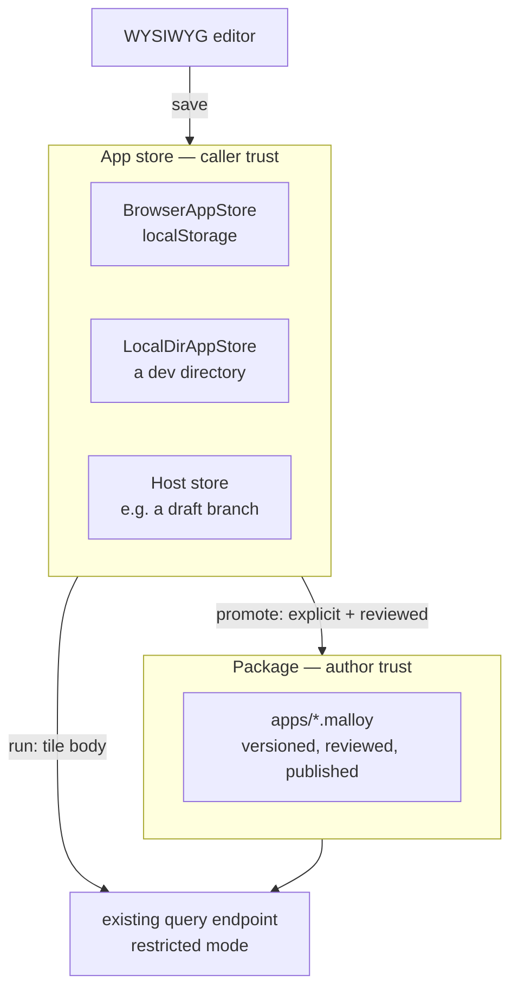

<!--
Copyright (c) Credible Data Inc.
SPDX-License-Identifier: MIT
-->

# Design: Malloy apps (v2)

**Status: a design, not shipped code.** Nothing below describes behavior you can run today. Where it
says a mechanism exists, there is a citation; everything else is a proposal. Written September 2026.

One authored artifact — an **app** — becomes the surface you reach for instead of a notebook, a
dashboard, or a workbook, and it gains a WYSIWYG editor, a pluggable place to save, an agent that can
add a tile, and an embedding story. The app is a plain `.malloy` file. There is no new file format, no
sidecar, and no fork.

It does not absorb every existing artifact. `.malloynb` survives for the one thing an app cannot
express — a document whose cells build on each other — and HTML data apps survive for pages that ship
code. §13 draws both lines.

**Related:** [choosing-a-surface.md](choosing-a-surface.md) (whose three-surface taxonomy this
narrows to an app-or-code decision), [malloyyo-dashboards-design.md](malloyyo-dashboards-design.md) (whose "one engine,
two document types" principle this reverses, §13), [security-posture.md](security-posture.md) (the
trust boundary §5 and §9 argue against), [givens.md](givens.md), [dashboards.md](dashboards.md).

## 1. Why

Publisher has **four** authored artifact types, and only one of them is editable:

| Artifact | Format | Editable | Lives in |
| --- | --- | --- | --- |
| Notebook | `.malloynb`, `>>>` delimiters | no | a package |
| Dashboard | `dashboards/*.malloy` + `# artifact` | no | a package |
| HTML data app | `public/*.html` | by editing files | a package |
| **Workbook** | `JSON.stringify(WorkbookData)` | **yes** | a `WorkbookStorage` |

The editable one is the only one that is not Malloy. A workbook persists a bespoke JSON shape
(`packages/sdk/src/components/Workbook/WorkbookManager.ts:155`) and exports to `.malloynb` through a
one-way function that emits syntactically invalid Malloy — `` `import {${cell.sourceName}}" from
'${cell.modelPath}'"` `` (`WorkbookManager.ts:174`). It is also unreachable: the route exists in
`packages/app/src/App.tsx`, and no shipped navigation points at it.

Meanwhile the read-only artifacts are the good ones. They are declarative, reviewable in a pull
request, and agent-authorable. The gap is not expressiveness — it is that **nothing can write them
back**. There is no endpoint in `api-doc.yaml` that persists a model, notebook, or dashboard file.

Downstream, every consumer that wants an editor builds its own. Credible's is the clearest case: it
reimplements the entire layer above the leaf renderer — `app/src/components/MalloyReport/` alone is
3,666 lines, plus a second cell splitter for uncommitted drafts, plus three unrelated
iframe protocols — and still has no authoring surface at all.

So: one authoring surface, one renderer, one editor, one place to save, and the same file in every
surface that displays it.

## 2. The app document

An app is a plain `.malloy` file. What makes it an app is a model-level `## app` tag; what makes a
query a tile is a `# tile` tag.

```malloy
## app { title="Storefront" layout=grid columns=3 }
import "ecommerce.malloy"

##" ### Revenue is up 12% this quarter
##" Narrative that introduces the page rather than any one tile.

#" ### Revenue trend
# tile { colspan=2 }
# line_chart
query: revenue_trend is orders -> by_month

# tile
query: top_brands is orders -> by_brand + { limit: 5 }
```

**This document is verified, not sketched.** Run through `MalloyTranslator` on `@malloydata/malloy`
0.0.432 — the version `packages/server/package.json` declares, as a caret range rather than a pin —
with the `import` resolved against a real model, it translates
with **zero problems**: the `## app` tag, the top-level `query:` tiles, `# tile { colspan=2 }`,
`# line_chart`, the `#"` tile prose, and both standalone `##"` blocks. Three forms that look
reasonable and are not:

- **`query:`, not `view:`.** A top-level `view:` is a syntax error — `no viable alternative at
  input 'view:'`. Views exist only inside a source's `{}`
  (`malloy/packages/malloy/src/lang/grammar/MalloyParser.g4`). `dashboards.md` already uses top-level
  `query:` for this.
- **A second `#` on a line is a new annotation, not a continuation.** The lexer takes `#` to
  end-of-line, so `# tile { colspan=2 } # line_chart` silently drops `line_chart` — no error, no
  warning. Several properties on one `#` line are fine (`## artifact { … } dashboard { columns=12 }`
  in `examples/storefront/dashboards/overview.malloy` is one annotation with two properties); a
  second `#` is not.
- **Tags precede the statement they annotate.** A control tag written after a `given:` attaches to
  whatever comes next.

### Reading mode is a property, not a format

`## app { layout=grid }` is the operational grid we call a dashboard today. `## app { layout=flow }`
is the narrative, top-to-bottom document we call a notebook. Same file, same engine, same renderer;
one tag decides how it reads. This is the whole basis for collapsing two document types into one, and
it is why §13 has to reverse a ratified principle rather than extend it.

### Prose has a home, and it needed no language change

This was the design's one genuinely open question, and the compiler answers it.

- **Prose belonging to a tile** is the tile's `#"` doc comment. It arrives on the query's
  `annotations.blockNotes`, each note carrying its own `at.range`.
- **Prose belonging to no tile** — an opening paragraph, a section break, a closing note — is a
  standalone `##"` block. It arrives in `modelAnnotations[url].ownNotes.notes`, **each note with an
  exact `at.range`**.

Because every note carries a source position, `flow` mode interleaves prose and tiles by **source
order**, which is author order. A notebook's "markdown cell, then code cell" becomes "doc comment,
then query" with no container, no delimiters, and no new syntax.

What is still missing is the *renderer*: `#"` is read today only as a dashboard title and description
(`dashboards.md`), and nothing renders either form as markdown. That is the one part of the format
merger that is real work rather than a reuse.

### Discovery is by tag, and must read own notes only

A dashboard is found today by globbing one directory — `DASHBOARDS_DIR = "dashboards"`,
`packages/server/src/service/dashboard.ts:77`, non-recursive by deliberate choice (`:252-262`). An app
is declared by carrying `## app`, so discovery becomes a package-wide scan.

That works because Publisher already compiles every `.malloy` in a package as its own entry, and
discovery reuses those compiles.

**Discovery must read own notes only, and the reason is the opposite of what it looks like.** `##`
annotations **do** cross imports, deliberately: the compiled `modelAnnotations` is a
`modelID → {ownNotes, inheritsFrom}` registry folded by a post-order DFS over the import lineage, and
Publisher replicates that fold on purpose — `packages/server/src/service/annotations.ts` documents why
(an imported `##(authorize)` has to be refused too, not just a locally written one). So a model that
merely *imports* an app file would inherit its `## app` and list as an app.

The guard already exists and app discovery reuses it: `ownModelNotes`, which counts a node only if it
is this document or one of malloy's synthetic URL-less compiles, so "every real-URL import is out".
Dashboard discovery reads exactly this (`packages/server/src/service/dashboard.ts:629`).

Two things follow. **An app file does not have to be self-contained** — it may import freely, because
its own `## app` is its own note. And **"is this file an app" is a reader question, not a language
property**: the same bytes imported elsewhere must not make that file an app too.

Reading the markers needs no new plumbing *for discovery* — `api-doc.yaml` already returns file-level
`##` annotations for notebooks (`:3878`) and per-view and per-query annotations (`:3970`, `:3986`).
The editor needs more than the API returns today; §6 says what.

## 3. Where an app lives

An app's home is an **app store**, not a package. A package is a *promotion target*.

This is the decision the rest of the design hangs off, and the reason is churn and authorship rather
than safety. An app in a package means every tile drag is a package version: a republish, a worker
reload, and a new `1.0.N` for every viewer of that environment. Apps are high-churn and often
personal; models are low-churn and shared. At least one downstream deployment reached this
conclusion independently for per-tenant dashboards, keeping them outside any package precisely so
that editing one never republishes the model it reads.



`WorkbookStorage` is already the right shape for this and becomes `AppStore`. It declares
`listWorkbooks`, `getWorkbook`, `saveWorkbook`, `moveWorkbook` and `deleteWorkbook` today
(`packages/sdk/src/components/Workbook/WorkbookStorage.ts:15`); the `*App` spelling below is this
document's proposal, not an existing API, and the substantive addition is an etag for concurrency.
`BrowserWorkbookStorage` over `localStorage` is the existing reference implementation.

## 4. The store dialect

An app in the store is **a binding, plus tags, plus tiles**. Nothing else.

The `import` line names the model the app is bound to. It is a *binding*, not a compile-time import:
the editor does not compile the app document as a model at all. To run a tile, it takes the tile's
query body and sends `run: <body>` to the bound model's ordinary query endpoint — which is exactly
what a dashboard tile does today:

```ts
// packages/sdk/src/components/Dashboard/DashboardTile.tsx:119
query: tile !== undefined ? `run: ${tile}` : undefined,
```

This is the design's load-bearing simplification, because that endpoint is already the governed one:

- It compiles caller text through `loadRestrictedQuery`
  (`packages/server/src/service/model.ts:4855`), which refuses `import`, `given:`, `##!`,
  `connection.table`, `connection.sql`, `name!type` and the `sql_*` family
  (`malloy/packages/malloy/src/api/CONTEXT.md:248`, enforced in `api/foundation/runtime.ts:945`).
  Confirmed empirically: a store tile naming a table directly fails with *"`duckdb.table(...)` cannot
  be used in a restricted query — direct table access is not permitted."*
- Caller-minted `#(authorize)` is already refused (`packages/server/src/service/authorize.ts`),
  because a source's own gate **replaces** its base's rather than adding to it. An app narrows with
  `where:`, which only ever narrows.
- A host that injects trusted attributes already does so on this path. Credible's router strips any
  caller-supplied value for a registered trusted name and injects the server-resolved one
  (`applyTrustedGivens`), so anti-forgery is inherited rather than rebuilt.

The rule this yields:

> **An app gives its author no reach beyond what that author already has on the query endpoint. It
> may not reach a new connection, and it may not remove or replace a gate.**

That is deliberately narrower than "an app may re-slice what the viewer can already read", which an
earlier draft of this document claimed and the code does not support. The endpoint accepts
caller-authored Malloy today; an app is a place to *keep* such a query, not a new capability.

**The exposure delta of a store is zero, and that — not gate containment — is the security argument.**
Anyone who can open an app can already post the same text to `/query`: on bare Publisher the API is
unauthenticated (`security-posture.md:28`), and under a host like Credible the query call is gated by
package read alone with the query string as free text. App author, viewer, and "could already write
this join by hand" are the same population, and every tile still executes under the viewer's own
identity. What a store adds is persistence and sharing, not reach.

**Gates are entry-point only, and a join reaches around them.** `#(authorize)` is evaluated on the
source the query *enters through* — the run target's own gate, the gate it carries from a derivation
base, and, when the target is a composite, the one member branch Malloy resolved. A gate on a source
reached only through `join_*` **does not fire**: at any depth, aliased, cross-file, or declared
query-local inside a refinement. The walk says so in its own words
(`packages/server/src/service/model.ts:1316`), `authorize.md:214` documents it as the rule authors
have to design around, and an integration spec asserts it positively on *caller query text* in exactly
a tile's shape. It is deliberate rather than an oversight: joined-gate enforcement was built and then
reversed to entry-point-only.

So a tile can read a gated source's rows through a join. This is not a hole the design opens — the
identical ad-hoc query does the same thing today — but this document must not be read as saying gates
contain an app, because they do not. The remedy is model-side and is `authorize.md`'s own: put the
gate on the source callers enter through, and use `include { private: * }` to control what an
extension re-exposes.

What gates *do* catch, they catch however the tile is written. The walk is unconditional on the query
path — `authorizeAndBindRunnable` (`packages/server/src/service/model.ts:5196`) runs it for every
query, under a comment warning against re-adding the `hasAuthorize()` guard that once re-opened an
inherited-gate bypass (`:5185`).

**Curation is not a boundary either, for a different reason.** `assertQueryBoundaryCompiled`
(`packages/server/src/service/model.ts:3706`) admits the run target if it is a curated source or
derives from one, and **never enumerates joined sources**. Under `queryableSources: "declared"` a tile
may write `run: curated extend { join_one: h is unexported_source on … } -> { group_by: h.field }` and
read a source the package chose not to export. That is the position Publisher already takes for
`/compile`, where the boundary is documented as *discovery curation, not access control*.

**A server-side "join walk on the app path" cannot be built, and this design should not imply one.** A
tile is an ordinary request to the ordinary query endpoint; nothing distinguishes it from any other
ad-hoc query, and the one caller-supplied class marker (`queryClass`) is caller-set and not a trust
signal. The options are an editor-side lint — bypassable, the same status as the store-dialect
exclusions below — or a Publisher-wide change to `queryableSources` semantics, which
`discovery-and-access.md:51` declines today on purpose. As a *security* control, deferring is
defensible precisely because the delta is zero. As a *promotion* check it is required, so it lands
with promotion in P7 rather than P1.

The `extendModel`-style store-dialect exclusions below are an **editor-enforced lint**, not a
consequence of restricted mode: restricted mode accepts `source:`, `query:` and inline `extend` at
caller trust (verified). It refuses `given:` on the **restricted construct list** —
`restricted-construct-forbidden`, at
`malloy/packages/malloy/src/lang/ast/statements/define-given.ts:279` — which is a stronger guarantee
than the experimental-flag gate an earlier draft credited. The flag only decides which error you get
when the bound model does not enable givens, and any model carrying controls enables them.

**No new compile door is built.** An earlier draft of this design proposed a restricted authoring
compile over a server-synthesized prologue. That would have been a bespoke trust tier layered on
`/compile`, which is construct-unrestricted (`packages/server/src/service/environment.ts:911` uses
`runtime.loadModel`) and resolves imports through a reader with no package containment
(`packages/server/src/utils.ts:9`). Routing tiles to the endpoint that is already restricted deletes
that work and the risk with it.

**The costs, stated rather than discovered:**

- **No cross-tile shared definitions in the store.** A tile is self-contained. An app that wants a
  shared `source:` extension has outgrown the store and should be promoted.
- **Controls come from the bound model's `given:` declarations.** The app chooses which to surface and
  what value to start them at; it cannot declare its own. That matches how dashboards already work —
  declarations are a model concern (`givens.md`).
- `given:`, `source:`, `##!` and `import` become live **only at promotion** (§8).

**An app carries given *values*, never given *declarations*** — the distinction the rest of this
section rests on, and the one an earlier draft collapsed. Three things look alike and sit at three
different trust levels:

| Shape | Who sets it | Trust level |
|---|---|---|
| `## app { givens { REGION is 'emea' } }` | the app author | **presentation.** The viewer's URL overrides it |
| `?REGION=emea` in the viewer's URL | the viewer | presentation — the same level, at the wire |
| a tenant given injected per request | the host's middleware | **a boundary**, and the only one of the three |

The first is the "pin a dashboard to a segment" affordance, and it already exists: dashboards and
notebooks carry `startingGivens` today (`packages/server/src/service/dashboard.ts:895`), documented as
values that **URL parameters override** (`api-doc.yaml:3713`). An app spells it `givens { … }` on
`## app` and inherits that behavior, including the recorded limitation that a starting value cannot be
cleared (`packages/sdk/src/hooks/useGivensState.ts:176`). Because the URL wins, *an author-pinned
tenant is not a tenant boundary* — say it in the UI, not just here.

The third is how one app serves customer-specific views, and it needs no new mechanism: the given is
declared on the **model**, gated with `#(authorize)` or narrowed with `where:`, and its value is set
by the host's middleware on the very path tiles use. Credible's router strips a caller-supplied value
for a registered name and injects the server-resolved one, whoever set it. **Publisher OSS has no
trusted tier at all** — the only request headers it reads are `x-publisher-bypass-authorize` and
`traceparent`, and identity-bound givens are a stated future milestone (`authorize.md:394`). So in
bare Publisher the tenant boundary does not exist to be inherited; it is the host's to supply.

Three containment rules govern a server-side store, and they are load-bearing because the API is
unauthenticated by design (`security-posture.md`): **a store root is never inside a package root**;
**the package loader never compiles store files as package models**; and **every store path
canonicalizes inside the store root** — `..` and symlink traversal resolved, as the `public/` file
server already does — with a size cap per app. Without the first two, writing an app into a watched
directory turns caller-trust content into author-trust package content.

`frozenConfig` is a boolean and defaults to open, so it is not sufficient on its own: **a server-side
store is off by default and is a development affordance.** A deployment that wants a shared,
writable store puts an authenticating gateway in front of it, which is the same control
`security-posture.md` names for the rest of the API. The browser store carries none of this risk — it
is per-viewer and reaches no server — and a tampered browser store is uninteresting for the same
reason a tile is safe: every tile compiles restricted against a model the author did not write.

This is also the direct answer to Malloyyo's recorded objection to storing authored artifacts outside
a repo (§12): the store holds a binding and tiles, not code.

## 5. The five ports

The app runtime is one core with five injected ports. Every surface is an adapter, and two of the
five already exist in some form.

| Port | Contract | Adapters |
| --- | --- | --- |
| **Data** | run one tile | Publisher query endpoint; MCP `execute_query`; a host's own proxy |
| **Store** | `AppStore` + etag | browser, local directory, read-only package, a host's versioned store |
| **Agent** | `propose(intent, context) → AppPatch` | a host's agent; an MCP-connected agent; none |
| **Host** | navigation, theme, auth, URL state, **which models an author may bind to** | `onNavigate` and `ServerProvider`'s `getAccessToken`/`theme` exist |
| **Embed** | React in-tree; iframe + `publisher:*`; MCP app (`ui://`) | §9 |

Binding authorization sits on the **Host** port deliberately. Publisher does not authenticate end
users (`security-posture.md`), so "which models may this author bind to" is a question only a host
with a user model can answer. Under `queryableSources: "declared"` the host also has to consult the
package's servable entry points, the same filter dashboards already apply — otherwise an author binds
to a model that is not listed and gets an app of uniformly dead tiles.

**That check is an authoring affordance, not the containment.** The binding is data in a document the
store holds, and the store is caller-writable — trivially so in `localStorage`, and over an API for a
server-side one. "Rebinding is refused" below is an editor gesture, not a boundary. So the invariant
belongs on the **Data** port instead: *the bound model is authorized on every tile run, under the
viewer's identity, exactly as any other query against that model would be.* This is also the only way
the "may not reach a new connection" half of §4's rule can fail — another package's model may sit on
another connection — so it is the one place a tampered binding has to be caught, and it is caught by
the endpoint rather than by anything this design adds.

## 6. The edit algebra

There is no Malloy pretty-printer this design can use. The only one,
`malloy/packages/malloy/src/lang/prettify/`, is whole-document and self-labelled *"**Experimental —
this API may vanish or change at any time without notice.**"* (`lang/prettify/index.ts:119`). So the editor
**never re-emits the document**. Every gesture is a bounded text operation, and everything outside the
touched span stays byte-identical.

### Where the document is analyzed

§4 says the editor does not compile the app document as a model, and that stays true: **the editor
never sends the document anywhere to be compiled.** It analyzes it locally, and the two things it
needs are available locally.

- **Statement extents** come from `Malloy.parse({source})`, which is synchronous, needs no
  connection, and yields `DocumentSymbol` entries with `range` and `lensRange`.
- **Annotation lines** the editor parses itself, with `parseAnnotation` from
  `@malloydata/malloy-tag`. This is exact rather than approximate because **annotations are
  line-oriented**: the lexer takes `#` to end-of-line, so "which line carries which property" is a
  property of the text, not something requiring semantic analysis.

An earlier draft said the property-to-line map is "handed over by the compiler". That was wrong, and
the distinction matters: notes with `at.range` exist only after *translation*, which needs the import
resolved and schemas fetched — exactly the round trip §4 declines. The map is **reconstructed by the
editor, exactly**, from line-oriented text. Translation still happens, on the server, for discovery
and for running tiles; the editor does not depend on it to draw or to edit.

What the API returns today is not enough for the editor: `api-doc.yaml:3878` gives annotation
*texts* as `string[]` with no ranges. That is fine for discovery and insufficient for editing, which
is why the editor parses locally rather than asking.

### Two properties that make splicing safe

**In the line-oriented form, every annotation is its own note with its own line.** A tile's three
annotations — the `#"` prose, `# tile { colspan=2 }`, `# line_chart` — are three separate entries at
three separate lines, verified both in the compiled `blockNotes` and in the editor's own line parse.
In that form one line never carries two annotations, and `#` runs to end of line.

**Malloy also has block annotations, and they break that assumption.** `#|` … `|#` and `##|` … `|##`
open an annotation that spans lines (`malloy/packages/malloy/src/lang/grammar/MalloyLexer.g4:188-195`
and `MalloyParser.g4:102-111` beside it), which the
compiler models as a **single** note — hence `Note.indentStripped`, present precisely "for multi-line
annotations" (`malloy/packages/malloy/src/model/malloy_types.ts:2064`). A document using them is legal
Malloy this editor did not anticipate.

It fails in the **unsafe** direction, which is why it gets a guard rather than a footnote:
`parseAnnotation('#|')` returns an empty tag with an empty log, so the ownership test below — "every
property on this line is one the editor manages" — is *vacuously* true, and the editor would claim an
author's block opener as its own line and rewrite or cut it. The stale-parse guard does not fire,
because the parse is clean.

> **The editor refuses every structural gesture on a document containing `#|` or `##|`**, and says
> why, until its line map is block-aware. Text editing stays live. This is a check on the raw text
> that runs before any line map is trusted — not an invariant the editor may assume.

**Annotation lines fold in order, last-wins per property, and merge rather than replace.** Verified
against `parseAnnotation`: given `## app { title="A" columns=3 }` followed by `## app { columns=9 }`,
the result is `columns=9` **and** `title="A"`. Against the real storefront's co-mingled
`## artifact { … } app { columns=3 }`, appending `## app { columns=9 }` wins on `columns` and leaves
`artifact.title` intact.

That second property is what makes tag editing safe, because it means **tag edits never rewrite a
line the editor did not write**:

> To change a property, the editor rewrites a line it owns, or appends one. It never re-serializes a
> line it does not own.

This matters more than it sounds. `Tag.toString()` is a canonicalizer, not a fidelity round-trip: it
does not preserve author spelling, and it **silently drops references** — `# a=$ref b=1` serializes to
`# -a b = 1` with an empty error log, turning a reference into a deletion
(`malloy/packages/malloy-tag/src/tags.spec.ts:512`, "References are dropped"). The ownership rule is
what keeps that bug unreachable.

**Ownership has to survive a reload, and nothing in the file records who wrote a line.** An editor
that reopens an app cannot tell its own `# tile { colspan=2 }` from an identical hand-written one. The
rule is therefore a **property of the content, not of history**:

> A line is editor-owned if it is a single-line annotation, carries **at least one** property, every
> property on it is one the editor manages, and it contains no reference (`$`) and no property the
> editor does not know. Otherwise the line is the author's: the editor appends its own line to
> override, and if even that cannot express the change, the gesture is refused.

The "at least one property" clause is not redundant — it is what stops an empty parse from reading as
a line the editor owns, which is the block-annotation trap above and would otherwise be the one place
this rule hands the editor *more* authority the less it understands.

That is decidable from the text on every reload, by any editor, with no sidecar and no provenance
marker — and it degrades the right way, because an unfamiliar property makes a line *more* protected
rather than less. A file hand-written to put `colspan` beside a `$ref` gets an appended
override line, which is correct and legible in a diff.

**Rebinding is refused.** Changing which model an app is bound to means changing its `import`, and a
second `import` line is a second binding rather than an override. Rebinding is a create-new-app
operation, not an edit.

| Gesture | Operation |
| --- | --- |
| resize, retype, restyle a tile | **own-line write** — rewrite the editor's line, or append one |
| set app title, columns, reading mode | **own-line write** on the `## app` line |
| edit prose | **doc-comment splice** over that note's range |
| add a tile | **append** a `query:` at end of file |
| delete a tile | **block-extent cut** |
| reorder tiles | **block-extent move** |
| edit a tile's query | **body splice**, text from `@malloydata/malloy-query-builder` |

**That table describes `## app` / `# tile` documents, and only those.** §12 says the editor preserves
a `## artifact { tiles=[…] }` document in whichever form it found rather than rewriting it — but in
that form membership and order live in the `tiles=[…]` array, not in statement order. A block-extent
move would reorder nothing, and a block-extent cut would leave a dangling name in the array. So until
the array mutations are specified and tested, **an artifact-list document opens read-only in the
builder**, with an explicit one-way convert action. Preserving a form the editor cannot correctly
mutate is worse than declining to edit it.

### The block extent, and why `range` is not enough

`DocumentSymbol.range` excludes a statement's annotations, and `lensRange` covers them only when the
block declares exactly one thing (`document-symbol-walker.ts`). Cutting `range` therefore leaves the
tile's `# tile` and `#"` lines hanging — and **an orphaned annotation is a compile error**, not a
no-op: *"Object annotation not connected to any object"*
(`malloy/packages/malloy/src/lang/malloy-to-ast.ts:2235`), verified by translating a document with a
dangling tag.

So delete and reorder operate on a **block extent** — tags, doc comment and body as one unit. The
extent is computed from the annotations **attached to the statement**, and explicitly *not* as
"everything since the previous statement."

That distinction is load-bearing rather than pedantic. A standalone `##"` prose block is its own
statement, but the symbol walker emits **no symbol** for it — `document-symbol-walker.ts` has handlers
for query, run, source, nest, field, join and import, and none for `docAnnotations`. So "since the
previous statement" reaches back past page-level narrative and swallows it, and deleting or reordering
a tile would delete or move prose that belongs to no tile — in `flow`, the reading mode this design
exists to add.

The extent therefore runs from the first annotation token attached to the statement through the end of
that statement, **stopping at any standalone model-level note** (`##`, `##"`, `##|`). Three cases the
implementation covers explicitly, because all three are reachable from the §2 example: prose before
the first tile, prose between two tiles, and prose after the last tile. Every one of them belongs to
the page, not to a neighbor.

The editor computes this from its own line map plus `DocumentSymbol` — the only inputs it holds. Not
from note ranges, which, as above, exist only after translation. Where `lensRange` happens to agree it
is a useful cross-check and not a substitute: its public getter silently falls back to `range` when
unset, so a caller cannot tell "covers the tags" from "does not" and still needs its own
single-definition test. Reorder is a multi-line diff by construction; that is stated here rather than
promised away.

### Three guards

- **Stale-parse guard.** The translator preserves document symbols *"even when there's a bad parse"*
  (`parse-malloy.ts:446`). Ranges from a partial tree are worse than no ranges, so while the parse has
  errors every structural gesture is disabled and plain text editing stays live. An editor that
  splices against a broken parse corrupts the file.
- **Concurrency.** Every `AppPatch` carries a `baseVersion` content hash. A mismatch is rebased by
  re-resolving symbols **by name** rather than by offset, or refused. Store writes use etags.
  **Single-writer-per-document is the v1 constraint.** Undo is inverse patches over the same rebase.
- **Inexpressible gestures are refused.** If a property the user changed lives on a human-written line
  the editor cannot safely rewrite, the editor appends its own overriding line; if even that cannot
  express the change, the gesture is disabled rather than approximated. A gesture that cannot be
  expressed as a bounded operation does not ship.

One small upstream convenience would help and is not required: a public `codeAtLocation`. It is a
~25-line line-map slice, today on `MalloyTranslation` (`lang/parse-malloy.ts:808`) and reachable but
unsupported through `Parse._translator`.

## 7. Live rendering

- **Tiles run independently and combine on the client.** A tile result and a `nest:` are structurally
  identical in the interfaces format, so N independently-run tiles merge into a single `# dashboard`
  result and `@malloydata/render` owns the grid. Malloyyo proved this (their
  `packages/cli/src/frame-runtime/combine.ts`)
  after starting with a server-side sequential merge; we start where they finished. **This is new
  Publisher code**, not a reuse — v1's dashboard lays its own grid out from per-tile tags rather than
  synthesizing one result — and it is the largest single piece of work in §7.
- Each tile runs with only the givens it references.
- **Wait-for-all single paint**, with a per-tile status list. Malloyyo shipped and then reverted
  progressive fill, schema-up-front skeletons, *and* hide-until-settled reveal. Three reversals worth
  not repeating.
- **A layout drag re-runs nothing.** Layout is a tag; tags are not query inputs.
- Per-tile invalidation is **dependency analysis, not text diff** — a change a tile depends on has to
  re-run that tile.
- The result cache key includes **caller identity** wherever a host injects trusted attributes.
  Otherwise a shared cache leaks rows across users.
- An agent's `AppPatch` applies **optimistically**: the affected tile shows a skeleton, every other
  tile keeps its rendered result. That is the difference between this and handing the file to an
  agent and waiting.
- **Two URL namespaces**, from Malloyyo: `$NAME` for givens — the governed contract — and a separate
  prefix for view state. Request-derived state is parsed client-side and never interpolated into
  served HTML; they fixed a real reflected XSS that way.

## 8. Promotion

Promotion moves an app into a package, and it is the only point where `given:`, `source:`, `import`
and `##!` become live. It changes behavior in ways a text diff does not show:

- Named-query and ad-hoc query paths are not identical.
- `queryableSources: "declared"` applies at run time, so a promoted app whose file is absent from
  `explores` fails every tile. Dashboards already meet this and are *withheld from listing* rather
  than served broken; an app reuses that treatment rather than inventing a third behavior.
- The app's tiles become package queries, visible to MCP, `get_context`, and indexing.
- **The binding stops being a binding.** An `import` specifier resolves relative to the containing
  file, so `import "ecommerce.malloy"` identifies nothing while the app sits in a store and does not
  resolve from `apps/` once promoted. The store records the bound model as a package-qualified
  locator, and promotion **rewrites the specifier** to a path that resolves from the app's new home.
  Without this the same document cannot run in both places.

Promotion therefore runs the following, with a package author as the reviewer:

**Run every tile before and after, and compare result hashes.**

**Touch `explores` only when it already exists.** Adding the app unconditionally is wrong in both
directions. On a package with no `explores`, writing a single entry *switches curation on* — `explores`
is the single opt-in — so every other model in that package becomes unlisted and, under the default
`"declared"`, unqueryable. Promotion into such a package adds nothing. On a package that already
curates, the entry is a real widening: it belongs in the diff the reviewer reads, alongside an
explicit `export { … }` naming the tile queries, since a model with no `export {}` exports all of its
top-level sources.

**Lint every tile against the curated set.** This is the join walk §4 says cannot be built
server-side — and promotion is where it *can* be, because the app text is in hand, the curated set is
known, and nothing is ambiguous about which query is a tile. Listing an app in `explores` also puts
its tiles among the package's curated queries, where they clear the early gate and skip the compiled
boundary backstop, so a tile joining an unexported source has to be caught here or not at all.

**Refuse a `given:` that shadows the bound model's.** The lint an earlier draft described — collision
with a host's registered trusted attribute, or with a name a gate references — misses the case that
actually breaks tenancy. Malloy mints a fresh identity per declaration, so a promoted app that
re-declares a name the bound model uses only in `where:` **shadows** it: the request value, including
one the host's middleware injected, binds to the app's declaration while the base's given falls back
to its default. So promotion refuses any app `given:` whose name appears anywhere on the bound model's
given surface. Publisher has no knowledge of a host's registered names, so that half is a Host-port
hook (`reservedGivenNames()`), empty in OSS.

**Lint the import surface.** Promotion is where `import` becomes live, and the reader resolving it has
no package containment (`packages/server/src/utils.ts:9`) — it will read any `file:` URL.
Caller-authored text becoming author-trust content is the escalation "an app author is not a modeler"
exists to prevent, so promotion refuses an absolute or traversing specifier rather than trusting the
reviewer to spot one.

**The hash comparison is a smoke test, and the doc should not oversell it.** It compares one
identity's rows at one moment across two code paths, so it catches the mechanical breakages — a tile
that 404s because the app is not in `explores`, a named-query path that resolves differently from the
ad-hoc one — and it cannot catch a divergence that depends on *who* is asking. An app whose tiles
read the same under the promoter's identity may read differently under a viewer whose gates resolve
elsewhere, and newly-live `given:` declarations bring new defaults with them. It will also fail
spuriously on live data, so it compares shape and row count rather than demanding byte equality.
What it is genuinely for is the identity-independent half; the rest is what review is for.

That distinction is the point. Under today's Publisher, anyone who can write dashboard Malloy into a
package is architecturally a modeler: the file is author-trust content, so it can declare a source or
a gate. This design separates the two — **an app author is not a modeler** — and promotion is the one
place where they meet, under review.

## 9. Embedding

A builder is not a read-only dashboard. Its frame holds delete, save, and an agent trigger, and behind
a versioned store it reaches a write path. Two consequences:

**The framing policy is a prerequisite for the first edit-capable route**, not a later nicety. Today
in-package HTML gets `frame-ancestors` and **Console routes set no framing header at all**
(`security-posture.md`, gap 1) — which means setting `PUBLISHER_FRAME_ANCESTORS` implies a coverage it
does not have. One policy over every document, `'self'` by default with an opt-in allowlist. Edit
gestures refuse when framed by a non-allowlisted ancestor.

**Inbound messages need an origin check.** The `publisher:*` protocol validates `event.source` and
never `event.origin` (gap 4). For a resize message the exposure is one number; for a givens or
navigate message reaching a builder it is not. Any host-to-app channel carrying text into an agent is
a prompt-injection path and is rendered as quoted data, never as instructions.

**Cross-origin embedding waits on real token verification.** `Publisher.embed`'s `embed_token` and
`Publisher.setToken`'s bearer header are read by no server code (gap 2). An affordance that looks like
authentication and is not is worse than its absence.

**One support status for the React SDK, chosen here.** `embedded-data-apps.md:9` calls the SDK *"an
internal building block, not a supported path for external integration"*, while
`malloyyo-dashboards-design.md` calls `<Dashboard>` a public export any React app may use. Both cannot
be true. This design says: `<MalloyApp>` is **public and supported**; the rest of the SDK stays
internal. React embedding therefore works from P0 with **the host owning framing and auth**.

That is a decision this document takes, not one it has already landed — both sentences above are
still in their own docs, and `choosing-a-surface.md` still routes notebook and dashboard embedding to
the internal-building-block page. Reconciling those three is part of **P0**, because an integrator
who reads them in the wrong order builds against the wrong contract.

## 10. MCP apps

An app becomes addressable as an MCP resource, `ui://app/{store}/{path}`. The MCP-app bundle is the
**same renderer core** with an MCP host adapter on the Data port and a read-only Store port. A tool
result carrying `_meta.ui.resourceUri` (and `openai/outputTemplate` for hosts that want it) renders
the app inside ChatGPT or Claude Desktop.

This is consolidation, not new surface. `@malloydata/render` already runs inside an MCP-app iframe in
Credible today; folding it in replaces three bespoke bundles with one, and collapses three postMessage
protocols to two — MCP-Apps JSON-RPC inside an MCP host, `publisher:*` inside a web host.

MCP stays **data-only for authoring**: an agent proposes an `AppPatch` through the Agent port, and the
host applies it. Publisher does not grow a tool that writes an app, for the same reason Malloyyo
rejected one (§12).

## 11. A host adapter, concretely

Credible is the first host, and it is worth stating what a host actually supplies, because it is
little: a Data adapter (its router), a Store adapter (its versioned store), an Agent adapter, and the
Host port's binding authorization, theme and navigation. What it *deletes* is the interesting part —
its own notebook renderer, its own cell splitters, and its own draft-render path.

One Credible-side widget deserves to come upstream rather than stay a host concern: a
**semantic-search given control**, a `control=` kind backed by a pluggable suggest provider. It is
genuinely generic and the given-control contract already has the shape for it (`given.ts`'s control
spec, `givens.md`).

## 12. Malloyyo, and the objection this design has to answer

Malloyyo is the closest prior art and the reason Publisher's dashboard grammar exists. Its position is
the opposite of this design's, deliberately, and pretending otherwise would be dishonest.

- **It has no WYSIWYG, on purpose.** Its one in-app model editor shipped and was deleted a week later.
  Authoring is a CLI plus an agent editing files, gated by `lint`.
- **It rejected an artifact store.** Its `docs/repo-artifacts.md` rejects a runtime tool that would
  write agent-authored code into a store, because such code is *"untrusted forever with no review, no
  compile check, and no test"* — authoring moved into the repo precisely to get review, compile and
  test.

  **The answer, and it is the whole of §4:** the store holds a binding and tiles, not code. Every tile
  compiles restricted, on the endpoint that already governs untrusted query text, against a model the
  author did not write. So a stored app reaches nothing its author could not already reach by typing
  the same query into the same endpoint — the store's exposure delta is zero, and *that*, rather than
  any containment restricted mode provides, is what makes it safe to keep an app outside the repo.
  Note what this does not claim: it is not a claim that a tile is confined to what a *viewer* may
  read, because §4 shows joins evade both curation and gates. Promotion is where review enters, for
  the apps that want to become package artifacts.
- **Its round-trip rule is this design's instinct at coarser grain.** Malloyyo canonicalizes
  machine-written Malloy through the prettifier, and its formatter is *"NOT applied to Malloy a person
  typed."* (`format-malloy.ts`). It draws that line per document; §6 draws it per line, which is what
  a tile drag needs.
- **It cannot embed** (`X-Frame-Options: SAMEORIGIN` app-wide); its only embed-anywhere path is a
  static WASM bundle with no auth. Embedding is genuinely Publisher's to win, which is why §9 is a
  prerequisite and not a footnote.
- **It has no notebook and no prose.** `layout=flow` and `##"` prose have no Malloyyo counterpart.

**One correction made in this change.** `malloyyo-dashboards-design.md` stated that Malloyyo's
composite has no per-tile layout. That has been false since their 0.2.19, where the client-side
combiner lifts a tile result's own `# colspan` and `# break` onto its card. The sentence is fixed
here, because leaving it would mislead the shared-grammar conversation into settling a divergence
that no longer exists.

Worth being precise about the open issue, since it is often cited the wrong way round:
`malloydata/malloyyo#160` does **not** track this correction. It is about the `dashboard_columns`
spelling, and it *repeats* the stale per-tile-layout claim — asserted a month after 0.2.19 made it
false. It needs amending rather than citing.

A second sentence in that document was left alone deliberately. Its "one trust tier" framing is still
accurate: Malloyyo removed the Malloy renderer from custom components in 0.2.19, but it **kept a
sandboxed custom-component tier**, so Publisher's single in-page tier remains a real divergence rather
than convergence. An earlier draft of this section claimed otherwise and was wrong.

**On that shared grammar:** the committed follow-up to extract `# artifact` and the given-spec
introspection into a package both projects consume still makes sense, and this design widens what it
must cover. The honest framing is a **Publisher superset that stays read-compatible**: a Malloyyo repo
renders here unchanged, `## artifact { tiles=[…] }` stays accepted, and the editor **preserves
whichever form it found** rather than silently rewriting `## artifact` into `# tile`. Do not carry
`# artifact` on a `source:` into any shared package — Malloyyo's own notes mark that form dead.

## 13. What this supersedes

[malloyyo-dashboards-design.md](malloyyo-dashboards-design.md) is normative today on **one engine, two
document types**, and says *"Merging the formats themselves is a non-goal, now and later: the
principle is shared machinery, not converged documents."* This design reverses that sentence, and the
reversal is written into that document in this change rather than left as two docs disagreeing.

The reasoning that held then still holds on its own terms: notebooks and dashboards serve different
reading modes, and folding one into the other would have broken Malloyyo compatibility. What changed is
that **four capabilities now have to be built for each document type** — a WYSIWYG editor, write-back
storage, an agent patch protocol, and an embedding contract — and that cost was not on the table when
the principle was written. The v1 argument was that everything *below* the surface should be shared;
this is that argument carried up one level, with `layout=` as the thing that lets one format serve two
reading modes.

**The reversal is earned on the reading-mode axis, and only there.** A dashboard and a narrative
report are the same document with a different `layout=`, and that is the whole claim. It is *not* a
claim that an app replaces every `.malloynb`:

> A notebook cell compiles via `extendModel`, so cell N sees cell N-1's definitions and each cell is
> its own compile checkpoint. A single `.malloy` document has no representation for that, and no
> phase in §14 adds one. **A notebook used as incremental modeling scratch is not an app**, and
> converting one would lose the chain rather than reformat it.

So `.malloynb` does not go away. It stops being the format you reach for to write a *report* — which
is most of its use — and remains the format for a document whose cells build on each other. The four
artifact types in §1 become three, not one: §1 names the surface an author reaches for *instead of* a
notebook, a dashboard, or a workbook, which is a statement about authoring rather than a deletion
list.

Everything v1 built stays: the given control contract, `# drill`, the shared control components, the
load-time lint, the per-tile layout tags. This changes what a document *is*, not how it runs.

`choosing-a-surface.md` becomes a two-surface decision — an app, or an HTML data app when you need
code — and the notebook-versus-dashboard question becomes one tag.

## 14. Phasing

| Phase | Delivers |
| --- | --- |
| P0 | `## app` grammar, `layout=grid\|flow`, tag discovery, prose rendering for `#"` and `##"` **with raw HTML disabled in the app renderer**, one `<MalloyApp>` **viewer** replacing the internals of `Notebook` and `Dashboard`; `.malloynb` and workbook JSON as read-only *readers* — they render in the builder and are never written back, and a notebook whose cells chain through `extendModel` renders as today's notebook rather than as an app (§13); `<MalloyApp>` documented as the supported export |
| P0b | **A host adopts the viewer.** Depends on nothing later, and is deliberately early: it validates the reader against real documents and lets a host delete its duplicate renderer at the start of the program rather than the end |
| P1 | Store port: `AppStore` with etags, browser and local-directory adapters, the three containment rules. **Binding authorization on the Host port lands here, not later** — a store that can save an app is a store that records which model it binds to, and a host with per-package authorization needs that question answered before the first save, not after. The Data port's per-run authorization of the bound model (§5) is the invariant this phase must not be read as replacing |
| P2 | Edit algebra: block extents, own-line tag writes with the content-based ownership rule, stale-parse guard, `baseVersion` rebase, undo. **The framing policy lands here**, as the prerequisite for the first edit-capable route |
| P3 | A render-tag validation call the editor can make before saving; the gate-walk contract spec (§15) |
| P4 | Agent port: the "+" gesture, `AppPatch`, optimistic apply, per-tile re-run |
| P5 | Embedding: chromeless route, `publisher:*` with an origin allowlist, embed-token verification |
| P6 | MCP app adapter; collapse the bespoke MCP-app bundles |
| P7 | Promotion, with the before/after tile comparison, the conditional `explores` edit, the import-containment and given-shadowing lints, and the **join walk** — which is a promotion check rather than a runtime control, because §4 shows it cannot be built server-side |

**P0 is the fattest phase and is not a foundation.** Grammar, two reading modes, discovery, a prose
renderer, two importers, and a rewrite of `Notebook` and `Dashboard` internals is a lot to land
before anything is editable. It is worth splitting on the renderer boundary — the `## app` grammar
plus discovery plus `layout=grid` (which is today's dashboard behavior under a new tag) is shippable
without `layout=flow` or the prose renderer, and `layout=flow` is where the new rendering work
actually is.

## 15. Risks and open questions

- **No printer**, so the editor is bounded-operation-only and §6's guards are load-bearing rather than
  defensive. The rule with teeth: a gesture that cannot be expressed as a bounded operation does not
  ship.
- **`Tag.toString()` drops references silently.** The own-line ownership rule is what keeps that bug
  unreachable. Any future code path that re-serializes a line the editor does not own reintroduces it.
- **Prose rendering is unbuilt.** The format merger is free in the *language* and not in the renderer.
- **`.malloynb` does not convert, permanently.** Not a phase limitation: the per-cell `extendModel`
  chain has no representation in a single document and no phase adds one (§13). An app is also not a
  notebook in VS Code — it opens as a model. Both belong in `choosing-a-surface.md` as stated
  trade-offs.
- **Neither curation nor gates contain a tile's joins** (§4). A tile can join an unexported source,
  and it can read a gated source's rows, because `#(authorize)` is evaluated at the entry point only.
  Neither is a hole this design opens — the same ad-hoc query does both today, so the exposure delta
  of a store is zero — but neither may be described as a boundary that holds app authors in. The walk
  that would close the curation half cannot be built server-side, since a tile is indistinguishable
  from any other query; it is a promotion check (P7) or an editor lint, not a runtime control.
- **Ownership is inferred from content, not recorded.** §6's rule is decidable on every reload, but it
  means a human line that happens to carry only editor-known properties is treated as the editor's.
  That is the safe direction — the edit is expressible and the diff is legible — but it is an
  inference, and a future property added to the editor's vocabulary silently widens what it will
  rewrite. Adding one is a review-worthy change.
- **A display tag must never perturb the `#(authorize)` gate walk.** Adding any annotation to a
  derivation demotes the inherited set to `annotations.inherits`
  (`packages/server/src/service/source_extraction.ts`). The gate walk already handles this, and store
  apps never `extend` at author trust — but an app is a document made almost entirely of added display
  tags, so this gets a contract spec that fails loudly rather than an assumption.
- **Raw HTML in package markdown** is parsed with `disableParsingRawHTML` unset at three call sites
  (`security-posture.md`, gap 3). Prose is markdown, so an app renderer inherits this — and a store
  turns it from author-written package content into stored cross-user content. **This is scheduled,
  not merely noted**: raw HTML is disabled in the app renderer in P0, alongside the prose renderer
  that would otherwise introduce the exposure. A shared store must not ship before it.
- **Things that are not cheap**: in-browser re-parsing pulls `@malloydata/malloy` and its ANTLR runtime
  into the SDK bundle; a versioned store adapter writes one version per drag unless it has a working
  area underneath; and no drag-and-drop library exists in the SDK today.
- **Resolved — app-local given *values*; still open — app-local given *declarations*.** §4 settles the
  first: an app carries `givens { … }` as starting values over the bound model's declarations, which
  covers pinning a dashboard to a segment and, with host middleware, per-tenant views. Declarations
  stay out, and the fallback if authors ever need them is an upstream ask to turn
  `MalloyTranslator.restrictedMode` from a boolean into a capability set. Note the cost is higher than
  an earlier draft assumed: `given:` is refused by the **restricted construct list**, not only by the
  experimental flag, so lifting the flag alone would not deliver it.
- **Open question — `## app` vs `## artifact` as the shared spelling.** §12 proposes a superset that
  accepts both. Whether the shared grammar package adopts `## app` is a conversation this document
  opens, not one it presumes.
