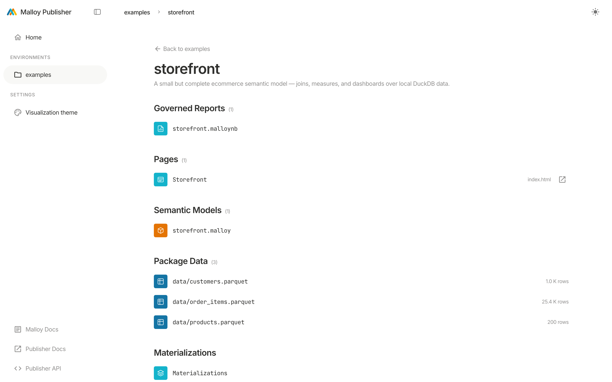
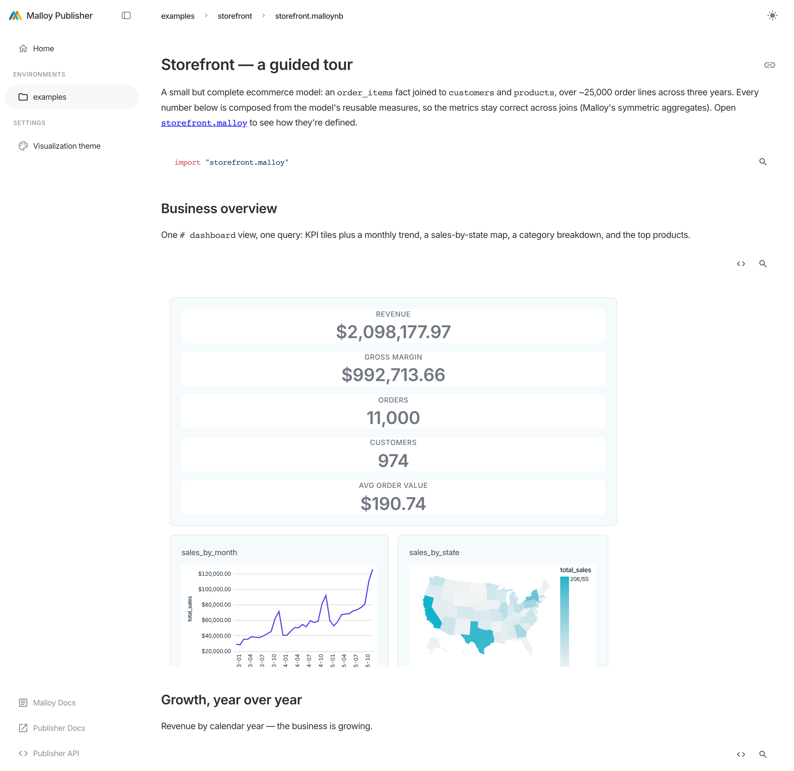

# The Publisher App

> What this is: a tour of Publisher's built-in web app — how the core constructs (environments,
> packages, models, sources, views, notebooks, data apps) surface in the UI, and how to navigate
> them. Zero code required. It's served at **http://localhost:4000** whenever the server is running.

The App is the default, no-code way to explore what a Publisher deployment serves. It's built from the
[SDK](embedded-data-apps.md) but you don't need to know that — just open it and browse.

## The resource hierarchy

Everything in Publisher nests the same way, and the App mirrors it:

```
Environment            e.g. "examples"
└── Package            e.g. "storefront"  (a versioned bundle of models + data)
    ├── Model          a .malloy file: sources, views, measures, dimensions
    │   ├── Source     a queryable entity (a table or a join graph)
    │   └── View       a saved, reusable query on a source
    ├── Notebook       a .malloynb file: markdown + live query cells
    └── Pages          an in-package HTML data app (the package's public/ dir)
```

The [REST and MCP APIs](api-overview.md) expose this exact hierarchy; the App is a view onto it.

## Navigating

- **Left sidebar** — **Home**, then an **Environments** list, and a **Settings** section
  (Visualization theme). Pick an environment to see its packages; pick a package to see its models,
  notebooks, and pages.
- **Breadcrumbs** across the top track where you are: `environment › package › file`.
- **Theme toggle** (top-right) switches light/dark when the deployment allows it (see
  [theming.md](theming.md)).
- **Footer links** jump to the Malloy docs, these Publisher docs, and the live **Publisher API**
  explorer (see [api-overview.md](api-overview.md)).



## Two URL shapes

You'll see two path styles, and they're not interchangeable:

- **App routes** are short — `/{environment}/{package}/{file}`, e.g.
  `http://localhost:4000/examples/storefront/storefront.malloynb`. Use these to link to something
  inside the App (a notebook, a package).
- **Resource paths** are fully qualified — `/environments/{environment}/packages/{package}/...`.
  This is the canonical form the [REST and MCP APIs](api-overview.md) use, and it's also how an
  in-package HTML page is served, e.g.
  `http://localhost:4000/environments/examples/packages/html-data-app/`.

When in doubt, the fully-qualified `/environments/.../packages/...` form always works; the short form
is an App convenience.

## What you can do in the App

- **Browse a package** — see its models, notebooks, and README at a glance.
- **Explore, no code** — open a source in the [Explorer](explorer.md), the visual query builder;
  every action generates valid Malloy, and you can view the Malloy and SQL behind any result.
- **Read a notebook** — a `.malloynb` renders its markdown and runs its query cells inline, including
  `# dashboard` views (KPI tiles + nested charts). Try
  `http://localhost:4000/examples/storefront/storefront.malloynb`.



- **Tune parameters live** — when a model declares [givens](givens.md), the notebook shows a
  **Parameters panel** above the cells; change a control and every cell re-runs. Try
  `http://localhost:4000/examples/governed-analytics/orders.malloynb`.


- **Open a data app** — a package's [HTML pages](html-data-apps.md) render inside the App (and can be
  opened standalone). Try `http://localhost:4000/environments/examples/packages/html-data-app/`.
- **Edit the theme** — operators can iterate colors/fonts live at `/settings/theme` (see
  [theming.md](theming.md)).

## Where to go next

- Discover data with an AI agent instead of clicking: [ai-agents.md](ai-agents.md).
- Build a custom UI: [html-data-apps.md](html-data-apps.md).
- Drive it programmatically: [api-overview.md](api-overview.md).
