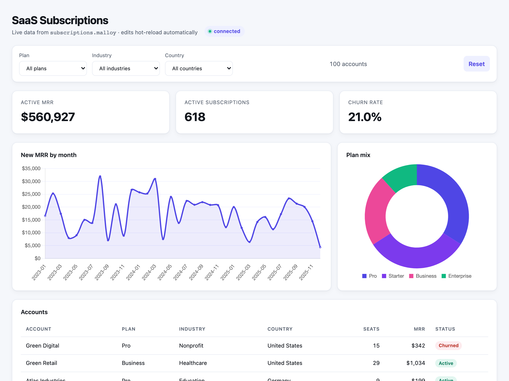

# html-data-app — example in-package data app

A no-build **SaaS subscriptions dashboard**: KPI tiles (active MRR, active
subscriptions, churn rate), a new-MRR trend, a plan-mix doughnut, and a
filterable accounts table — all driven by `Publisher.query()` against a Malloy
model.

Put your web files in a `public/` directory next to your `.malloy` files;
Publisher serves them at `/environments/<env>/packages/<pkg>/<file>`. Only
`public/` is served, so your models, data, and manifest stay private. Live
reload, embeddable iframe, no build step. See
[docs/html-data-apps.md](../../docs/html-data-apps.md) for the full reference.

## Files

- `publisher.json`: package manifest (stays at the package root, not served).
- `subscriptions.malloy`: the semantic model (root, not served).
- `subscriptions.parquet`: the data — 800 subscriptions across four plans (root,
  not served). Regenerate with `bun run generate:example-data`.
- `public/index.html`: Chart.js dashboard with KPI tiles, two charts, a data
  table, and three dropdown filters (plan, industry, country). Calls
  `Publisher.query()` to talk to the Publisher API.
- `public/embed-test.html`: host page that demonstrates `Publisher.embed()`
  iframing the dashboard.

## Try it

`html-data-app` ships in Publisher's default config under the `examples`
environment, so with the server running just open
<http://localhost:4000/environments/examples/packages/html-data-app/>.

### Run it standalone (live editing)

To edit this package and see changes hot-reload, mount it on its own in watch
mode — the [Quick start in docs/html-data-apps.md](../../docs/html-data-apps.md#quick-start)
walks through the `/tmp/publisher-demo` + `--watch-env demo` recipe step by step.
Once it's running:

- The dashboard is at <http://localhost:4000/environments/demo/packages/html-data-app/>.
- Edit `subscriptions.malloy` (e.g. change a view's `order_by:` or add a measure)
  or `public/index.html`, save, and the open browser tab reloads with the change.
- The embed demo is at <http://localhost:4000/environments/demo/packages/html-data-app/embed-test.html>.

Without `--watch-env`, Publisher serves a copy of the package taken at startup,
so source edits won't show up — right for production, wrong for development.

## Learn more

- [docs/html-data-apps.md](../../docs/html-data-apps.md) — the full in-package HTML data app reference
  (runtime API, query patterns, embedding, security).
- [AGENTS.md](AGENTS.md) — the same guidance for AI coding agents working in this package.
- [examples/storefront](../storefront) — another package with a `public/` HTML dashboard.
