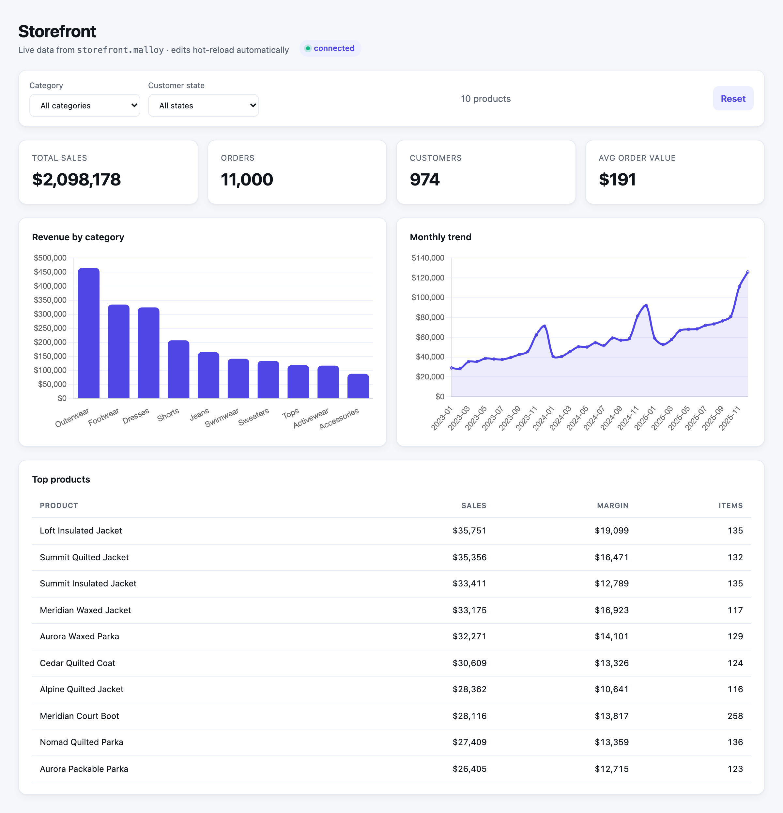

# storefront — the flagship sample package

A small but complete ecommerce semantic model. It's the default package Publisher
serves out of the box, and the one the [React SDK example](../data-app) reads from.

Everything runs on local DuckDB files, Parquet and CSV side by side, read in place with
no conversion step. **No credentials required.**

## What's here

| File | Role |
| --- | --- |
| `data/customers.parquet` | 1,000 customers across all 50 states (id, name, state, city, signup date). |
| `data/products.parquet` | 200 products in 10 categories and 12 brands (id, name, category, brand, cost, retail price). |
| `data/order_items.parquet` | ~25,000 order lines (~11,000 orders) over three years, joining customers to products. |
| `data/regions.csv` | The 50 states mapped to a sales region. A CSV, not Parquet: it's the kind of small lookup you'd keep in a spreadsheet, and `duckdb.table()` reads either format. |
| `storefront.malloy` | The model: `order_items` fact joined to `customers`, `products`, and `regions`, with reusable measures and `# dashboard` views. |
| `storefront.malloynb` | A guided-tour notebook: the business overview dashboard plus growth, seasonality, geography, category, brand, and top-seller views. |
| `public/index.html` | A no-build [HTML data app](../../docs/html-data-apps.md) — a Chart.js dashboard driven by `Publisher.query`. Served at `/environments/examples/packages/storefront/`. |
| `public/vendor/chart.umd.js` | Chart.js v4.5.0 (MIT), vendored so the page renders where a CDN is blocked. |

The data is generated deterministically by [`scripts/generate-example-data.mjs`](../../scripts/generate-example-data.mjs)
(`bun run generate:example-data`) — it has a growth trend and holiday seasonality, so the charts have
something real to show.

## The model at a glance

- **Sources:** `order_items` (fact) with `join_one` to `customers`, `products`, and
  `regions` (the CSV lookup, joined through the customer's state).
- **Measures:** `total_sales`, `total_margin`, `margin_rate`, `order_count`,
  `order_item_count`, `avg_order_value`, `customer_count`, `orders_per_customer`,
  `return_rate`, `percent_of_sales`.
- **Chart views:** `by_category` / `margin_by_category` / `top_brands` / `by_status`
  (`# bar_chart`), `sales_by_month` / `seasonality` (`# line_chart`),
  `sales_by_year` / `sales_by_region` (`# bar_chart`), `sales_by_state` (`# shape_map`).
- **Table views:** `top_products`, `top_customers`.
- **Dashboard:** `business_overview` — `# big_value` KPI tiles + nested charts.

## The data app

`public/index.html` is a self-contained dashboard — KPI tiles, a revenue-by-category bar chart, a
monthly trend line, category/state filters, and a top-products table — all served by Publisher and
driven by `Publisher.query` against the model's views. No build step. See
[docs/html-data-apps.md](../../docs/html-data-apps.md).



## Try it

`storefront` ships in Publisher's default config, so with the server running just open
`http://localhost:4000` and pick the **storefront** package. To query it directly:

```bash
API=http://localhost:4000/api/v0/environments/examples/packages/storefront/models/storefront.malloy/query

curl -s -X POST $API -H 'content-type: application/json' \
  -d '{"query":"run: order_items -> top_products"}'

curl -s -X POST $API -H 'content-type: application/json' \
  -d '{"query":"run: order_items -> business_overview"}'
```

Or ask an AI agent over MCP: *"Use Malloy to chart storefront revenue by category."*

## Learn more

- [docs/publisher-app.md](../../docs/publisher-app.md) — navigate this package in the built-in web app.
- [docs/explorer.md](../../docs/explorer.md) — explore the model with the no-code visual query builder.
- [docs/html-data-apps.md](../../docs/html-data-apps.md) — how `public/index.html` works.
- [docs/ai-agents.md](../../docs/ai-agents.md) — query this model from an AI agent over MCP.
- [examples/data-app](../data-app) — the React SDK app that reads from this package.
