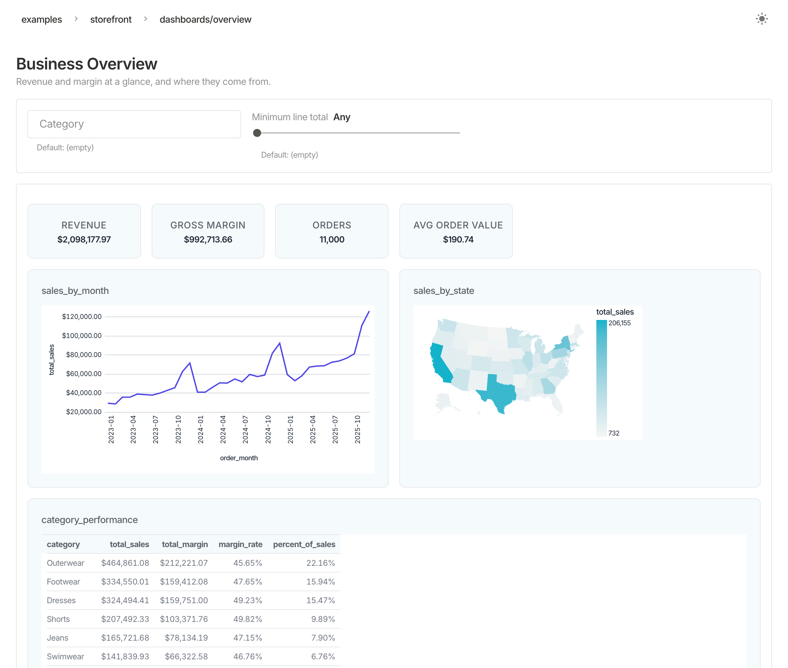

# storefront — the flagship sample package

A small but complete ecommerce semantic model. It's the default package Publisher
serves out of the box, and the one the [React SDK example](../data-app) reads from.

Everything runs on local DuckDB files, Parquet and CSV side by side, read in place with
no conversion step. **No credentials required.**

## What's here

| File | Role |
| --- | --- |
| `data/customers.parquet` | 1,000 customers across all 50 states (id, name, state, city, signup date). |
| `data/products.parquet` | 200 products in 10 categories and 12 brands (id, name, category, brand, cost, retail price). |
| `data/order_items.parquet` | ~25,000 order lines (~11,000 orders) over three years, joining customers to products. |
| `data/regions.csv` | The 50 states mapped to a sales region. A CSV, not Parquet: it's the kind of small lookup you'd keep in a spreadsheet, and `duckdb.table()` reads either format. |
| `storefront.malloy` | The model: `order_items` fact joined to `customers`, `products`, and `regions`, with reusable measures, `# dashboard` views, and the `# drill` tags that make cells clickable. |
| `givens.malloy` | The [givens](../../docs/givens.md) the dashboards and the notebook filter by — and, in their tags, the controls each one renders as. |
| `storefront.malloynb` | A guided-tour notebook: the business overview dashboard plus growth, seasonality, geography, category, brand, and top-seller views, behind a Parameters panel of four of those givens. |
| `dashboards/` | Four [dashboards](../../docs/dashboards.md) — see below. |
| `data_app.malloy` | The source the data app queries: `order_items` narrowed by all five givens, the way the notebook's first cell and `dashboards/_shared.malloy` each do for their own surface. |
| `public/index.html` | A no-build [HTML data app](../../docs/html-data-apps.md) — one tab per dashboard, driven by `Publisher.query`. Served at `/environments/examples/packages/storefront/`. |
| `public/app/` | The page's JavaScript, split by job: `format`, `result` (reading field tags off a result), `charts`, `table`, `drill`, `controls`, `tabs`, `app`. |
| `public/embed-test.html` | A host page that embeds `index.html` with `Publisher.embed`, to show what dropping a dashboard into your own app looks like. |
| `public/vendor/chart.umd.js` | Chart.js v4.5.0 (MIT), vendored so the page renders where a CDN is blocked. |
| `AGENTS.md` | Package-scoped guidance for an AI coding agent, for clients that read `AGENTS.md` rather than Anthropic Agent Skills. |

This is the one package that carries **all four analytics surfaces over the same data** — a
notebook, dashboards, an HTML data app, and the model itself queried directly — so the
[choosing-a-surface](../../docs/choosing-a-surface.md) comparison can be read against something
concrete rather than in the abstract.

The data is generated deterministically by [`scripts/generate-example-data.mjs`](../../scripts/generate-example-data.mjs)
(`bun run generate:example-data`) — it has a growth trend and holiday seasonality, so the charts have
something real to show.

## The model at a glance

- **Sources:** `order_items` (fact) with `join_one` to `customers`, `products`, and
  `regions` (the CSV lookup, joined through the customer's state).
- **Measures:** `total_sales`, `total_margin`, `margin_rate`, `order_count`,
  `order_item_count`, `avg_order_value`, `customer_count`, `orders_per_customer`,
  `return_rate`, `percent_of_sales`.
- **Chart views:** `by_category` / `margin_by_category` / `top_brands` / `by_status`
  (`# bar_chart`), `sales_by_month` / `seasonality` (`# line_chart`),
  `sales_by_year` / `sales_by_region` (`# bar_chart`), `sales_by_state` (`# shape_map`).
- **Table views:** `category_performance`, `brand_performance`, `top_products`, `top_customers`.
- **Dashboard view:** `business_overview` — four KPI cards over four tiles on a 12-column grid, laid
  out the way `dashboards/` lays its pages out ([docs/dashboards.md](../../docs/dashboards.md#laying-out-the-grid)).
- **Drill tags:** `category`, `brand`, and `region` are declared as dimensions on `order_items`
  (rather than referenced through the join as `products.category`) so they can carry `# drill`.
  Every view that groups by one is clickable, in a dashboard tile and in a notebook cell alike.

## The dashboards

`dashboards/*.malloy` — each file is a dashboard, discovered at package load and served at
`/examples/storefront/dashboards/<name>`. Between them they cover every form the grammar has:

| File | What it shows |
| --- | --- |
| `overview.malloy` | The common shape: one tagged query, laid out as a grid. KPI cards, two charts, and a drillable table, behind a Category and Minimum-line-total control. |
| `category.malloy` | A drill destination. Opening it from a category cell arrives with `CATEGORY` already set. |
| `regions.malloy` | `autorun=false`, so control changes batch behind an **Apply** button, and a starting value of `REGION=West`. |
| `seasonality.malloy` | A **composite**: no query of its own, just a list of existing views tiled together, each run separately. |
| `_shared.malloy` | No `# artifact` tag, so a shared include rather than a dashboard. Holds the given-scoped source the composite tiles. |



The controls are not written on any page: they are rendered from the `given:` declarations in
`givens.malloy` that each dashboard's query references. [docs/dashboards.md](../../docs/dashboards.md)
walks through the grammar using these five files.

## The data app

`public/index.html` is the same model again as a hand-authored web page: no build step, no
framework, one tab per dashboard in `dashboards/`. See
[docs/html-data-apps.md](../../docs/html-data-apps.md).


It is worth reading for what it does *not* hardcode. The control row is built from the `given:`
declarations in `givens.malloy`, so adding a given adds a widget. Table headings, number formats,
and column alignment come from each field's `# label`, `# currency`, and `# percent` tags, read off
the result envelope. And `# drill` works as it does on a dashboard: a category cell reads as a link
on hover and offers to open the Category tab or filter in place, because the page's tab slugs are
the dashboard slugs the tag names. A bar chart over a drillable dimension is clickable too — the
brands chart on the Category tab, by its label as much as its bar — since the tag belongs to the
field and not to any one way of drawing it. Filters and drill values travel as givens and land in
the URL — `?tab=regions&REGION=West` is a link someone can send.

Where a tab differs from its dashboard, the renderer is the reason: Chart.js has no US choropleth,
so revenue by state is a bar chart here and a `# shape_map` there.

`public/embed-test.html` is the other half of the story: a pretend host page that mounts
`index.html` with `Publisher.embed`, which auto-sizes the iframe to its content. Open it at
`/environments/examples/packages/storefront/embed-test.html`.

## Try it

`storefront` ships in Publisher's default config, so with the server running just open
`http://localhost:4000` and pick the **storefront** package. To query it directly:

```bash
API=http://localhost:4000/api/v0/environments/examples/packages/storefront/models/storefront.malloy/query

curl -s -X POST $API -H 'content-type: application/json' \
  -d '{"query":"run: order_items -> top_products"}'

curl -s -X POST $API -H 'content-type: application/json' \
  -d '{"query":"run: order_items -> business_overview"}'
```

Or ask an AI agent over MCP: *"Use Malloy to chart storefront revenue by category."*

## Learn more

- [docs/dashboards.md](../../docs/dashboards.md) — how the files in `dashboards/` work.
- [docs/choosing-a-surface.md](../../docs/choosing-a-surface.md) — notebook, dashboard, or HTML data app.
- [docs/console.md](../../docs/console.md) — navigate this package in the Publisher Console, the built-in web UI.
- [docs/explorer.md](../../docs/explorer.md) — explore the model with the no-code visual query builder.
- [docs/html-data-apps.md](../../docs/html-data-apps.md) — how `public/index.html` works.
- [docs/ai-agents.md](../../docs/ai-agents.md) — query this model from an AI agent over MCP.
- [examples/data-app](../data-app) — the React SDK app that reads from this package.
